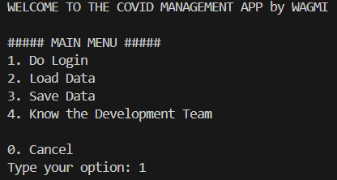
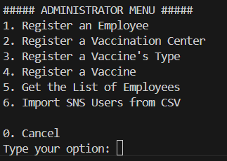
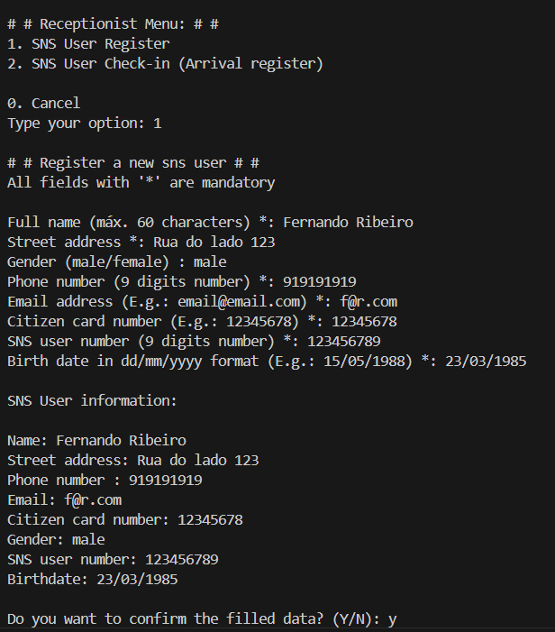
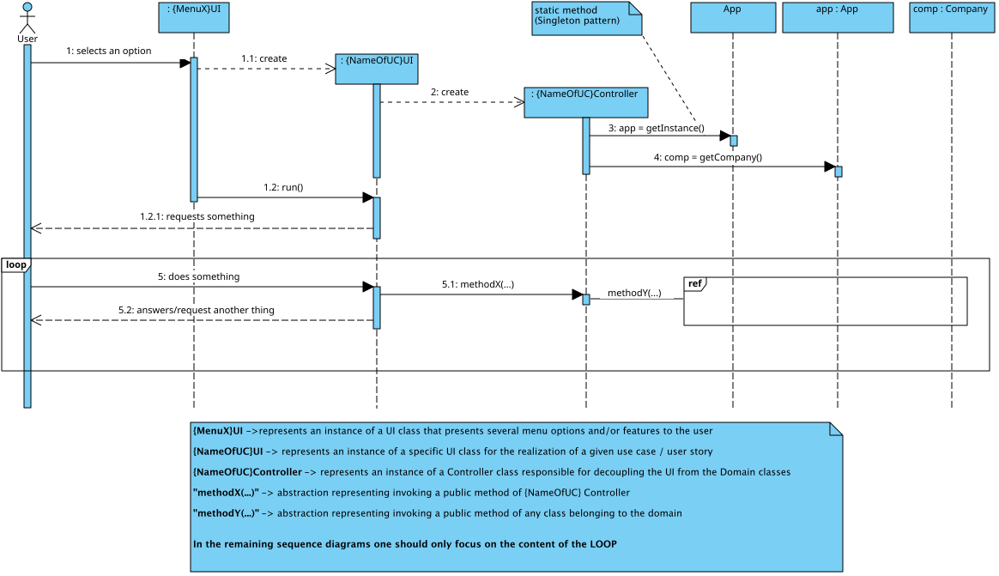
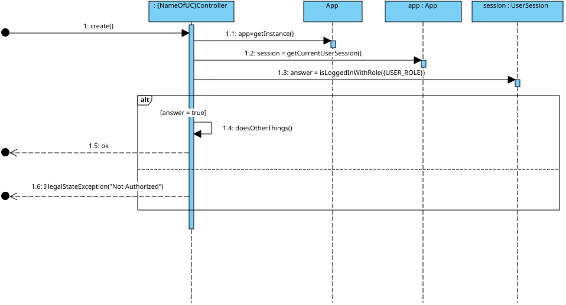

# 🏥 SNS COVID-19 Vaccination Management System

> A comprehensive Java-based vaccination management system developed as part of the LEI program at ISEP (2021-2022)

[](https://www.oracle.com/java/)
[](https://openjfx.io/)
[](https://maven.apache.org/)
[]()

## ✨ Highlights

- **🖥️ JavaFX GUI** with complete vaccination workflow and performance analysis
- **🏥 Mass Vaccination Support** - 4 vaccination centers (Porto, Gondomar, Trofa, Gaia)
- **📊 Performance Analysis** - Real-time center efficiency monitoring for coordinators
- **👥 Role-Based Access Control** - Admin, Nurse, Receptionist, Center Coordinator, SNS User
- **📁 CSV Import/Export** - Legacy system integration and statistics generation
- **✅ Comprehensive Testing** - JUnit 5 with JaCoCo coverage reports
- **🏗️ Design Patterns** - MVC, Singleton, Repository, DTO, Factory, Strategy

## 📚 Documentation

- **[📖 Comprehensive Project Overview](docs/PROJECT_OVERVIEW.md)** - Technical architecture, design patterns, and features
- **[🔍 General Project Status](General%20project%20status.md)** - Security audit and code quality analysis
- **[👥 Team Members & Task Assignment](docs/README.md)** - Sprint organization and team structure
- **[🔐 AuthLib Documentation](docs/Auth/README.md)** - Authentication component details

## 🚀 Quick Start

### Prerequisites
- Java 11 or higher
- Maven 3.x

### Build & Run

```bash
# Clone the repository
git clone https://github.com/Frsoul7/vaccination-management-system.git
cd vaccination-management-system

# Build the project
mvn clean package

# Run GUI version (recommended)
java -jar target/Sem2App-1.0-SNAPSHOT-jar-with-dependencies.jar --graphic

# Run console version
java -jar target/Sem2App-1.0-SNAPSHOT-jar-with-dependencies.jar --console
```

### Default Login Credentials for Testing

| Role | Email | Password |
|------|-------|----------|
| **Center Coordinator** | c@c.pt | 123 |
| **Administrator** | admin@lei.sem2.pt | 123456 |
| **Nurse** | n@n.pt | 123 |
| **Receptionist** | r@r.pt | 123 |
| **SNS User** | u@u.pt | 123 |

## 📸 Screenshots

### Console Interface

<div align="center">
  
  <p><em>Console Login Screen</em></p>
</div>

<div align="center">
  
  <p><em>Administrator Menu Options</em></p>
</div>

<div align="center">
  
  <p><em>Receptionist Registering SNS User</em></p>
</div>

### GUI Interface

<div align="center">
  
  <p><em>Graphical Login Interface</em></p>
</div>

<div align="center">
  
  <p><em>Vaccination Center Selection</em></p>
</div>

<div align="center">
  
  <p><em>Center Coordinator - Performance Analysis Dashboard</em></p>
</div>

<div align="center">
  
  <p><em>Nurse Interface - Vaccine Administration Process</em></p>
</div>

[🖼️ View all screenshots →](docs/screenshots)

## 🎯 Key Features

### For SNS Users
- Schedule vaccination appointments
- Select vaccination center and time slot
- Digital vaccination certificate (EU COVID Digital Certificate)
- Check-in via QR code or SNS number

### For Center Coordinators
- Analyze vaccination center performance
- Identify peak hours and bottlenecks
- Export vaccination statistics to CSV
- Monitor waiting room and recovery room flow

### For Healthcare Staff
- **Nurses**: Administer vaccines, record dosage, lot numbers
- **Receptionists**: Register user arrivals, manage waiting room
- **Administrators**: Configure centers, vaccines, employees, users

### Data Management
- Import legacy system data from CSV
- Bulk user registration via CSV files
- Export performance reports
- Persistent data storage (Java serialization)

## 🏗️ Tech Stack

**Core Technologies:**
- **Java 11** - Primary programming language
- **JavaFX 18.0.1** - Rich GUI framework with FXML
- **Maven 3.x** - Build automation and dependency management

**Testing & Quality:**
- **JUnit 5.8.2** - Unit testing framework
- **JaCoCo** - Code coverage analysis
- **PlantUML** - UML diagram generation

**Key Libraries:**
- **Apache Commons Lang 3.12.0** - Utility functions
- **Passay 1.6.1** - Password generation
- **AuthLib** - Authentication & authorization

**Algorithms:**
- MergeSort & BubbleSort for data sorting
- Brute-Force Maximum Subarray for performance analysis

## 📐 Architecture

The application follows a **layered architecture** with clear separation of concerns:



```
┌─────────────────────────┐
│  Presentation Layer     │  JavaFX GUI / Console UI
├─────────────────────────┤
│  Controller Layer       │  Application Logic
├─────────────────────────┤
│  Domain Layer           │  Business Logic
├─────────────────────────┤
│  Persistence Layer      │  Data Management
└─────────────────────────┘
```

**Authorization Flow:**



**Design Patterns Implemented:**
- **MVC** - Model-View-Controller separation
- **Singleton** - App instance management
- **Repository/Store** - Data access abstraction
- **DTO** - Data Transfer Objects
- **Factory** - Object creation
- **Strategy** - Algorithm selection via configuration

For detailed architecture documentation, see [docs/PROJECT_OVERVIEW.md](docs/PROJECT_OVERVIEW.md).

## 🧪 Testing

```bash
# Run all tests
mvn test

# Generate coverage report
mvn clean test jacoco:report

# View coverage report
# Open target/site/jacoco/index.html in browser
```

**Test Coverage:**
- 11 test classes covering core domain logic
- Focus on validation, domain models, and algorithms
- JaCoCo excludes UI and I/O operations

## 📊 Project Management

The project was developed using **Agile/Scrum methodology** across **4 sprints**:

- **Sprint A**: Requirements analysis, domain modeling, FURPS+ specification
- **Sprint B**: Core features with console UI (user management, scheduling, administration)
- **Sprint C**: Advanced features (CSV import/export, performance analysis)
- **Sprint D**: GUI implementation with JavaFX, legacy system integration

Each sprint includes comprehensive documentation:
- User Story specifications with acceptance criteria
- System Sequence Diagrams (SSD)
- Domain Models and Class Diagrams
- Sequence Diagrams with detailed interactions
- Test cases and validation

## 🎓 Academic Context

**Institution:** [Instituto Superior de Engenharia do Porto (ISEP)](http://www.isep.ipp.pt)  
**Program:** [Degree in Informatics Engineering (LEI)](http://www.isep.ipp.pt/Course/Course/26)  
**Course:** LAPR2 - Laboratório de Projeto e Análise de Requisitos 2  
**Academic Year:** 2021-2022 (2nd Semester)

This project demonstrates proficiency in:
- ✅ Object-Oriented Programming (OOP)
- ✅ Software Engineering best practices
- ✅ Design patterns and SOLID principles
- ✅ Agile/Scrum methodology
- ✅ Requirements analysis and UML modeling
- ✅ Algorithm design and complexity analysis
- ✅ Testing and quality assurance
- ✅ Version control and CI/CD

## 📁 Project Structure

```
ersmoreira-lei-22-s2-1na-g074/
│
├── docs/                          # Documentation
│   ├── PROJECT_OVERVIEW.md       # Comprehensive technical overview
│   ├── SprintA/                  # Requirements & domain modeling
│   ├── SprintB/                  # Console features
│   ├── SprintC/                  # Advanced features
│   └── SprintD/                  # GUI & legacy integration
│
├── src/
│   ├── main/java/app/
│   │   ├── controller/           # Application controllers
│   │   ├── domain/               # Domain models & business logic
│   │   ├── dto/                  # Data Transfer Objects
│   │   ├── ui/                   # Console UI
│   │   └── ui/gui/               # JavaFX GUI controllers
│   │
│   └── resources/fxml/           # JavaFX FXML layouts
│
├── pom.xml                       # Maven configuration
├── config.properties             # Application configuration
└── General project status.md     # Code quality audit
```

## 🔐 Security Note

**⚠️ Important:** This is an academic project. Before production use:
- Review [General project status.md](General%20project%20status.md) for security concerns
- Change all default passwords
- Implement proper database instead of serialization
- Add input sanitization and validation
- Implement HTTPS and secure authentication

## 🤝 Contributing

This is an academic project and is not actively maintained. However, it serves as a reference implementation for:
- University students learning software engineering
- Developers exploring JavaFX applications
- Teams studying design patterns in practice

## 📞 Contact

For questions about the project architecture or implementation:
- Review the [comprehensive documentation](docs/PROJECT_OVERVIEW.md)
- Check the [Sprint documentation](docs/SprintD/) for specific features
- Analyze the [code quality report](General%20project%20status.md)

## 📄 License

Academic project developed at ISEP for educational purposes.

---

**Developed with ❤️ at ISEP - 2021/2022**

For detailed technical information, architecture diagrams, and implementation notes, see **[docs/PROJECT_OVERVIEW.md](docs/PROJECT_OVERVIEW.md)**.
