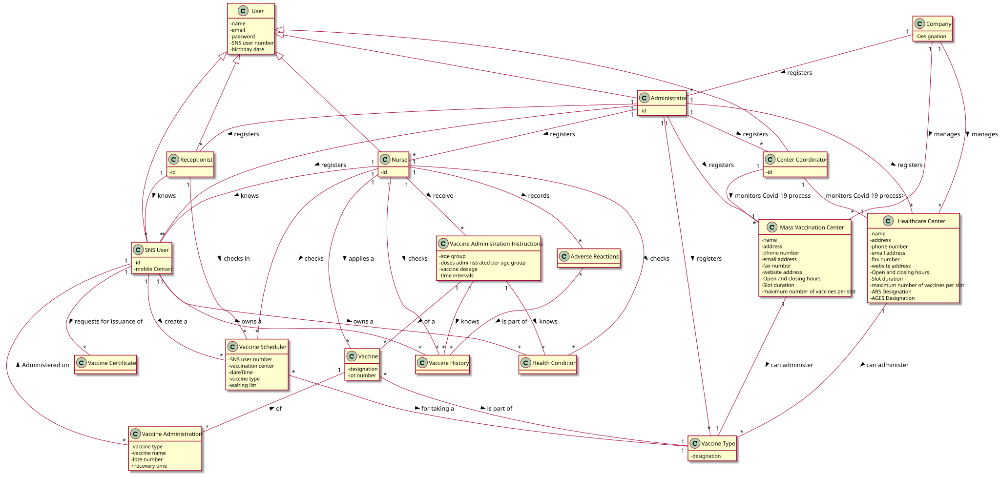

# OO Analysis #

## Rationale to identify domain conceptual classes ##

### _Conceptual Class Category List_ ###

**Business Transactions**

* Vaccine Administration
* Vaccination Certificate
* Vaccination Scheduling
---

**Transaction Line Items**

* Vaccine Type
---

**Product/Service related to a Transaction or Transaction Line Item**

* Vaccine
---

**Transaction Records**

* Adverse Reactions
* Vaccine Administration
* Vaccination Scheduling
---  

**Roles of People or Organizations**

* Administrator
* Company (DGS)
* Coordinator
* Nurse
* Receptionist
* SNS User
---

**Places**

* Health Care Center
* Mass Vaccination Center
---

**Noteworthy Events**

* Adverse Reactions
* SNS Users Check-in
* Vaccination Certificate
* Vaccine Administration
* Vaccine Scheduling
---

**Physical Objects**

* Health Care Centers
* Mass Vaccination Center
* Vaccination Certificate
* Vaccine
---

**Descriptions of Things**

* Vaccine
* Vaccine Type
---

**Catalogs**

*  Vaccine Administration Instructions
---

**Containers**

* Health Care Centers
* Mass Vaccination Center
---

**Elements of Containers**

* Users
* Vaccine
---

**Organizations**

*  Company (DGS)
---

**Other External/Collaborating Systems**

*  n/a
---

**Records of finance, work, contracts, legal matters**

* Health Conditions
* Vaccination History
---

**Financial Instruments**

*  n/a
---

**Documents mentioned/used to perform some work/**

*  Vaccine Administration Instructions
* Reports
---

###**Rationale to identify associations between conceptual classes**

| Concept (A) 		|  Association   	|  Concept (B) |
|----------	   		|:-------------:	|------:       |
| Administrator | registers | Users (SNS Users, Receptionist, Coordinator, Nurse) |
| Administrator | registers | Vaccination Centers (HealCareCenter, Mass….) |
| Administrator | registers | Vaccine Type |
| Administrator | registers | Vaccine |
| Adverse Reactions | is a part of | Vaccination History |
| Center Coordinator | monitors | Vaccination Process |
| Company (DGS) | registers | Administrator |
| Company (DGS) | manages | Vaccination Centers (Mass and Health care |
| Nurse | checks | Vaccine Scheduling |
| Nurse | checks | Health Condition |
| Nurse | checks | Vaccination History |
| Nurse | applies | Vaccine |
| Nurse | knows | SNS User |
| Nurse | records | Adverse Reactions |
| Nurse | receives | Vaccine Administration Instructions |
| Receptionist | knows | SNS User |
| Receptionist | checks-in | Vaccine Scheduling |
| SNS User | creates a | Vaccine Scheduling |
| SNS User | requests for issuance of | Vaccination Certificate |
| SNS User | owns | Vaccination History |
| SNS User | owns | Health Condition |
| Vaccination Centers (HealCareCenter, Mass….) | can administer  | Vaccine Type |
| Vaccine | is part of | Vaccine Type |
| Vaccine Administration | of | Vaccine |
| Vaccine Administration | administered on | SNS User |
| Vaccine Administration Instructions | knows | Health Condition |
| Vaccine Administration Instructions | knows | Vaccination History |
| Vaccine Administration Instructions | of a | Vaccine |

## Domain Model

