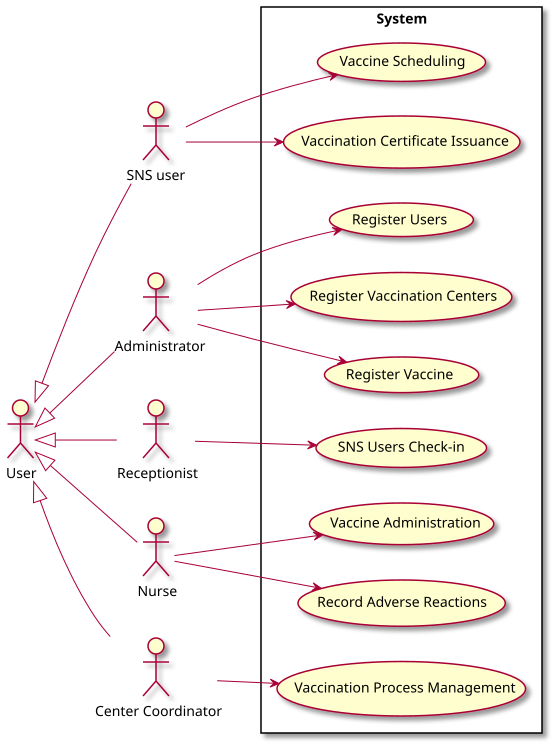

# Use Case Diagram (UCD)

# Use Cases / User Stories
| UC/US  | Description                                                               |                   
|:----|:------------------------------------------------------------------------|
| **UC001** | [**Register Users**](../UC/UC001_RegisterUsers/UC001.md)  |
| **UC002** | [**Register Vaccination Centers**](../UC/UC002_RegisterVaccinationCenters/UC002.md)  |
| **UC003** | [**Register Vaccine**](../UC/UC003_RegisterVaccine/UC003.md)  |
| **UC004** | [**Vaccine Scheduling**](../UC/UC004_VaccineScheduling/UC004.md) |
| **UC005** | [**Vaccination Certificate Issuance**](../UC/UC005_VaccinationCertificateIssuance/UC005.md)  |
| **UC006** | [**SNS Users Check-in**](../UC/UC006_SNSUsersCheckIn/UC006.md)  |
| **UC007** | [**Vaccine Administration**](../UC/UC007_VaccineAdministration/UC007.md)  |
| **UC008** | [**Record Adverse Reactions**](../UC/UC008_RecordAdverseReactions/UC008.md)  |
| **UC009** | [**Vaccination Process Management**](../UC/UC009_VaccinationProcessManagement/UC009.md)  |

