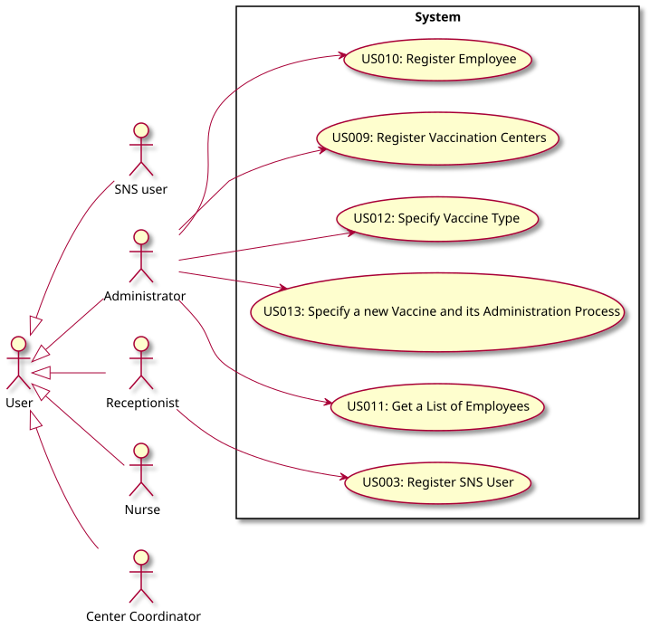

# Use Case Diagram (UCD)

# Use Cases / User Stories
| UC/US  | Description                                                               |                   
|:----|:------------------------------------------------------------------------|
| **US003** | [**Register SNS User**](../US/US003_RegisterSNSUser/US003.md)  |
| **US009** | [**Register Vaccination Centers**](../US/US009_RegisterVaccinationCenters/US009.md)  |
| **US010** | [**Register Employee**](../US/US010_RegisterEmployee/US010.md)  |
| **US011** | [**Get a List of Employees**](../US/US011_GetaListofEmployees/US011.md) |
| **US012** | [**Specify Vaccine Type**](../US/US012_SpecifyVaccineType/US012.md)  |
| **US013** | [**Specify Vaccine and its Administration Process**](../US/US013_SpecifyVaccineanditsAdministrationProcess/US013.md)  |
