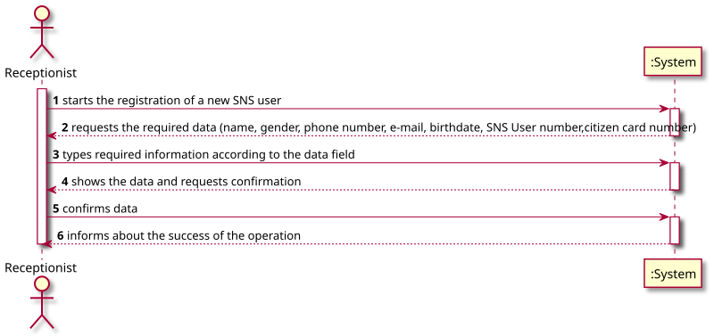
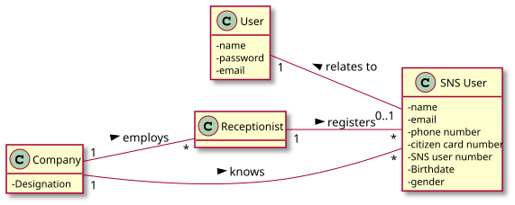
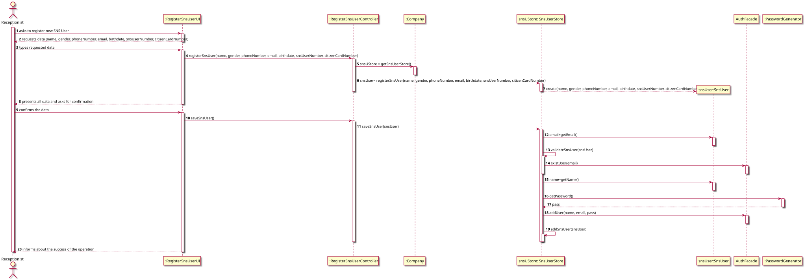
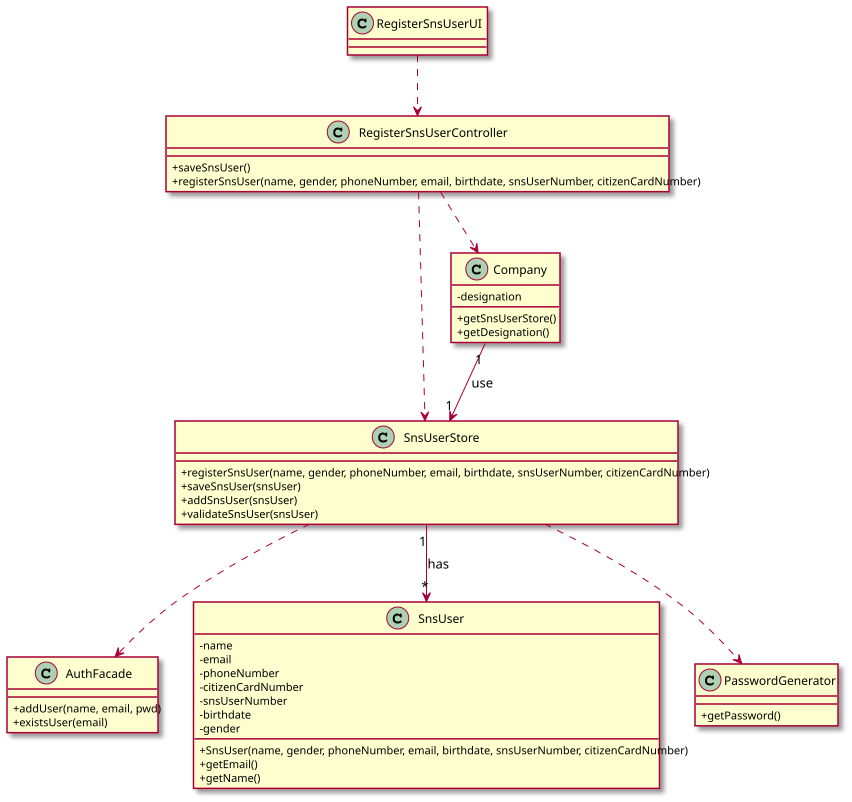

# US 003 - Register SNS user

## 1. Requirements Engineering

### 1.1. User Story Description

*As a receptionist, I want to register an SNS user.*

### 1.2. Customer Specifications and Clarifications 

**From the specifications document:**

> "On the scheduled day and time, the SNS user should go to the vaccination center to get the vaccine. 
> When the SNS user arrives at the vaccination center, a receptionist registers the arrival of the user to take the respective vaccine. 
> The receptionist asks the SNS user for his/her SNS user number and confirms that he/she has the vaccine scheduled for the that day and time. 
> If the information is correct, the receptionist acknowledges the system that the user is ready to take the vaccine. 
> Then, the receptionist should send the SNS user to a waiting room where (s)he should wait for his/her time."

>"[...]a nurse responsible for administering the vaccine will use the application to check the
list of SNS users that are present in the vaccination center to take the vaccine and will call one SNS
user to administer him/her the vaccine."

**From the client clarifications:**

> **Question**:
> What are the necessary components in order to register an SNS User?
>
> **Answer**: 
The attributes that should be used to describe a SNS user are: Name, Address, Sex, Phone Number, E-mail, Birth Date, SNS User Number and Citizen Card Number.
The Sex attribute is optional. All other fields are required.
The E-mail, Phone Number, Citizen Card Number and SNS User Number should be unique for each SNS user.

> **Question**:  
"For the SNS user account, is a username necessary, or does the SNS number function as a username?"
>
> **Answer**:  
"Login: is the user e-mail;  
Password: the password should be randomly generated.
In the project description we get “All those who wish to use the application must be authenticated with a password holding seven alphanumeric characters, including three capital letters and two digits.”

> **Question**:
"There we can read "US03 - As a receptionist, I want to register a SNS User."
Accordingly to our project description, the person allowed to register a SNS User it's the DGS Administrator".
>
>**Answer**:
>"There is no error. We will have two User Stories for registering SNS users. One of these USs is US03 and the other US will be introduced later, in Sprint C."

### 1.3. Acceptance Criteria

* **AC1:** All required fields, except gender field, must be filled in.
* **AC2:** SNS User must become a system user
* **AC3:** Password should be generated automatically, and it must hold 7 alphanumeric characters, including three capital letters and two digits.
* **AC4:** Each SNS user must have a name, gender, phone number, e-mail, birthdate, SNS User number and citizen card number.
* **AC5:** The name field is a string and should have a max length of **60** characters.
* **AC6:** The gender field is a String and should have a max length of **6** characters.
* **AC7:** Phone number, must be a maximum 9 digit number of type long.
* **AC8:** The e-mail field is a string and should be in e-mail format, with an @ and a dot.
* **AC9:** Birthdate field is a DATE type.
* **AC10:** SNS User number is an integer type with a maximum of **10** digits length.
* **AC11:** Citizen Card number, must be a string with **12** chars and have check-sum specific validation.
* **AC12:** When registering a new SNS User arrival that doesn't have a valid vaccine scheduling, the registering operation must fail and the receptionist should be notified.

### 1.4. Found out Dependencies

n/a

### 1.5 Input and Output Data

**Input Data:**

* Typed data:
    * Name
    * Gender
    * Phone number
    * E-mail
    * Birthdate
    * SNS User number
    * Citizen card number
    
* Selected data:
    * n/a
    
**Output Data:**

* (In)Success of the operation

### 1.6. System Sequence Diagram (SSD)

### 1.7 Other Relevant Remarks

* The gender attribute is optional. All other fields are required.
* The E-mail, Phone Number, Citizen Card Number and SNS User Number should be unique for each SNS user.

## 2. OO Analysis

### 2.1. Relevant Domain Model Excerpt

### 2.2. Other Remarks

n/a 

## 3. Design - User Story Realization 

### 3.1. Rationale

**The rationale grounds on the SSD interactions and the identified input/output data.**

| Interaction ID | Question: Which class is responsible for... | Answer  | Justification (with patterns)  |
|:-------------  |:--------------------- |:------------|:---------------------------- |
| Step 1  		 |... interacting with the actor?| RegisterSnsUserUI | Pure Fabrication: there is no reason to assign this responsibility to any existing class in the Domain Model. |
|               |... coordinating the US? | RegisterSnsUserController |Pure Fabrication: responsible for coordinating and distributing the actions                            |
|               | ... instantiating a new SNS User? |SnsUserStore  | Creator R1/2                         |
|                |... instantiating a new SNS User store? | Company   | Creator R1/2       | 
| 		         |... knowing all the SNS Users? | Company  | Information Expert: the object owns the SNS Users store   |
| Step 2  		 |	 |           |                              |
| Step 3  		 |... saving the typed data?| SnsUser   |Information Expert: the object has its on data       |
| Step 4  		 |... validating the data locally? | SnsUser |Information Expert (IE): the object knows its own data                           |
|                |... validating the data globally?| SnsUserStore | IE: SnsUserStore knows all the SNS Users objects |
| Step 5  		 |... saving all the created data? | Company  |IE: records all the SnsUserStore objects  |
| Step 6  		 |... informing the operation success?| RegisterSnsUserUI | IE: responsible for user interaction  |              

### Systematization ##

According to the taken rationale, the conceptual classes promoted to software classes are: 

 * SnsUser
 * Receptionist
 * Company

Other software classes (i.e. Pure Fabrication) identified: 

 * RegisterSnsUserUI  
 * RegisterSnsUserController
 * SnsUserStore

## 3.2. Sequence Diagram (SD)

## 3.3. Class Diagram (CD)

# 4. Tests 
*In this section, it is suggested to systematize how the tests were designed to allow a correct measurement of requirements fulfilling.* 

**_DO NOT COPY ALL DEVELOPED TESTS HERE_**

**Test 1:** Check that it is not possible to create an instance of the SnsUser class without name. 

    @Test
    void testCreationOfNewSnsUserWithoutName() {
      Exception e = assertThrows(IllegalArgumentException.class, () -> {
        SNSUser snsUser =
          new SNSUser(null, email, phoneNumber, citizenCardNumber, snsUserNumber, birthDate, gender);
      });
    }

**Test 2:** Check that it is not possible to create an instance of the SnsUser class without all data.

    @Test
    void testCreationOfNewSnsUserWithAllData() {
        Exception e = assertThrows(IllegalArgumentException.class, () -> {
            SNSUser snsUser =
                    new SNSUser(null, email, phoneNumber, citizenCardNumber, snsUserNumber, birthDate, gender);
        });
    }

# 5. Construction (Implementation)

**Class SNS User** - Constructor of class SNS User

    /***
    * Vaccination center constructor with all attributes
    * @param name                  - Name of SNS user
    * @param phoneNumber           - Phone number of SNS user
    * @param email                 - Email of SNS user
    * @param citizenCardNumber     - Citizen card number of SNS user
    * @param snsUserNumber         - SNS user card number of SNS user
    * @param BirthDate             - BirthDate of SNS user
    * @param Gender                - Gender of SNS user
    */

    public SNSUser(String name, String email, long phoneNumber, String citizenCardNumber, long snsUserNumber,
                 Date birthDate, String gender) {

     setName(name);
     setEmail(email);
     setPhoneNumber(phoneNumber);
     setCitizenCardNumber(citizenCardNumber);
     setSnsUserNumber(snsUserNumber);
     setBirthDate(birthDate);
     setGender(gender);

    }

# 6. Integration and Demo 

*In this section, it is suggested to describe the efforts made to integrate this functionality with the other features of the system.*

# 7. Observations

*In this section, it is suggested to present a critical perspective on the developed work, pointing, for example, to other alternatives and or future related work.*

