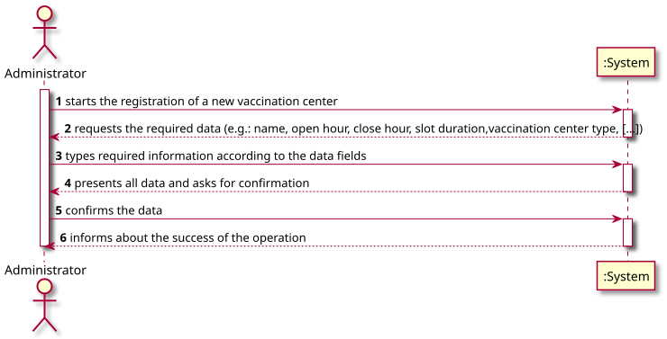
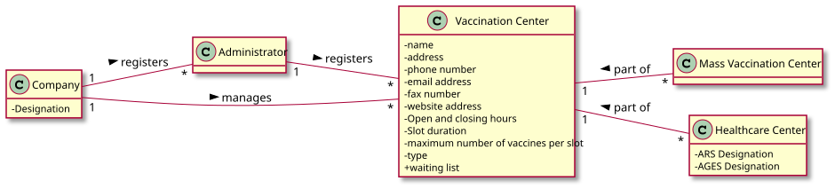
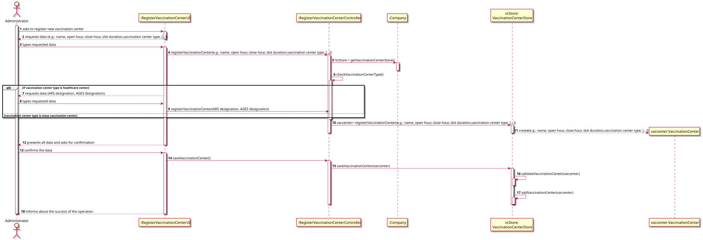
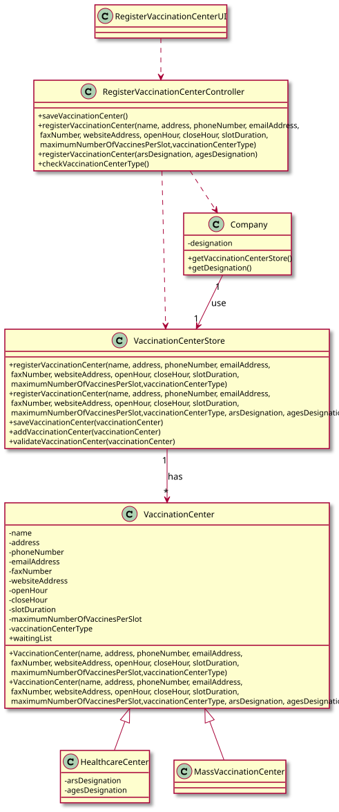

# US 009 - Register vaccination centers

## 1. Requirements Engineering

### 1.1. User Story Description

*As an administrator, I want to register a vaccination center to respond to a certain pandemic.*

### 1.2. Customer Specifications and Clarifications

**From the specifications document:**

> "Any Administrator uses the
> application to register centers, SNS users, center coordinators,[...]"

> "An Administrator is responsible for properly configuring and managing the core information (e.g.:
> type of vaccines, vaccines, vaccination centers, employees)[...]"

> "[...]vaccination process is mainly carried out through community mass vaccination centers
> and health care centers distributed across the country."

> "The main difference between the two kinds of centers is
> that a healthcare center is associated with a given ARS (Administração Regional de Saúde) and
> AGES (Agrupamentos de Centros de Saúde), and it can administer any type of vaccines (e.g.:
> Covid-19, Dengue, Tetanus, smallpox)."

> "[...]vaccination centers are characterized by a name, an address, a phone number, an e-mail address, a
> fax number, a website address, opening and closing hours, slot duration (e.g.: 5 minutes) and the
> maximum number of vaccines that can be given per slot (e.g.: 10 vaccines per slot)."

**From the client clarifications:**

> **Question**:  
> As to the interval between doses, what time format should we use (e.g. days, weeks, months)?
>
> **Answer**:  
> Number of days.

> **Question**:  
> How should we verify that a vaccination center is already registered in the system? Which attribute should the system
> use to verify this?
>
> **Answer**:

### 1.3. Acceptance Criteria

* **AC1:** All required fields must be filled in.
* **AC2:** The name field is a string and should have a max length of **60** characters.
* **AC3:** The address field is a string and should have a max length of **100** characters.
* **AC4:** The phone number must have a maximum 14 digits number, of type long.
* **AC5:** The website address field is a string and must follow website format (start with three "w" and have two dots)
  .
* **AC6:** The e-mail field is a string and should be in e-mail format, with an @ and a dot.
* **AC7:** The fax number must have a maximum 14 digits number, of type long.
* **AC8:** The opening hour should follow the time format according to the 12-hour notation, in the form hh:mm am/pm.
* **AC9:** The closing hour should follow the time format according to the 12-hour notation, in the form hh:mm am/pm.
* **AC10:** The slot duration should be defined in minutes, between 1 and 60 of type integer.
* **AC11:** The maximum number of vaccines per slot should be defined by a number of type integer.
* **AC12:** Each vaccination center is defined by a type: mass vaccination center or healthcare center.
* **AC13:** When the vaccination center is of type "healthcare center" the designation of ARS and AGES
  field is a string and should have a max length of **100** characters.
* **AC14:** When registering a new vaccination center that is already registered, the registering operation must fail
  and the administrator should be notified.

### 1.4. Found out Dependencies

* n/a

### 1.5 Input and Output Data

**Input Data:**

* Typed data:
    * a Name
    * an Address
    * a Phone Number
    * an Email
    * a Fax number
    * a Website address
    * an Open hour
    * a Close hour
    * a Slot duration
    * a Maximum number of vaccines per slot
    * a Vaccination center type
    * an ARS designation
    * an AGES designation

* Selected data:
    * n/a

**Output Data:**

* (In)Success of the operation

### 1.6. System Sequence Diagram (SSD)

### 1.7 Other Relevant Remarks

* Centers can only be registered once (no repetition).
* Receptionists and nurses registered in the application will work in the vaccination process. By now,
  the system might assume that receptionists and nurses can work on any vaccination center.

## 2. OO Analysis

### 2.1. Relevant Domain Model Excerpt

### 2.2. Other Remarks

n/a

## 3. Design - User Story Realization

### 3.1. Rationale

**The rationale grounds on the SSD interactions and the identified input/output data.**

| Interaction ID | Question: Which class is responsible for... | Answer  | Justification (with patterns)  |
|:-------------  |:--------------------- |:------------|:---------------------------- |
| Step 1         |... interacting with the actor?| RegisterVaccinationCenterUI | Pure Fabrication: there is no reason to assign this responsibility to any existing class in the Domain Model. |
|               |... coordinating the US? | RegisterVaccinationCenterController |Pure Fabrication: responsible for coordinating and distributing the actions                            |
|               | ... instantiating a new vaccination center? |VaccinationCenterStore  | Creator R1/2                         |
|                |... instantiating a new vaccination center store? |Company   | Creator R1/2       | 
| 		         |... knowing all the vaccination center? | Company     | Information Expert: the object owns the vaccination center store   |
| Step 2         |	 |           |                              |
| Step 3         |... saving the typed data?| VaccinationCenter   |Information Expert: the object has its on data       |
| Step 4         |	 |           |                              |
| Step 5         |... validating the data locally? | VaccinationCenter |Information Expert (IE): the object knows its on data                           |
|                |... validating the data globally?| VaccinationCenterStore | IE: VaccinationCenterStore knows all the vaccination center objects |
|  		         |... knowing how to add a vaccination center? | VaccinationCenterStore  |IE: knows all the vaccination center objects  |
|  		         |... saving all the created data? | Company  |IE: records all the VaccinationCenterStore objects  |
| Step 6         |... informing the operation success?| RegisterVaccinationCenterUI | IE: responsible for user interaction  |              

### Systematization ##

According to the taken rationale, the conceptual classes promoted to software classes are:

* Company
* VaccinationCenter
* VaccinationCenterStore

Other software classes (i.e. Pure Fabrication) identified:

* RegisterVaccinationCenterUI
* RegisterVaccinationCenterController

## 3.2. Sequence Diagram (SD)

## 3.3. Class Diagram (CD)

# 4. Tests

**Test 1:** Check successfull creation of a vaccination center

    @Test
    void testCreationOfNewEmployeeWithAllData() {
        VaccinationCenter vacCenter =
                new VaccinationCenter(name, address, phoneNumber, email, faxNumber, websiteAddress, openHour, closeHour,
                                      slotDuration, maxVaccinesPerSlot, type);
        assertNotNull(vacCenter);
    }

**Test 2:** Check that it is not possible to create a vaccination center without name.

    @Test
    void testCreationOfNewVaccinationCenterWithoutName() {
        Exception e = assertThrows(IllegalArgumentException.class, () -> {
            VaccinationCenter vacCenter =
                    new VaccinationCenter(null, address, phoneNumber, email, faxNumber, websiteAddress, openHour,
                                          closeHour, slotDuration, maxVaccinesPerSlot, type);
        });
    }

# 5. Construction (Implementation)

**Class Vaccination Center** - Constructor of class Vaccination Center

    /***
     * Vaccination center constructor with all attributes
     * @param name                  - Name of vaccination center
     * @param address               - Address of vaccination center
     * @param phoneNumber           - Phone number of vaccination center
     * @param email                 - Email of vaccination center
     * @param faxNumber             - Fax number of vaccination center
     * @param websiteAddress        - Website address of vaccination center
     * @param openHour              - Open hours of vaccination center 
     * @param closeHour             - Close hours of vaccination center
     * @param slotDuration          - Slot duration of vaccination center
     * @param maxVaccinesPerSlot    - Maximum number of vaccines per slot of vaccionation center
     * @param type                  - Type of vaccination center
     */
    public VaccinationCenter(String name, String address, long phoneNumber, String email, long faxNumber,
                             String websiteAddress, Time openHour, Time closeHour, Time slotDuration,
                             int maxVaccinesPerSlot, String type) {
        setName(name);
        setAddress(address);
        setPhoneNumber(phoneNumber);
        setEmail(email);
        setFaxNumber(faxNumber);
        setWebsiteAddress(websiteAddress);
        setOpenHour(openHour);
        setCloseHour(closeHour);
        setSlotDuration(slotDuration);
        setMaxVaccinesPerSlot(maxVaccinesPerSlot);
        setType(type);
    }

# 6. Integration and Demo

*In this section, it is suggested to describe the efforts made to integrate this functionality with the other features
of the system.*

# 7. Observations

*In this section, it is suggested to present a critical perspective on the developed work, pointing, for example, to
other alternatives and or future related work.*

