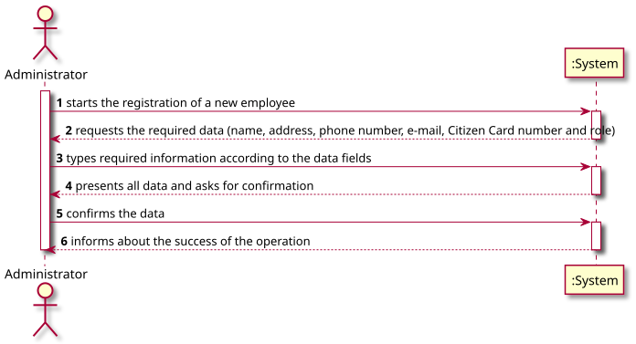
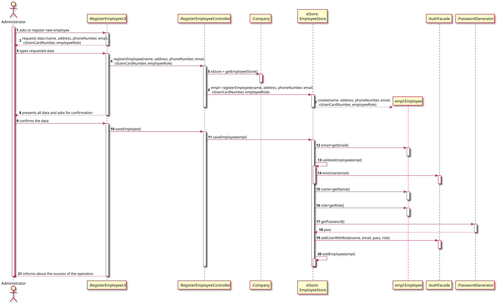
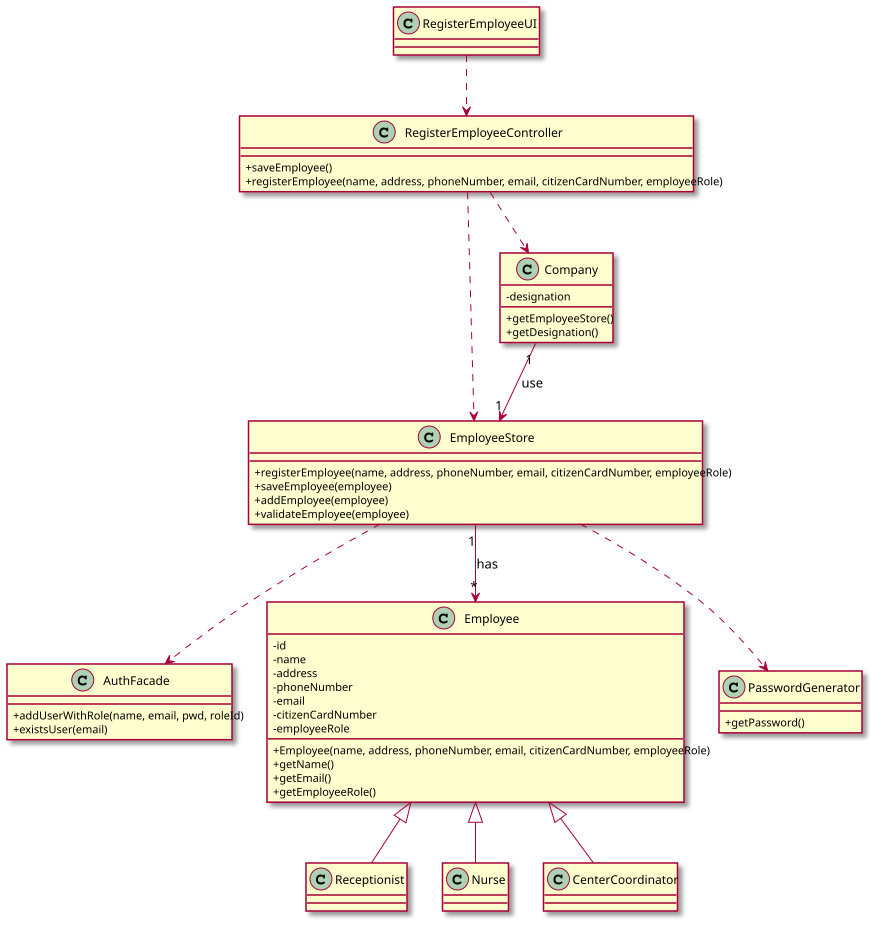

# US 010 - Register employees

## 1. Requirements Engineering

### 1.1. User Story Description

*As an administrator, I want to register an Employee.*

### 1.2. Customer Specifications and Clarifications 

**From the specifications document:**

> "An Administrator is responsible for properly configuring and managing the core information (e.g.:
type of vaccines, vaccines, vaccination centers, employees) required for this application to be
operated daily by SNS users, nurses, receptionists, etc."

> "Any Administrator uses the
application to register centers, SNS users, center coordinators, receptionists, and nurses enrolled in
the vaccination process."

**From the client clarifications:**

> **Question**:  
> "Besides a password and a user name, what other (if any) information should the Admin use to register a new employee? Are any of them optional?"
>
>  **Answer**:  
> "Every Employee has only one role (Coordinator, Receptionist, Nurse).
Employee attributes: Id (automatic), Name, address, phone number, e-mail and Citizen Card number.
All attributes are mandatory."

> **Question**:  
"For the SNS user account, is a username necessary, or does the SNS number function as a username?"
>
> **Answer**:  
"Login: is the user e-mail;  
Password: the password should be randomly generated.
In the project description we get “All those who wish to use the application must be authenticated with a password holding seven alphanumeric characters, including three capital letters and two digits.”
>

> **Question**:  
> "What is the correct format for the employee's phone
number and cc? Should we consider that these follow the portuguese
format? 
> 
> **Answer**:  
"Consider that these two attributes follow the portuguese format."

### 1.3. Acceptance Criteria

* **AC1:** All required fields must be filled in.
* **AC2:** Each employee must have a single organization role defined in the system. The "auth" component available on the repository must be reused (without modifications).
* **AC3:** The organization roles are of type string.
* **AC4:** Password should be generated automatically, and it must hold 7 alphanumeric characters, including three
  capital letters and two digits.
* **AC5:** Each employee must have a unique id (generated automatically), name, address, phone number, e-mail and
  citizen card number.
* **AC6:** Phone number, must be a maximum 9 digit number of type long.
* **AC7:** The name field is a string and should have a max length of **60** characters.
* **AC8:** The e-mail field is a string and should be in e-mail format, with an @ and a dot.
* **AC9:** Citizen Card number, must be an integer with 12 digit.
* **AC10:** The address field is a string and should have a max length of **100** characters.
* **AC11:** When registering a new employee that is already registered, the registering operation must fail and the user
  should be notified.

### 1.4. Found out Dependencies

* n/a

### 1.5 Input and Output Data

**Input Data:**

* Typed data:
  * a Name
  * an Address
  * a Phone Number
  * an Email
  * a Citizen Card number
  * Employee role  
  
    
* Selected data:
    * n/a
    
**Output Data:**

* (In)Success of the operation

### 1.6. System Sequence Diagram (SSD)

### 1.7 Other Relevant Remarks

* In accordance with the client specifications: "Every Employee has only one role".
* E-mail, citizen card number and phone number should be unique for each user.
* The id must be unique, will start in 1 and will be incremented.

## 2. OO Analysis

### 2.1. Relevant Domain Model Excerpt

### 2.2. Other Remarks

n/a

## 3. Design - User Story Realization 

### 3.1. Rationale

**The rationale grounds on the SSD interactions and the identified input/output data.**

| Interaction ID | Question: Which class is responsible for... | Answer  | Justification (with patterns)  |
|:-------------  |:--------------------- |:------------|:---------------------------- |
| Step 1  		 |... interacting with the actor?| RegisterEmployeeUI | Pure Fabrication: there is no reason to assign this responsibility to any existing class in the Domain Model. |
|               |... coordinating the US? | RegisterEmployeeController |Pure Fabrication: responsible for coordinating and distributing the actions                            |
|               | ... instantiating a new employee? |EmployeeStore  | Creator R1/2                         |
|                |... instantiating a new employee store? |Company   | Creator R1/2       | 
| 		         |... knowing all the employees? | Company     | Information Expert: the object owns the employee store   |
| Step 2  		 |	 |           |                              |
| Step 3  		 |... saving the typed data?| Employee   |Information Expert: the object has its on data       |
| Step 4  		 |... validating the data locally? | Employee |Information Expert (IE): the object knows its on data                           |
|                |... validating the data globally?| EmployeeStore | IE: EmployeeStore knows all the employees objects |
| Step 5  		 |... saving all the created data? | Company  |IE: records all the EmployeeStore objects  |
| Step 6  		 |... informing the operation success?| RegisterEmployeeUI | IE: responsible for user interaction  |              

### Systematization ##

According to the taken rationale, the conceptual classes promoted to software classes are: 

 * Company
 * Employee
 
Other software classes (i.e. Pure Fabrication) identified: 

 * RegisterEmployeeUI  
 * RegisterEmployeeController
 * EmployeeStore

## 3.2. Sequence Diagram (SD)

## 3.3. Class Diagram (CD)

# 4. Tests 

**Test 1:** Check that it is not possible to create an employee without name

    @Test
    void testCreationOfNewEmployeeWithoutName() {
        Exception e = assertThrows(IllegalArgumentException.class, () -> {
            Employee employee = new Employee(null, address, phoneNumber, email, citizenCardNumber, role);
        });
    }

**Test 2:** Check successfully creation of an employee

    @Test
    void testCreationOfNewEmployeeWithAllData() {
        Employee employee = new Employee(null, address, phoneNumber, email, citizenCardNumber, role);
        assertNotNull(employee);
    }

# 5. Construction (Implementation)

**Class Emplyee** - Constructor of class Employee

    /**
     * Employee constructor with all attributes
     *
     * @param name              String - name of the employee
     * @param address           String - address of the employee
     * @param phoneNumber       long - phone number of the employee
     * @param email             String - email of the employee
     * @param citizenCardNumber String - Citizen card number
     * @param role              Role - Role of employee
     */
    public Employee(String name, String address, long phoneNumber, String email, String citizenCardNumber, Roles role)
            throws IllegalArgumentException {
        setId();
        setName(name);
        setAddress(address);
        setEmail(email);
        setPhoneNumber(phoneNumber);
        setCitizenCardNumber(citizenCardNumber);
        setRole(role);
    }

# 6. Integration and Demo 

*In this section, it is suggested to describe the efforts made to integrate this functionality with the other features of the system.*

# 7. Observations

*In this section, it is suggested to present a critical perspective on the developed work, pointing, for example, to other alternatives and or future related work.*

