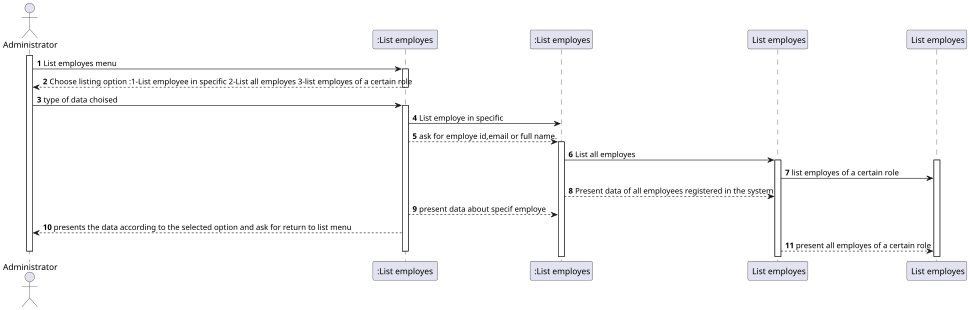
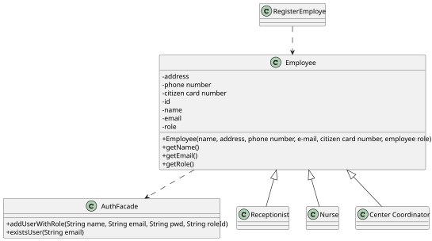

# US 011 - Get a list of employees

## 1. Requirements Engineering

### 1.1. User Story Description

*As an administrator, I intend to get a list of Employees with a given function/role.*

### 1.2. Customer Specifications and Clarifications 

**From the specifications document:**

> _" An Administrator is responsible for properly configuring and managing the core information. 
Eg: Regist Employees (Center coordinator, nurses, receptionists, etc)"_

> " These employes have different role/access in the system.  
> Eg:  Nurse:
>   - Have permission to check  the SNS user health information in accordance with the scheduled  vaccine type;
>   - Update the SNS data in system after vaccine;
>   - In case of any adverse reactions during recovery period the nurse should record the adverse reactions in the system.;
 Recepcionist:
>  - A receptionist registers the arrival of the user to
take the respective vaccine.
>   - If the informations about SNS user schedule is correctly,acknowledges the system that the user is ready to take the vaccine;
>   etc...
> 
> 
**From the client clarifications:**

> **Question**: 
>   Should we give the user (Administrator ) the possibility of listing employees from more than 1 role?
>
>  **Answer**:
> The Administrator should select a given role and all employees associated with the selected role should be listed.

> **Question**:
>  
>  Is the Admin an Employee of a certain(s) Vaccination Center(s)? Or it's just an external entity that has stated responsibilities but it's not connected with the Employee's "crew"?
> 
>  **Answer**:
>   In the project description we get: "The DGS has Administrators who administer the application. Any Administrator uses the application to register centers, SNS users, center coordinators, receptionists, and nurses enrolled in the vaccination process".
The Administrator is the application administrator that ensures the proper functioning of application used by the DGS organization.

### 1.3. Acceptance Criteria
* **AC1:** System administrator can register any employee or any SNS user.
* **AC2:** Each employee must have a single organization role defined in the system. The "auth" component available on the repository must be reused (without modifications).
* **AC3:** All employee attributes must be filled  in the system registration process.
* **AC4:** In addition to the system administrator, the receptionist can also register an SNS user.
*  **AC5:** Different employees can have the same permissions on the system.
### 1.4. Found out Dependencies

* There is a dependency to "US026 Authentication" since a user must be logged in as an administrator.
* There is a dependency to "US010" You can only list employees who are already registered in the system.

### 1.5 Input and Output Data

**Input Data:**

* Typed data:
  * Select a given role.
    
* Selected data:
    * n/a
    
**Output Data:**

* (In) List all employees in a given role.

### 1.6. System Sequence Diagram (SSD)

### 1.7 Other Relevant Remarks

* n/a

## 2. OO Analysis

### 2.1. Relevant Domain Model Excerpt 

### 2.2. Other Remarks

* n/a

## 3. Design - User Story Realization 

### 3.1. Rationale

**The rationale grounds on the SSD interactions and the identified input/output data.**

| Interaction ID | Question: Which class is responsible for... | Answer  | Justification (with patterns)  |
|:-------------  |:--------------------- |:------------|:---------------------------- |
| Step 1  		 |		...assign roles to employes?					 |       administrator      | The system administrator is the only person who assigns permission in the initial process to register a user in the system.                             |
| Step 2  		 |		...	give permission   to user for list employes?				 |  administrator           |     The authentication functionality that was available to us has an "addUser Role" function that allows the administrator to add user permissions on the system.                         |
| Step 3  		 |		... list employes?					 |             administrator/central coordinator|       As an Administrator, whose regist employees ,have the possibility to list all employees, this functionality is shared with another system user also "Center Coordinator" who can also list all employees or made an intelligent search.                        |
| Step 4  		 |		... Update role for employes?					 |      administrator        |               The person responsible for registering an employee in the system is the same person who can change their "permission roles in the system".               |
| Step 5  		 |		...organize a list of employee per "department/role"				 |     administrator        |     The organization of employees by department must be generated from the description/role defined in the employee registration process                         |

### Systematization ##

According to the taken rationale, the conceptual classes promoted to software classes are: 

* Administrator
* Employe

Other software classes (i.e. Pure Fabrication) identified: 
 * Central coordinator

## 3.2. Sequence Diagram (SD)

*In this section, it is suggested to present an UML dynamic view stating the sequence of domain related software objects' interactions that allows to fulfill the requirement.* 

## 3.3. Class Diagram (CD)

*In this section, it is suggested to present an UML static view representing the main domain related software classes that are involved in fulfilling the requirement as well as and their relations, attributes and methods.*

# 4. Tests 
*In this section, it is suggested to systematize how the tests were designed to allow a correct measurement of requirements fulfilling.* 

**_DO NOT COPY ALL DEVELOPED TESTS HERE_**

**Test 1:** Check that it is not possible to create an instance of the Example class with null values. 

	@Test(expected = IllegalArgumentException.class)
		public void ensureNullIsNotAllowed() {
		Exemplo instance = new Exemplo(null, null);
	}

*It is also recommended to organize this content by subsections.* 

# 5. Construction (Implementation)

*In this section, it is suggested to provide, if necessary, some evidence that the construction/implementation is in accordance with the previously carried out design. Furthermore, it is recommeded to mention/describe the existence of other relevant (e.g. configuration) files and highlight relevant commits.*

*It is also recommended to organize this content by subsections.* 

# 6. Integration and Demo 

*In this section, it is suggested to describe the efforts made to integrate this functionality with the other features of the system.*

# 7. Observations

*In this section, it is suggested to present a critical perspective on the developed work, pointing, for example, to other alternatives and or future related work.*

