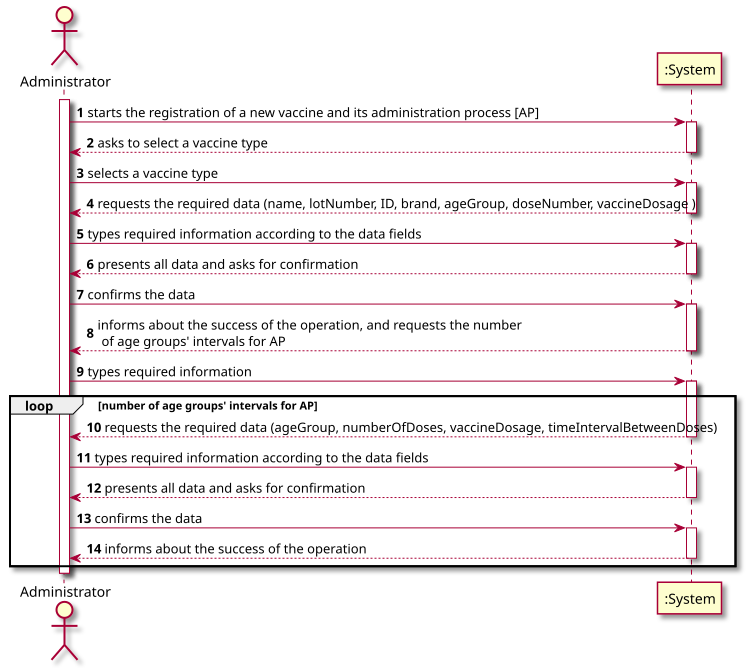
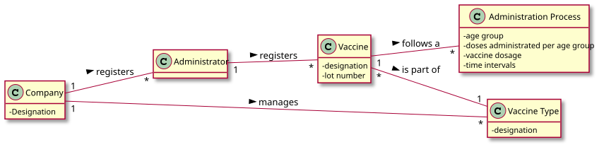
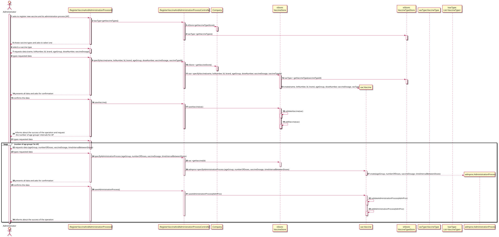
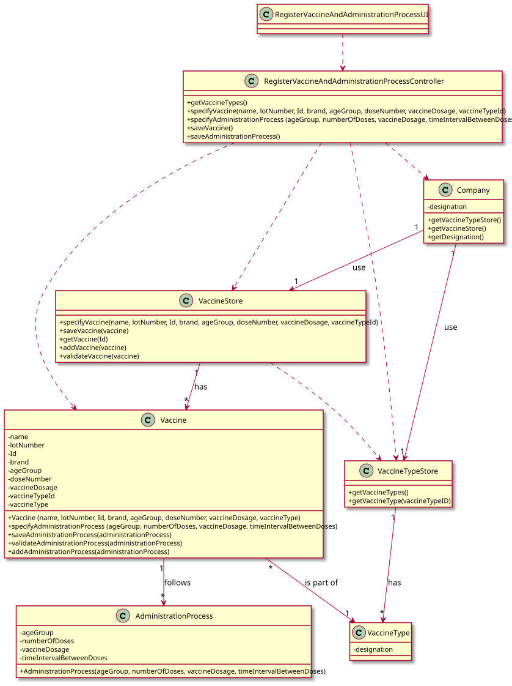

# US 013 - Specify a new vaccine and its administration process

## 1. Requirements Engineering

### 1.1. User Story Description

*As an administrator, I intend to specify a new vaccine and its administration process.*

### 1.2. Customer Specifications and Clarifications

**From the specifications document:**

> "An Administrator is responsible for properly configuring and managing the core information (e.g.:
> type of vaccines, vaccines, vaccination centers, employees) [...]"

> "[...]each type of vaccine, several vaccines might exist, each one
> demanding a distinct administration process."

> "[...]for the Covid-19 type, there is (i) the Pfizer vaccine, (ii) the Moderna vaccine, (iii) the Astra Zeneca
> vaccine, and so on."

> "The vaccine administration process comprises (i) one or more age groups (e.g.: 5 to 12 years old, 13 to 18 years
> old, greater than 18 years old), and (ii) per age group, the doses to be administered (e.g.: 1, 2, 3), the
> vaccine dosage (e.g.: 30 ml), and the time interval regarding the previously administered dose.
> Regarding this, it is important to notice that between doses (e.g.: between the 1st and 2nd doses) the
> dosage to be administered might vary as well as the time interval elapsing between two consecutive
> doses (e.g.: between the 1st and 2nd doses 21 days might be required, while between the 2nd and the
> 3rd doses 6 months might be required)."

**From the client clarifications:**

> **Question**:  
> "After giving the vaccine to the user, each nurse registers the event in the system, more precisely, registers
> the vaccine type (e.g.: Covid-19), vaccine name/brand (e.g.: AstraZeneca, Moderna, Pfizer), and the lot number used.
> Does the lot number follow a certain structure or length? (for example a 10 digit number)"
>
>  **Answer**:  
> "The lot number has five alphanumeric characters an Hyphen and two numerical characters (example: 21C16-05)"

> **Question**:  
> "Which attributes does the Vaccine have (besides the ones refering to the Vaccine Type)?"
>
>  **Answer**:  
> "Each vaccine has the following attributes: Id, Name, Brand, Vaccine Type, Age Group, Dose Number, Vaccine Dosage and
> Time Since Last Dose."

> **Question**:  
> "As to the interval between doses, what time format are we to use? (e.g. days, weeks, months)"
>
> **Answer**:  
> "Number of days."

> **Question**:  
> "We would like to know if when specifying a new Vaccine and its Administration Process, should a list of the existing
> types of vaccines be displayed in order for him to
> choose one, or should he just input it?"
>
> **Answer**:   
> "If the information is available in the system, it is a good practice to present the information to the user and
> ask the user to select."

### 1.3. Acceptance Criteria

* **AC1:** All required fields must be filled in.
* **AC2:** Each vaccine must have a name, a lot number, an ID, a brand, a vaccine type, an age group,
  a dose number, a vaccine dosage and a time since last dose.
* **AC3:** The name field is a string and should have a max length of **60** characters.
* **AC4:** The lot number should have five alphanumeric characters, an Hyphen and two numerical characters (example:
  21C16-05).
* **AC5:** The ID should be an integer.
* **AC6:** The brand field is a string and should have a max length of **60** characters.
* **AC7:** The vaccine type field is a string and should have a max length of **60** characters.
* **AC8:** The age group should be defined as an interval of two integer numbers separated by a comma (example: [20,65])
  .
* **AC9:** The dose number should be an integer.
* **AC10:** The vaccine dosage should be an integer and defined in milliliters [ml].
* **AC11:** Each vaccine must have at least one administration process.
* **AC12:** The administration process must have an age group, number of doses per age group, vaccine doses per age
  group and time intervals between doses.
* **AC13:** The number of doses should be an integer.
* **AC14:** The time since last dose and dosage should be defined for all doses to be administered.
* **AC15:** The time since last dose should be defined in days by an integer number.
* **AC16:** The administration process' dosage should be an integer and defined in milliliters [ml].
* **AC17:** The administration process' age group should be defined as an interval of two integer numbers separated by a
  comma (example: [20,65]).
* **AC18:** For each age group only one administration process should exist.
* **AC19:** When registering a new vaccine that is already registered, the registering operation must fail and the
  administrator should be notified.
* **AC20:** When registering an administration process that is already registered, the registering operation must fail
  and the administrator should be notified.

### 1.4. Found out Dependencies

* There is a dependency to the US012 (Specify a new vaccine type), since a vaccine and its administration process must
  belong to a specific vaccine type.

### 1.5 Input and Output Data

**Input Data:**

* Typed data:
    * name (vaccine)
    * lot number (vaccine)
    * ID (vaccine)
    * brand (vaccine)
    * age group (vaccine)
    * dose number (vaccine)
    * vaccine dosage (vaccine)
    * age group (administration process)
    * number of doses (administration process)
    * vaccine dosage (administration process)
    * time interval between doses (administration process)

* Selected data:
    * vaccine type (vaccine)

**Output Data:**

* (In)Success of the operation

### 1.6. System Sequence Diagram (SSD)

### 1.7 Other Relevant Remarks

n/a

## 2. OO Analysis

### 2.1. Relevant Domain Model Excerpt

### 2.2. Other Remarks

n/a

## 3. Design - User Story Realization

### 3.1. Rationale

**The rationale grounds on the SSD interactions and the identified input/output data.**

| Interaction ID | Question: Which class is responsible for... | Answer  | Justification (with patterns)  |
|:-------------  |:--------------------- |:------------|:---------------------------- |
| Step 1 |... interacting with the actor?| RegisterVaccineAndAdministrationProcessUI | Pure Fabrication: there is no reason to assign this responsibility to any existing class in the Domain Model. |
|   |... coordinating the US? | RegisterVaccineAndAdministrationProcessController |Pure Fabrication: responsible for coordinating and distributing the actions                            |
| 	|... knowing all the vaccines type? | Company     | Information Expert: the object owns the vaccines type store   |
| 	|... has the list of vaccines type? | VaccineTypeStore     | Creator R1/2 |
| 	|... has the information about vaccines types? | VaccineType    | Information Expert: the object knows the vaccines types attributes |
| Step 2  |	 |           |                              |
| Step 3   | ... instantiating a new vaccine? |VaccineStore  | Creator R1/2                         |
|     |... instantiating a new vaccine store? |Company   | Creator R1/2       | 
| 	  |... knowing all the vaccines? | Company     | Information Expert: the object owns the vaccines store   |
| Step 4  |	 |           |                              |
| Step 5  |... saving the typed data?| Vaccine  |Information Expert: the object has its on data       |
| Step 6   |	 |           |                              |
| Step 7  |... validating the data locally? | Vaccine |Information Expert (IE): the object knows its on data     |
|    |... validating the data globally?| VaccineStore | IE: VaccineStore knows all the vaccines objects |
|  	 |... knowing how to add a vaccine? | VaccineStore  |IE: knows all the vaccines objects  |
|  	|... saving all the created data? | Company  |IE: records all the VaccinesStore objects  |
| Step 8  |	 |           |                              |
| Step 9   | ... instantiating a new administration process? |Vaccine  | Creator R1/2      |
| 	  |... knowing all the administration process? | Vaccine     | Information Expert: the object owns all the administration process  |
| Step 10  |	 |           |                              |
| Step 11  |... saving the typed data?| AdministrationProcess  |Information Expert: the object has its on data       |
| Step 12   |	 |           |                              |
| Step 13  |... validating the data locally? | AdministrationProcess |Information Expert (IE): the object knows its on data     |
|    |... validating the data globally?| Vaccine| IE: Vaccine knows all the administration processes objects |
|  	 |... knowing how to add a administration process? | Vaccine |IE: knows all the administration processes  objects  |
|  	|... saving all the created data? | Vaccine  |IE: records all the administration processes objects  |
| Step 14 |... informing the operation success?| RegisterVaccineAndAdministrationProcessUI | IE: responsible for user interaction  |              

### Systematization ##

According to the taken rationale, the conceptual classes promoted to software classes are:

* Company
* VaccineType
* Vaccine
* AdministrationProcess

Other software classes (i.e. Pure Fabrication) identified:

* RegisterVaccineAndAdministrationProcessUI
* RegisterVaccineAndAdministrationProcessController
* VaccineTypeStore
* VaccineStore

## 3.2. Sequence Diagram (SD)

## 3.3. Class Diagram (CD)

# 4. Tests

**Test 1:** Check successfull creation of a vaccine

    @Test
    void testCreationOfNewEmployeeWithAllData() {
        Vaccine vaccine = new Vaccine(designation, lotNumber);
        assertNotNull(vaccine);
    }

**Test 2:** Check that it is not possible to create a vaccine without designation.

    @Test
    void testCreationOfNewVaccineWithoutDesignation() {
        Exception e = assertThrows(IllegalArgumentException.class, () -> {
            Vaccine vaccine = new Vaccine(null, lotNumber);
        });
    }

**Test 3:** Check that it is not possible to create a vaccine without lot number.

    @Test
    void testCreationOfNewVaccineWithoutLotNumber() {
        Exception e = assertThrows(IllegalArgumentException.class, () -> {
            Vaccine vaccine = new Vaccine(designation, null);
        });
    }

# 5. Construction (Implementation)

**Class Vaccine** - Constructor of class Vaccine

    /***
     * Vaccine constructor with all attributes
     * @param designation   - Designation of vaccine
     * @param lotNumber     - Lot number of vaccine
     */
    public Vaccine(String designation, String lotNumber) {
        setDesignation(designation);
        setLotNumber(lotNumber);
    }

# 6. Integration and Demo

*In this section, it is suggested to describe the efforts made to integrate this functionality with the other features
of the system.*

# 7. Observations

*In this section, it is suggested to present a critical perspective on the developed work, pointing, for example, to
other alternatives and or future related work.*

