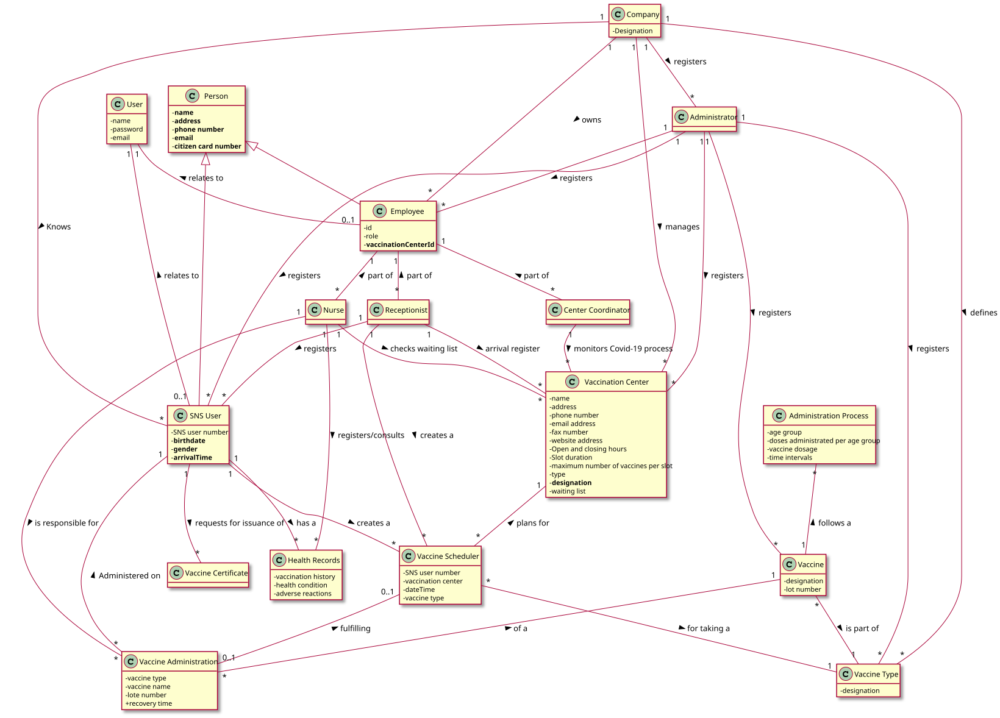

# OO Analysis #

## Rationale to identify domain conceptual classes ##

### _Conceptual Class Category List_ ###

**Business Transactions**

* Vaccine Administration
* Vaccination Certificate
* Vaccination Scheduling
---

**Transaction Line Items**

* Vaccine Type
---

**Product/Service related to a Transaction or Transaction Line Item**

* Vaccine
---

**Transaction Records**

* Vaccine Administration
* Vaccination Scheduling
* Health Records
---  

**Roles of People or Organizations**

* Administrator
* Company (DGS)
* Coordinator
* Nurse
* Receptionist
* SNS User
* Employees
---

**Places**

* Health Care Center
* Mass Vaccination Center
* Vaccination Center
---

**Noteworthy Events**

* SNS Users Check-in
* Vaccination Certificate
* Vaccine Administration
* Vaccine Scheduling
* Health Records
---

**Physical Objects**

* Health Care Centers
* Mass Vaccination Center
* Vaccination Certificate
* Vaccine
* Vaccination Center
---

**Descriptions of Things**

* Vaccine
* Vaccine Type
---

**Catalogs**

*  Vaccine Administration Instructions
---

**Containers**

* Health Care Centers
* Mass Vaccination Center
* Vaccination Center
---

**Elements of Containers**

* Users
* Vaccine
* Employees
---

**Organizations**

*  Company (DGS)
---

**Other External/Collaborating Systems**

*  n/a
---

**Records of finance, work, contracts, legal matters**

* Health Records
---

**Financial Instruments**

*  n/a
---

**Documents mentioned/used to perform some work/**

* Vaccine Administration Instructions
* Reports
---

###**Rationale to identify associations between conceptual classes**

| Concept (A) 		|  Association   	|  Concept (B) |
|----------	   		|:-------------:	|------:       |
| Administrator | registers | Employees (Receptionist, Coordinator, Nurse) |
| Administrator | registers | Vaccination Centers (HealthCareCenter, Mass….) |
| Administrator | registers | Vaccine Type |
| Administrator | registers | Vaccine |
| Administrator| registers | SNS User |
| Company (DGS) | registers | Administrator |
| Company (DGS) | manages | Vaccination Centers (Mass and Health care |
|Company (DGS)|knows|SNS User|
|Company (DGS)|owns|Employees|
|Company (DGS)|defines|Vaccine Type|
| Center Coordinator | is a | Employee |
| Center Coordinator | monitors | Vaccination Center |
| Employee | relates to | User |
| Health Care Center | is a  | Vaccination Center |
| Nurse | is a | Employee |
| Nurse | is responsible for | Vaccine Administration |
| Nurse | registers/consults | Health Records|
| Mass Vaccination Center | is a  | Vaccination Center |
| Receptionist | is a| Employee |
| Receptionist | registers | SNS User |
| Receptionist | creates a | Vaccine Scheduling |
| SNS User | creates a | Vaccine Scheduling |
| SNS User | requests for issuance of | Vaccination Certificate |
| SNS User | has | Health Records |
| SNS User | relates to | User |
| Vaccine | is part of | Vaccine Type |
| Vaccine | follows | Administration Process |
| Vaccine Administration | of | Vaccine |
| Vaccine Administration | administered on | SNS User |
| Vaccine Administration | fulfills | Vaccine Scheduling |
| Vaccine Scheduler | for taking a | Vaccine Type |
| Vaccine Scheduler | plans for | Vaccination Center |

## Domain Model

