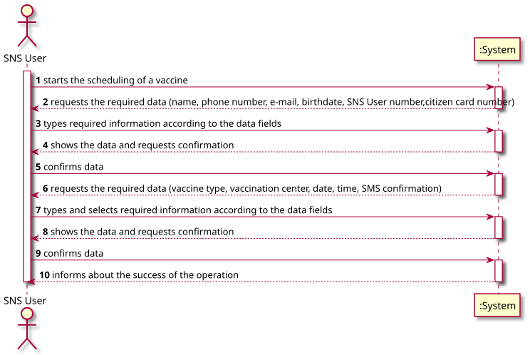
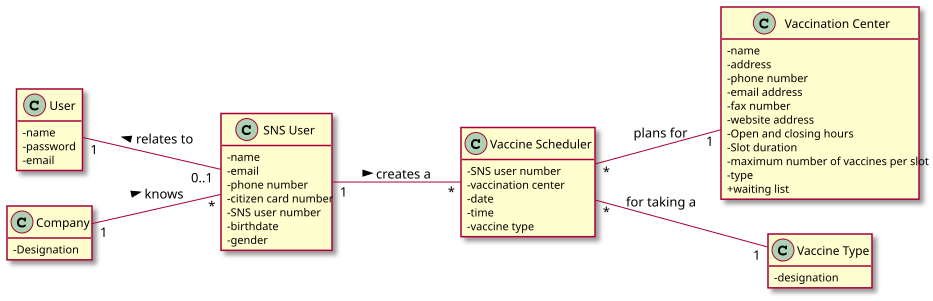
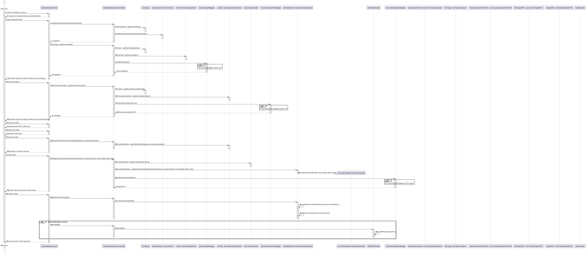
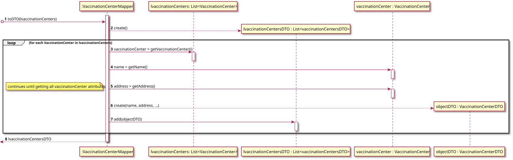
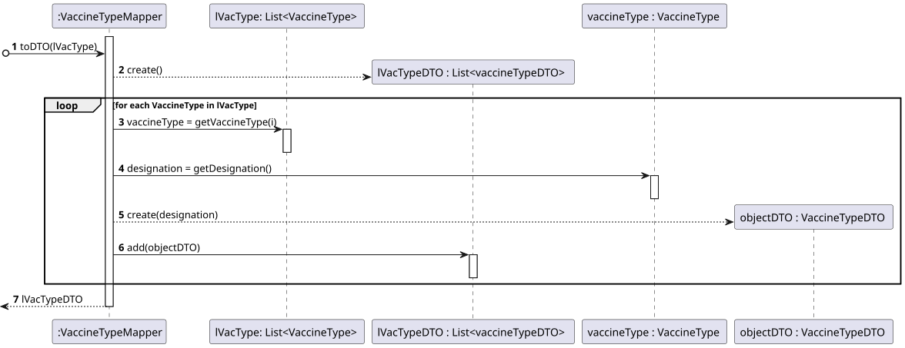
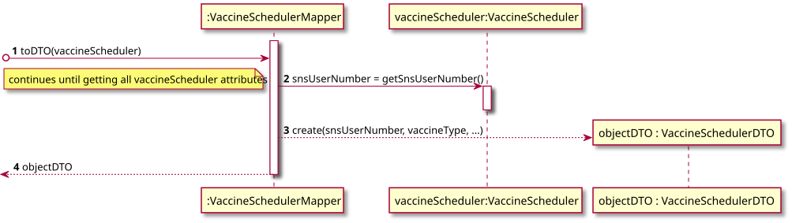
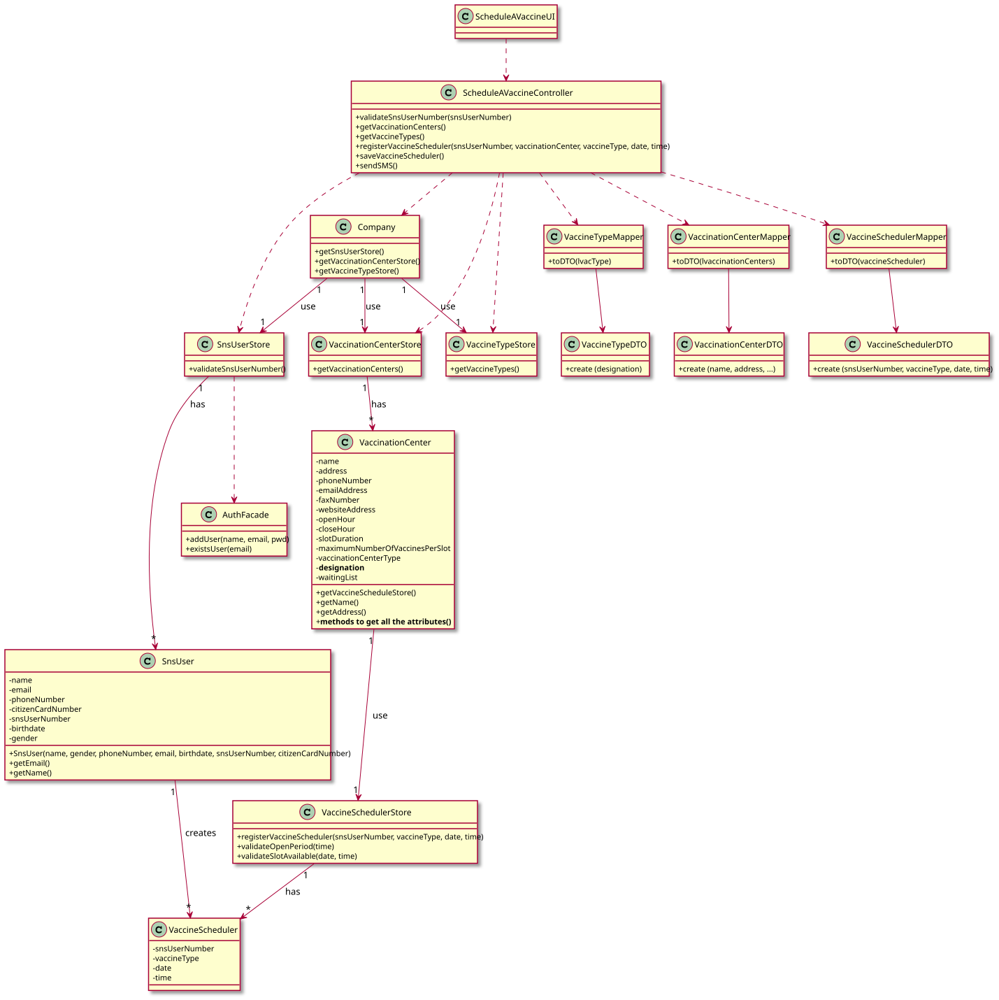

# US 001 - Schedule a vaccine

## 1. Requirements Engineering

### 1.1. User Story Description

*As an SNS user, I intend to use the application to schedule a vaccine.*

### 1.2. Customer Specifications and Clarifications

**From the specifications document:**

> "[...] to allow SNS users to schedule a vaccine and obtain a vaccination certificate."

> "To take a vaccine, the SNS user should use the application to schedule his/her vaccination."

> "Some users (e.g.: older ones) may want to go to a healthcare center to schedule the
vaccine appointment with the help of a nurse."

> "The user should introduce his/her SNS user number, select the vaccination center, the date, and the time (s)he
wants to be vaccinated as well as the type of vaccine to be administered (by default, the system
suggests the one related to the ongoing outbreak). Then, the application should check the
vaccination center capacity for that day/time and, if possible, confirm that the vaccination is
scheduled and inform the user that (s)he should be at the selected vaccination center at the
scheduled day and time. The SNS user may also authorize the DGS to send a SMS message with
information about the scheduled appointment. If the user authorizes the sending of the SMS, the
application should send an SMS message when the vaccination event is scheduled and registered in
the system."

**From the client clarifications:**

> **Question**:  
> "Regarding the US01 - Should the app ask for the location where the SNS User would like to take his vaccine or should it rather suggest a vaccination center for the SNS User to go, based on the timetable chosen by the SNS User?"  
> **Answer**:   
> The application should ask for a location where the SNS User wants to take the vaccine."

> **Statement of clarification**:  
> In a previous message I said: "The acceptance criteria for US1 and US2
> are: a. A SNS user cannot schedule the same vaccine more than once. b.
> The algorithm should check if the SNS User is within the age and time
> since the last vaccine".  
> We can always prepare a system for these two acceptance criteria. Even so,
> as we are in the final stage of Sprint C, we will drop the acceptance
> criteria b ( The algorithm should check if the SNS User is within the
> age and time since the last vaccine). This acceptance criteria will be
> included in Sprint D.

### 1.3. Acceptance Criteria

* **AC1:** All required fields must be filled in and/or selected. 
* **AC2:** The SNS User must be logged in to schedule a vaccine. 
* **AC3:** The SNS user number must have 9 digits of type long.
* **AC4:** The schedule date must be in the dd/mm/yyyy format.
* **AC5:** The schedule time must be in the hh:mm am/pm format.
* **AC6:** The type of vaccine must be previously inserted on the system.
* **AC7:** By default, the system suggests the one related to the ongoing outbreak
* **AC8:** The vaccination center must be previously inserted on the system.
* **AC9:** The application must check the conditions of time since previous vaccine (applicable only if not the first vaccine of certain type). 
* **AC10:** The SNS user must select if allows or not the SMS confirmation to be sent. 
* **AC11:** A SNS user cannot schedule the same vaccine more than once.
* **AC12:** A SNS user must schedule a vaccine in one available slot.
* **AC13:** The vaccine schedule time must be valid between the open and close time of vaccination center. 

### 1.4. Found out Dependencies

* There is a dependency to the US012 (Specify a new vaccine type), since it is one of the mandatory fields.
* There is a dependency to the US009 (Register vaccination center), since it is one of the mandatory fields.
* There is a dependency to the US003 (Register an SNS user) or the US014 (Load CSV list of SNS users), as the the SNS users need to be added to the system before scheduling a vaccine. 

### 1.5 Input and Output Data

**Input Data:**

* Typed data:
    * SNS user number
    * Scheduling date
    * Scheduling time
    
* Selected data:
    * Vaccination center
    * Vaccine type
    * SMS confirmation
    
**Output Data:**

* (In)Success of the scheduling operation
* SMS confirmation upon SNS user selection

### 1.6. System Sequence Diagram (SSD)

### 1.7 Other Relevant Remarks

* SNS User Number should be unique for each SNS user.
* SNS User can only schedule a vaccine of the same type one at a time. 
* SNS User can only schedule a vaccine for himself/herself.

## 2. OO Analysis

### 2.1. Relevant Domain Model Excerpt

### 2.2. Other Remarks

n/a 

## 3. Design - User Story Realization 

### 3.1. Rationale

**The rationale grounds on the SSD interactions and the identified input/output data.**

| Interaction ID | Question: Which class is responsible for... | Answer  | Justification (with patterns)  |
|:-------------  |:--------------------- |:------------|:---------------------------- |
| Step 1  		 |... interacting with the actor?| ScheduleAVaccineUI | Pure Fabrication: there is no reason to assign this responsibility to any existing class in the Domain Model. |
|                |... coordinating the US? | ScheduleAVaccineController |Pure Fabrication: responsible for coordinating and distributing the actions.                          |
|                |... instantiating a Sns User Store? | Company   | Creator R1/2       |
|                |... knows the SNS User number ? | SnsUser | IE: the object knows its own data
| Step 2  		 |	 |           |                              |
| Step 3  		 |... knowing all the Sns users | SnsUserStore |Information Expert (IE): the class owns all the Sns users profiles and data
|                |... validating the data locally? | SnsUser |Information Expert (IE): the object owns its data 
|                |... validating the data globally?| SnsUserStore | IE: SnsUserStore knows all the SNS Users objects |
|                |... instantiating the Vaccination Center Store? | Company   | Creator R1/2       |
|                |... instantiating the Vaccination Center? | VaccinationCenterStore   | Creator R1/2       |
|                |... knowing all the Vaccination Centers? | Company   | IE: The company knows all the objects contained on Vaccination Center Store      |
|                |... instantiating the Vaccine Type Store? | Company   | Creator R1/2       |
|                |... instantiating the Vaccine Type ? | VaccineTypeStore   | Creator R1/2       |
|                |... knowing all the vaccine types | Company | IE: The company knows all the objects contained on Vaccine Type Store
| Step 4  		 | | | |
| Step 5  		 |... interacting with the actor?| ScheduleAVaccineUI | Pure Fabrication: there is no reason to assign this responsibility to any existing class in the Domain Model. |
| Step 6         | | | |
| Step 7         |... instantiating a new Vaccine Schedule Store? | VaccinationCenter  | Creator R1/2                          |
|                |... responsible for validating the attributes of Vaccine Schedule | VaccineScheduleStore | IE: The class owns the data of the objects
|                |... instantiating a new Vaccine Schedule? | VaccineScheduleStore  | Creator R1/2                         |
| Step 8         | | | |
| Step 9         |... validating the data globally?| VaccineScheduleStore   |Information Expert: the class has all the data of objects |
|       		 |... saving the data globally?| VaccineScheduleStore   |Information Expert: the class has all the data of objects       |
|       		 |... saving the data locally?| VaccineSchedule    |Information Expert: the object has its on data       |
|                |... instantiating a new SMS confirmation? | SnsUser   | Creator R1/2       |
|                |... sending the SMS confirmation? | SmsNotification | IE: The class has the method responsible to send the SMS confirmation |
| Step 10        |... informing the operation success?| RegisterSnsUserUI | IE: responsible for user interaction  | 

### Systematization ##

According to the taken rationale, the conceptual classes promoted to software classes are: 

 * Company
 * SnsUser
 * VaccinationCenter
 * VaccineSchedule
 * SmsNotification

Other software classes (i.e. Pure Fabrication) identified: 

 * ScheduleAVaccineUI  
 * ScheduleAVaccineController
 * SnsUserStore
 * VaccineScheduleStore
 * VaccineTypeStore
 * VaccinationCenterStore

## 3.2. Sequence Diagram (SD)

**Global**

**Ref SD_VaccinationCenterMapper_toDTO_List**

**Ref SD_VaccineTypeMapper_toDTO_List**

**Ref SD_VaccineSchedulerMapper_toDTO_Object**

## 3.3. Class Diagram (CD)

# 4. Tests 
*In this section, it is suggested to systematize how the tests were designed to allow a correct measurement of requirements fulfilling.* 

**_DO NOT COPY ALL DEVELOPED TESTS HERE_**

# 5. Construction (Implementation)

**Class Vaccination Center Mapper ** - Constructor of class mapper

    /***
    public class VaccinationCenterMapper {

    public VaccinationCenterMapper() {
    }

    public List<VaccinationCenterDTO> toDTO(List<VaccinationCenter> lVaccinationCenters) {

        List<VaccinationCenterDTO> lVaccinationCentersDTO = new ArrayList<>();

        for(VaccinationCenter obj : lVaccinationCenters) {

            String name = obj.getName();
            int id = obj.getVaccinationCenterId();
            String vaccinationCenterType = obj.getVaccinationCenterType();

            lVaccinationCentersDTO.add(new VaccinationCenterDTO(name, vaccinationCenterType, id));

        }
        return lVaccinationCentersDTO;
    }

}

**Class Vaccination Center DTO ** - Constructor of DTOs

    /***

    public class VaccinationCenterDTO {

    private String name;

    private String vaccinationCenterType;

    private int vaccinationCenterID;

    public VaccinationCenterDTO(String name, String vaccinationCenterType, int id) {
        this.name = name;
        this.vaccinationCenterType = vaccinationCenterType;
        this.vaccinationCenterID = id;
    }

    public String getName() {
        return this.name;
    }

    public String getVaccinationCenterType() {
        return vaccinationCenterType;
    }

    public int getVaccinationCenterId() {
        return this.vaccinationCenterID;
    }

    public String toString() {
        return String.format("Name: %s", this.getName());
    }

    }

# 6. Integration and Demo 

*In this section, it is suggested to describe the efforts made to integrate this functionality with the other features of the system.*

# 7. Observations

*In this section, it is suggested to present a critical perspective on the developed work, pointing, for example, to other alternatives and or future related work.*

