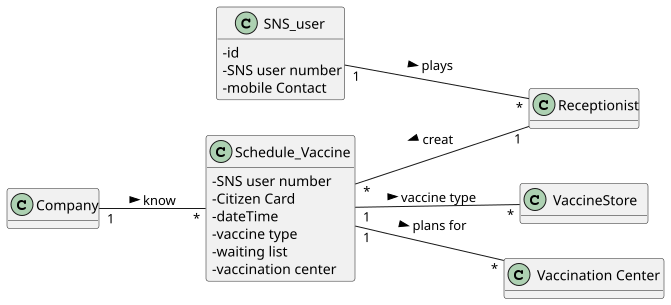
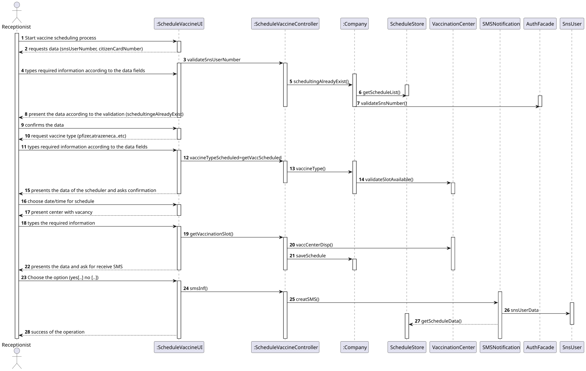
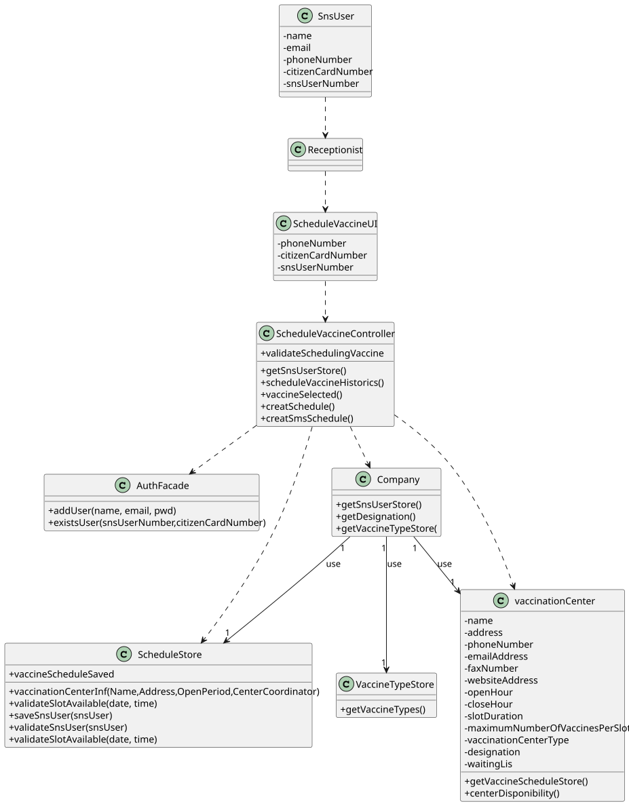

# US 002 - Schedule a vaccine

## 1. Requirements Engineering

### 1.1. User Story Description

*As a receptionist at one vaccination center, I want to schedule a vaccination.*

### 1.2. Customer Specifications and Clarifications 

**From the specifications document:**
> "A receptionist is the "first person" the user has direct contact with when the user arrives  vaccination center.
The receptionist asks the user for his/her data to "check in" the system and confirm that he/she is able to proceed with the vaccination process.  
> Eg1: When the SNS user arrives at the vaccination center, a receptionist registers the arrival of the user to
take the respective vaccine"  
> Eg2: The receptionist asks the SNS user for his/her SNS user number and
confirms that he/she has the vaccine scheduled for the that day and time. If the information is
correct, the receptionist acknowledges the system that the user is ready to take the vaccine. Then,
the receptionist should send the SNS user to a waiting room where

**From the client clarifications:**
> **Question**:
>  When a receptionist schedules a vaccination for an SNS user, should they be presented with a list of available vaccines (brands, that meet acceptance criteria) from which to choose? Or should the application suggest only one? 
**Answer**:
> The receptionist do not select the vaccine brand.
When the user is at the vaccination center to take the vaccine, the nurse selects the vaccine.

### 1.3. Acceptance Criteria
* **AC1:** The algorithm should check if the SNS User is within the age and time since the last vaccine.
* **AC2:** The receptionist can only schedule the vaccine for users who have an SNS number.
* **AC3:** SNS User number is an integer type with a maximum of **9** digits length.
* **AC4:** When it is intended to schedule a vaccine, if it already exists in the system, the operation must fail and the user must be notified.
* **AC5:** The receptionist presents different types of vaccine and he snsUser must choose one to be schedule
* **AC6:** The system must confirm the capacity of the vaccination center for the date on which the vaccine is to be scheduled.
* **AC7:** If the scheduling process is successfully completed, the system should show a notification about the completed task.
* **AC8:** The receptionist can ask the user if he would like to receive SMS with information about the appointment, if yes, the application must send a message with the data of the appointment successfully executed.
* **AC9:** The system cannot permit the receptionist to schedule the same vaccine more than one time.

### 1.4. Found out Dependencies
* There is a dependency to " US001" the scheduling processes are identical. 
* There is a dependency to "US003" to execute a schedule it is necessary that the user is registered and has an sns user number.

### 1.5 Input and Output Data

**Input Data:**
 * SNS user number
 * Select the date and the time

**Output Data:**

* Notification about the success of the vaccine scheduling process.

### 1.6. System Sequence Diagram (SSD)

### 1.7 Other Relevant Remarks

* n/a

## 2. OO Analysis

### 2.1. Relevant Domain Model Excerpt

### 2.2. Other Remarks

n/a
  
## 3. Design - User Story Realization

### 3.1. Rationale

**The rationale grounds on the SSD interactions and the identified input/output data.**

| Interaction ID | Question: Which class is responsible for... | Answer  | Justification (with patterns)                                                                                                          |
|:-------------  |:--------------------- |:------------|:----------------------------                                                                                                                             |
| Step 1  		 |... interacting with the actor?                      |ScheduleVaccineUI        |Pure Fabrication:there is no reason to assign this responsibility to any existing class in the Domain Model.    |
| 		         |... coordinating the US?                             |ScheduleVaccineController|Pure Fabrication:responsible for coordinating and distributing the actions                                      |
|   		     |... instantiating a new vaccine Schedule ?           |ScheduleVaccineStore     |Creator R1/2                                                                                                    |
|  		         |... instantiating a new vaccine Schedule User store? |Company                  |Creator R1/2                                                                                                    |
|   		     |... knowing all Schedule ?                           |Company                  |Information Expert: the object owns the Schedule Vaccine store                                                         |
| Step 2	     |                                                     |                         |                                                                                                                |
| Step 3 		 |... saving the typed data?                           |Schedule                 |Information Expert: the object has its on data                                                                  |
| Step 4 		 |... validating the data locally?                     |Schedule                 |Information Expert (IE): the object knows its own data                                                          |
|          		 |... validating the data globally?                    |ScheduleVaccineStore     |IE: ScheduleVaccineStore knows all the Schedule VaccineS objects                                                |
| Step 5  		 |... saving all the created data?                     |Company                  |IE: records all the Schedule objects                                                                            |
| Step 6  		 | ... informing the operation success?                |ScheduleVaccineUI        |IE: responsible for user interaction                                                                            |

### Systematization ##

According to the taken rationale, the conceptual classes promoted to software classes are:

* Receptionist
* ScheduleVaccine
* Company

Other software classes (i.e. Pure Fabrication) identified:

* ScheduleVaccineUI
* ScheduleVaccineController
* ScheduleVaccineStore

## 3.2. Sequence Diagram (SD)

## 3.3. Class Diagram (CD)

# 4. Tests
**Test 1:** Check that it is not possible to create an instance of the SnsUser class without name.

    @Test
    void testCreationOfNewSnsUserWithoutName() {
      Exception e = assertThrows(IllegalArgumentException.class, () -> {
        SNSUser snsUser =
          new SNSUser(null, email, phoneNumber, citizenCardNumber, snsUserNumber, birthDate, gender);
      });
    }

**Test 2:** Check that it is not possible to create an instance of the SnsUser class without all data.

    @Test
    void testCreationOfNewSnsUserWithAllData() {
        Exception e = assertThrows(IllegalArgumentException.class, () -> {
            SNSUser snsUser =
                    new SNSUser(null, email, phoneNumber, citizenCardNumber, snsUserNumber, birthDate, gender);
        });
    }

# 5. Construction (Implementation)

    /***
    * Scheduling vaccine builder with all sns user attributes
    * @param citizenCardNumber     - Citizen card number 
    * @param phoneNumber           - Phone number 
    * @param email                 - Email 
    * @param snsUserNumber         - SNS user card number
    */

    public remoteSchedule( String email, long phoneNumber, String citizenCardNumber, long snsUserNumber) {

     setEmail(email);
     setPhoneNumber(phoneNumber);
     setCitizenCardNumber(citizenCardNumber);
     setSnsUserNumber(snsUserNumber);

    }