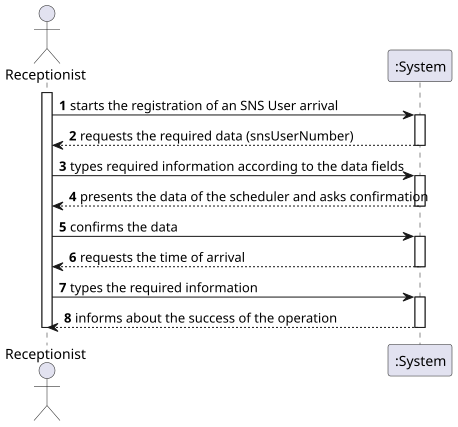
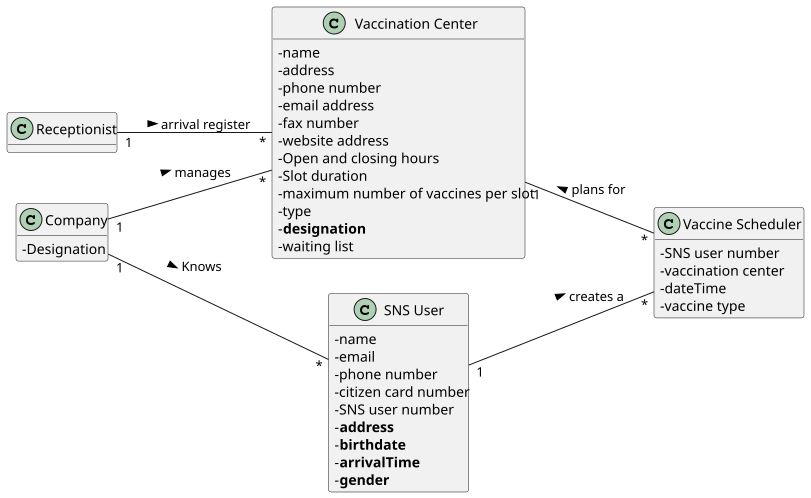
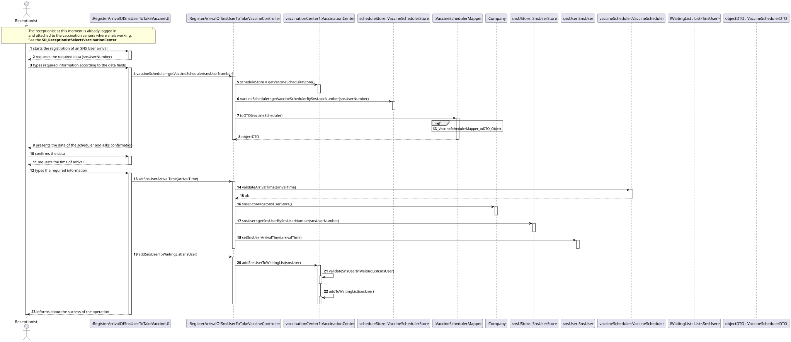
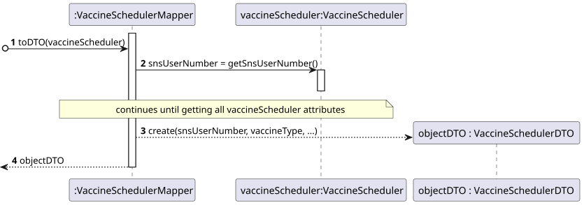
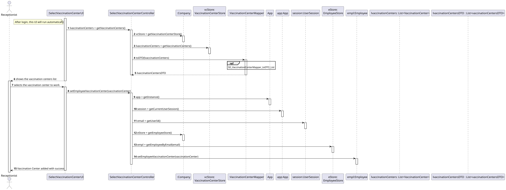
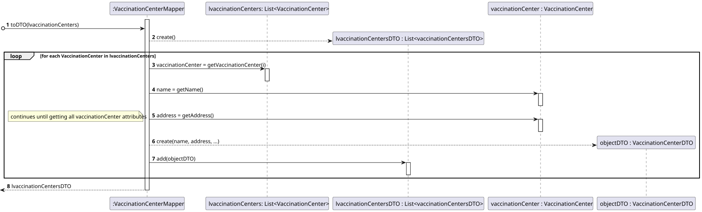
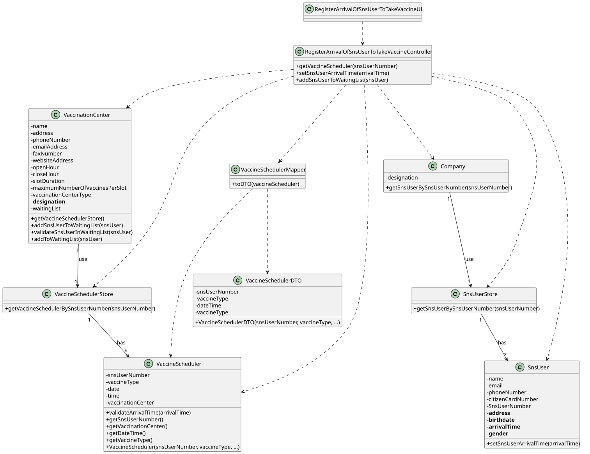

# US 004 - Register the arrival of an SNS user to take the vaccine

## 1. Requirements Engineering

### 1.1. User Story Description

*As a receptionist at a vaccination center, I want to register the arrival of an SNS user to take the vaccine.*

### 1.2. Customer Specifications and Clarifications

**From the specifications document:**

> "When the SNS user arrives at the vaccination center, a receptionist registers the arrival of the user to take the respective vaccine. The receptionist asks the SNS user for his/her SNS user number and confirms that he/she has the vaccine scheduled for that day and time. If the information is correct, the receptionist acknowledges the system that the user is ready to take the vaccine."

> "[...]receptionists and nurses registered in the application will work in the vaccination process. As the allocation of receptionists and nurses to vaccination centers might be complex, by now, the system might assume that receptionists and nurses can work on any vaccination center."

> "Usually, the user that has arrived firstly will be the first one to be vaccinated (like a FIFO queue). However, sometimes, due to operational issues, that might not happen."

**From the client clarifications:**

> **Question**:  
> "Regarding US04, i would like to know what's the capacity of the waiting room."
>
>  **Answer**:  
> "The waiting room will not be registered or defined in the system.
> The waiting room of each vaccination center has the capacity to receive all users who take the vaccine on given slot."

> **Question**:  
> "When the SNS user number is introduce by the receptionist and the system
> has no appointment for that SNS user number, how should the system proceed?"
>
> **Answer**:  
> "The application should present a message saying that the SNS user did not scheduled a vaccination."

> **Question**:  
> "Regarding US04, a receptionist register the arrival of a SNS user immediately when he arrives at the vaccination center or
> only after the receptionist confirms that the respective user has a vaccine schedule for that day and time."
>
> **Answer**:   
> "The receptionist registers the arrival of a SNS user only after confirming that the user has a vaccine scheduled for that day and time."

> **Question**:
> "Regarding US04, what are the attributes needed in order to register
> the arrival of a SNS user to a vaccination center"
>
> **Answer**:
> "The time of arrival should be registered."

> **Question**:
> "When the receptionist registers a SNSUser arrival, should we validate that the vaccination center where the SNS user arrives is the same as
> where the receptionist is currently working? If so, should we allocate receptionists to vaccination centers, i.e., ask the receptionist which vaccination center is she currently working at?"
>
> **Answer**:
> "To start using the application, the receptionist should first select the vaccination center where she is working. The receptionists register the arrival of a SNS user at the vaccination center where she is working."

> **Question**:
> "Regarding US04, the attribute "arrival time" should be considered to let the user enter the waiting room.
> For example, a user that arrives 40 minutes after his appointment wont be allowed to enter the center, and another who only arrives 10 minutes late may proceed. If so, how much compensation time should we provide to the user."
>
>  **Answer**:
> "In this sprint we are not going to address the problem of delays. All arriving users are attended and registered by the receptionist."

### 1.3. Acceptance Criteria

* **AC1:** All required fields must be filled in.
* **AC2:** No duplicate entries should be possible for the same SNS user on the same day or vaccine period.
* **AC3:** The arrival time should be registered on SNS User.
* **AC4:** The arrival time should follow the time format according to the 12-hour notation, in the form hh:mm am/pm.
* **AC5:** The date and time of the schedule should be verified on the arrival of an SNS User.
* **AC6:** The arrival time should be at the time of the scheduler or in the previous slot if it's not full.
* **AC7:** When SNS User didn't have a vaccine scheduler for that day and time the system should present a message
  informing that.
* **AC8:** The receptionist when logged in the system should be associated to a vaccination center.
* **AC9:** The SNS Users must be organized in accordance with a FIFO list on the system after they arrive.

### 1.4. Found out Dependencies

* There is a dependency to the US001 or US002, since there have to be schedulers in the system.
* There is a dependency to the US009, since there have to be vaccination centers registered in the system.
* There is a dependency to the US010, since there have to be receptionists registered in the system.
* There is a dependency to the US003 or US014, since there have to be SNS users registered in the system.

### 1.5 Input and Output Data

**Input Data:**

* Typed data:
    * Sns User Number
    * Time of arrival

* Selected data:
    * n/a

**Output Data:**

* (In)Success of the operation

### 1.6. System Sequence Diagram (SSD)

### 1.7 Other Relevant Remarks

* Each receptionist should work at a specific vaccination center

## 2. OO Analysis

### 2.1. Relevant Domain Model Excerpt

### 2.2. Other Remarks

n/a

## 3. Design - User Story Realization

### 3.1. Rationale

**The rationale grounds on the SSD interactions and the identified input/output data.**

| Interaction ID | Question: Which class is responsible for... | Answer  | Justification (with patterns)  |
|:-------------  |:--------------------- |:------------|:---------------------------- |
| Step 1 |... interacting with the actor?| RegisterArrivalOfSnsUserToTakeVaccineUI | Pure Fabrication: there is no reason to assign this responsibility to any existing class in the Domain Model. |
|   |... coordinating the US? | RegisterArrivalOfSnsUserToTakeVaccineController |Pure Fabrication: responsible for coordinating and distributing the actions                            |
| Step 2  |	 |           |                              |
| Step 3 |... knowing all the vaccination centers? | Company    | Information Expert: the object owns the vaccination centers stores   |
| 	|... instantiating a new vaccine scheduler store? | VaccinationCenter  | Creator R1/2  |
| 	  |... knowing all the vaccine scheduler store? | VaccinationCenter     | Information Expert: the object owns the vaccine scheduler store  |
| 	|... has the list of vaccines schedulers? | VaccineSchedulerStore   | Creator R1/2 |
| 	  |... coordinate the assembly of a data transfer object? | VaccineSchedulerMapper    | Pure Fabrication: there is no reason to assign this responsibility to any existing class in the Domain Model. |
| 	  |... save the information in domain to be shown to the actor? | VaccineSchedulerDTO    | Pure Fabrication: there is no reason to assign this responsibility to any existing class in the Domain Model. |
| Step 4  |	  |           |                              |
| Step 5  | ... interacting with the actor?| RegisterArrivalOfSnsUserToTakeVaccineUI | Pure Fabrication: there is no reason to assign this responsibility to any existing class in the Domain Model. |
| Step 6  |	      |           |                              |
| Step 7 |...validating the data locally?| VaccineScheduler  |Information Expert: the object has its on data |
|  |... knowing all the Sns Users? | Company    | Information Expert: the object owns the Sns Users store  |
| 	  |... has the list of Sns Users? | SnsUserStore    | Creator R1/2   |
| 	  |... saving the time of arrival? | SnsUser    | IE: the object knows its on data  |
|   |... validating the data globally? | VaccinationCenter |Information Expert (IE): the object knows its on data (waiting list)|
|  	 |... knowing the waiting list? | VaccinationCenter  |IE: owns the waiting list |
|  	|... saving the SNS User arrival? | VaccinationCenter  |IE: records all the SNS User objects on the waiting room |
| Step 8 |... informing the operation success?| RegisterArrivalOfSnsUserToTakeVaccineUI | IE: responsible for user interaction  |              

### Systematization ##

According to the taken rationale, the conceptual classes promoted to software classes are:

* Company
* VaccinationCenter
* VaccineScheduler
* SnsUser

Other software classes (i.e. Pure Fabrication) identified:

* RegisterArrivalOfSnsUserToTakeVaccineUI
* RegisterArrivalOfSnsUserToTakeVaccineController
* VaccineSchedulerStore
* SnsUserStore
* VaccineSchedulerMapper
* VaccineSchedulerDTO

## 3.2. Sequence Diagram (SD)

**Global**

**Ref SD_VaccineSchedulerMapper_toDTO_Object**

**Ref SD_ReceptionistSelectsVaccinationCenter**

**Ref SD_VaccinationCenterMapper_toDTO_List**

## 3.3. Class Diagram (CD)

# 4. Tests

# 5. Construction (Implementation)

**Class Vaccine Scheduler Mapper ** - Constructor of class mapper

    /***
    public class VaccineSchedulerMapper {

    public VaccineSchedulerMapper() {}

    public List<VaccineSchedulerDTO> toDTO(List<VaccineScheduler> vaccineSchedulers) {
        return vaccineSchedulers
                .stream()
                .map(vaccineScheduler -> new VaccineSchedulerDTO(
                        vaccineScheduler.getSnsUserNumber(),
                        vaccineScheduler.getVaccineTypeDesignation(),
                        vaccineScheduler.getVaccinationCenterName(),
                        vaccineScheduler.getDate(),
                        vaccineScheduler.getSchedulerTime()
                ))
                .collect(Collectors.toList());
    }
    }

**Class Vaccine Scheduler DTO ** - Constructor of DTOs

    /***
    public class VaccineSchedulerDTO {
    private long snsUserNumber;

    private String vaccineTypeDesignation;

    private String vaccinationCenterName;

    private DateCustom date;

    private TimeHour schedulerTime;

    // Constructor
    public VaccineSchedulerDTO(long snsUserNumber, String vaccineTypeDesignation, String vaccinationCenterName, DateCustom date, TimeHour schedulerTime) {
        this.snsUserNumber = snsUserNumber;
        this.vaccineTypeDesignation = vaccineTypeDesignation;
        this.vaccinationCenterName = vaccinationCenterName;
        this.date = date;
        this.schedulerTime = schedulerTime;
    }
    }

# 6. Integration and Demo

*In this section, it is suggested to describe the efforts made to integrate this functionality with the other features
of the system.*

# 7. Observations

*In this section, it is suggested to present a critical perspective on the developed work, pointing, for example, to
other alternatives and or future related work.*

