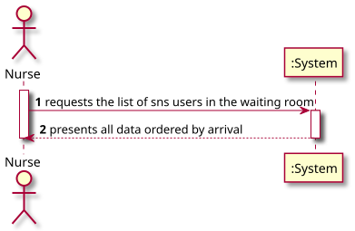
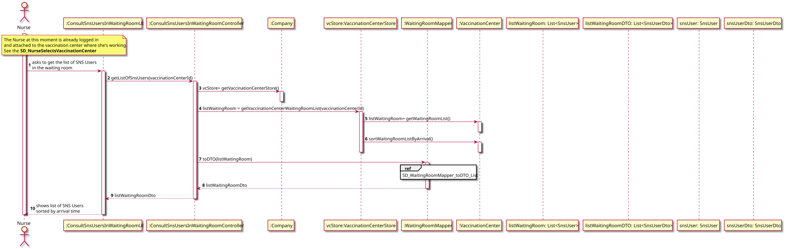
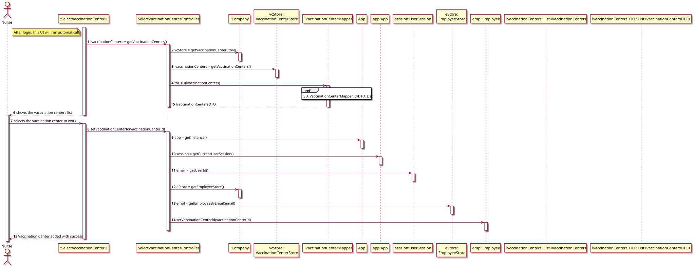
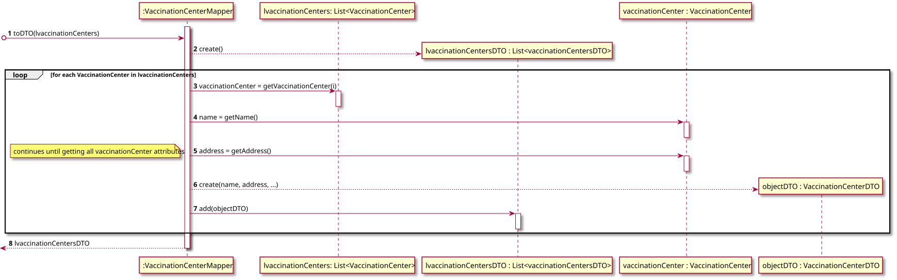
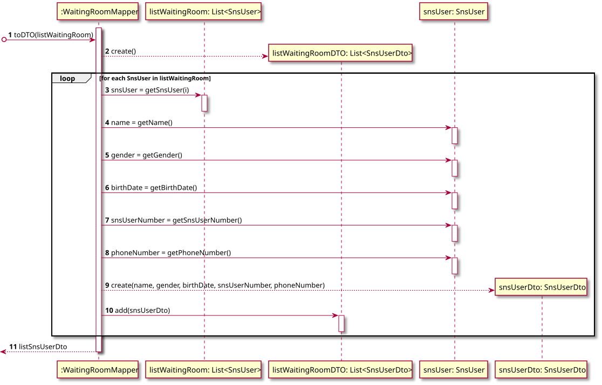
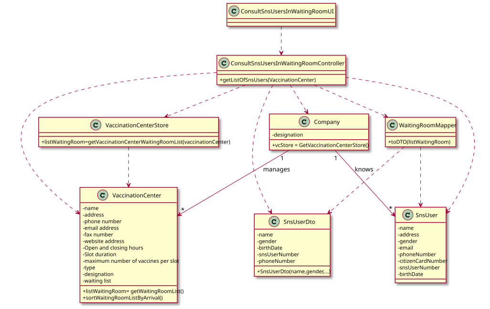

# US 005 - Consult SNS Users in the waiting room

## 1. Requirements Engineering

### 1.1. User Story Description

*As a nurse, I intend to consult the users in the waiting room of a vaccination center.*

### 1.2. Customer Specifications and Clarifications 

**From the specifications document:**

> "At any time, a nurse responsible for administering the vaccine will use the application to check the list of SNS users that are present in the vaccination center to take the vaccine and will call one SNS user to administer him/her vaccine. Usually, the user that has arrived firstly will be the first one to be vaccinated (like FIFO queue). However, sometimes, due to operational issues, that might not happen."

**From the client clarifications:**

> **Question**:  
> "I would like to know which are the attributes of the waiting room."
>
>  **Answer**:  
> "The waiting room will not be registered or defined in the system. The waiting room of each vaccination center has the capacity to receive all users who take the vaccine on given slot."

> **Question**:  
>"We need to know if the nurse have to choose the vaccination center before executing the list or if that information comes from employee file?"
>
> **Answer**:  
>"When the nurse starts to use the application, firstly, the nurse should select the vaccination center where she is working. The nurse wants to check the list of SNS users that are waiting in the vaccination center where she is working.”

> **Question**:  
> "What does consulting constitute in this context? Does it refer only to seeing who is present and deciding who gets the vaccine or is checking the user info to administer the vaccine, registering the process, and sending it to the recovery room also part of this US?" 
> 
> **Answer**:  
>"The goal is to check the list of users that are waiting and ready to take the vaccine."

> **Question**:  
> "In the PI description it is said that, by now, the nurses and the receptionists will work at any center. Will this information remain the same on this Sprint, or will they work at a specific center?"
>
> **Answer**:  
>"Nurses and receptionists can work in any vaccination center."

> **Question**:  
> "The listing is supposed to be for the day itself or for a specific day?"
>
> **Answer**:  
>"The list should show the users in the waiting room of a vaccination center."

> **Question**:  
> "What information about the Users (name, SNS number, etc) should the system display when listing them?"
>
> **Answer**:  
>"Name, Sex, Birth Date, SNS User Number and Phone Number."

### 1.3. Acceptance Criteria

* **AC1:** SNS Users' list should be presented by order of arrival
* **AC2:** SNS Users' list should include the following attributes for each SNS user: Name, Sex, Birth Date, SNS User Number and Phone Number
* **AC3:** It has to previously exist a waiting room list created otherwise there must be launch an error message related to the system user (Nurse)

### 1.4. Found out Dependencies

* Dependency with US004: Waiting room list is filled when an SNS user arrives to a vaccination center, registered and is ready to take the scheduled vaccine.
* Dependency with US009: Vaccination Centers must be previously registered 
* Dependency with US010: Nurses must be registered as System Users - Employees with Nurse role by Administrators

### 1.5 Input and Output Data

**Input Data:**

* Typed data:
  * n/a 
  
* Selected data:
  * n/a
    
**Output Data:**

* SNS Users list which are in the waiting room ordered by arrival

### 1.6. System Sequence Diagram (SSD)

### 1.7 Other Relevant Remarks

* When the nurse starts to use the application, firstly, the nurse should select the vaccination center where she is working.

## 2. OO Analysis

### 2.1. Relevant Domain Model Excerpt

### 2.2. Other Remarks

* n/a

## 3. Design - User Story Realization 

### 3.1. Rationale

**The rationale grounds on the SSD interactions and the identified input/output data.**

| Interaction ID | Question: Which class is responsible for... | Answer  | Justification (with patterns)  |
|:-------------  |:--------------------- |:------------|:---------------------------- |
|Step 1|||
| |... interacting with the actor?|ConsultSnsUsersInWaitingRoomUI|Pure Fabrication: responsible for user interaction for this specific user scenario|
| |... coordinates the US?|ConsultSnsUsersInWaitingRoomController|Pure Fabrication: responsible for coordinating/controlling the flow and distributing the actions for this specific user scenario|
| |... instantiating the class where the waiting room list is stored? |Company|Creator: R1/2|
| |... instantiating a vaccination center?|VaccinationCenterStore|Creator: R1/2|
| |... store the vaccination center list?|VaccinationCenterStore|Information Expert: knows all the vaccination centers|
| |... containing all the SNS Users attributes |SnsUser|Information Expert: has it's owns attributes 
| |... store waiting room list| VaccinationCenter| Information Expert: owns the waiting room
| |... sort waiting room list by arrival?|VaccinationCenter|Information Expert: knows its own data to sort it by a specific attribute|
| |... coordinates DTO operations?|WaitingRoomMapper|Information Expert: responsible for coordinating and distributing the actions at DTO level|
| |... containing all the SNS Users DTO attributes|SnsUserDto|Information Expert: has it's owns attributes
| |... instantiating a new SnsUser DTO List?|WaitingRoomMapper|Creator: R1/2|
| |... instantiating a new SnsUser DTO?|WaitingRoomMapper|Creator: R1/2|
| |... add a new SnsUser DTO to the DTO List?|WaitingRoomMapper|Information Expert: knows all SnsUser DTO objects and owns the SnsUser DTO List|
|Step 2|||
| |... retrieving the requested data|ConsultSnsUsersInWaitingRoomUI|Information Expert:responsible for user interaction|

### Systematization ##

According to the taken rationale, the conceptual classes promoted to software classes are: 

* Company
* VaccinationCenter
* SnsUser
 
Other software classes (i.e. Pure Fabrication) identified: 

 * ConsultSnsUsersInWaitingRoomUI
 * ConsultSnsUsersInWaitingRoomController
 * VaccinationCenterStore
 * WaitingRoomMapper
 * SnsUserDto

## 3.2. Sequence Diagram (SD)

**Global**

**Ref SD_NurseSelectsVaccinationCenter**

**Ref SD_VaccinationCenterMapper_toDTO_List**

**Ref SD_WaitingRoomMapper_toDTO_List**

## 3.3. Class Diagram (CD)

# 5. Construction (Implementation)

**Class WaitingRoomDTO** - Constructor of class WaitingRoomDTO

     /**
     * Method to protect List<SNSUser> listWaitingRoom with DTO
     *
     * @param listWaitingRoom
     * @return
     */
    public List<WaitingRoomDTO> toDTO(List<SNSUser> listWaitingRoom) {

        List<WaitingRoomDTO> listWaitingRoomDTO = new ArrayList<>();

        for(SNSUser obj : listWaitingRoom) {

            String name = obj.getName();
            String gender = obj.getGender();
            DateCustom birthDate=obj.getBirthDate();
            long snsUserNumber=obj.getSnsUserNumber();
            long phoneNumber=obj.getPhoneNumber();

            listWaitingRoomDTO.add(new WaitingRoomDTO(name,gender,birthDate,snsUserNumber,phoneNumber));
        } return listWaitingRoomDTO;
    }

**Class WaitingRoomMapper** - Method of class WaitingRoomMapper

     /**
     * WaitingRoomDTO constructor
     *
     * @param name
     * @param gender
     * @param birthDate
     * @param snsUserNumber
     * @param phoneNumber
     */
    @ExcludeFromJacocoGeneratedReport
    public WaitingRoomDTO(String name,String gender,DateCustom birthDate,long snsUserNumber,long phoneNumber){
        this.name=name;
        this.gender=gender;
        this.snsUserNumber=snsUserNumber;
        this.birthDate=birthDate;
        this.phoneNumber=phoneNumber;
    }

# 6. Integration and Demo 

*In this section, it is suggested to describe the efforts made to integrate this functionality with the other features of the system.*

# 7. Observations

*In this section, it is suggested to present a critical perspective on the developed work, pointing, for example, to other alternatives and or future related work.*

