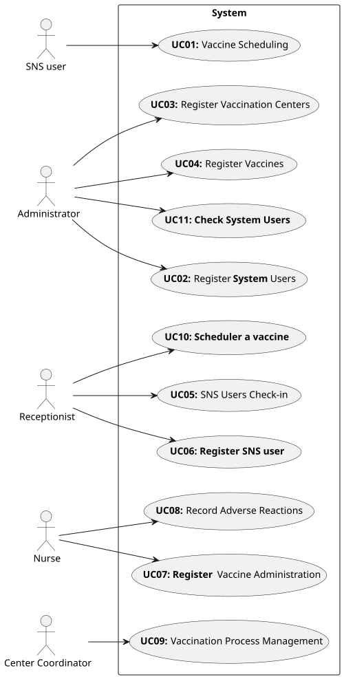

# Use Case Diagram (UCD)

# Use Cases / User Stories
| UC/US  | Description                                                               |                   
|:----|:------------------------------------------------------------------------|
| **UC01/US001** | [**Schedule a vaccine**](SprintD/US/US001/US001_ScheduleAVaccine.md) |
| **UC02/US010** | [**Register employees**](SprintD/US/US010/US010_RegisterEmployee.md)  |
| **UC02/US014** | [**Load set of users from CSV file**](SprintD/US/US014/US014_LoadSetOfUsersFromCSV.md)  |
| **UC03/US009** | [**Register vaccination centers**](SprintD/US/US009/US009_RegisterVaccinationCenters.md)  |
| **UC04/US013** | [**Specify a new vaccine and its administration process**](SprintD/US/US013/US013_SpecifyVaccineAndItsAdministrationProcess.md) |
| **UC04/US012** | [**Specify Vaccine Type**](SprintD/US/US012/US012_UCD.puml)  |
| **UC05/US004** | [**Register the arrival of an SNS user to take the vaccine**](SprintD/US/US004/US004_RegisterTheArrivalOfSNSUserToTakeAVaccine.md)  |
| **UC06/US003** | [**Register SNS User**](SprintD/US/US003/US003_RegisterSNSUser.md)  |
| **UC07/US005** | [**Consult SNS Users in the waiting room**](SprintD/US/US005/US005_ConsultSnsUsersInWaitingRoom.md)  |
| **UC07/US008** | [**Record the administration of a vaccine**](SprintD/US/US008/US008_RecordAdministrationOfAVaccineToSnsUser.md)  |
| **UC09/US015** | [**Check and export vaccination statistics**](SprintD/US/US015/US015_CheckAndExportVaccinationStatistics.md)  |
| **UC09/US016** | [**Analyse the Performance of a Center**](SprintD/US/US016/US016_AnalyseThePerformanceOfaVaccinationCenter.md)  |
| **UC09/US017** | [**Import data from a legacy system**](SprintD/US/US017/US017_ImportDataFromALegacySystem.md)  |
| **UC10/US002** | [**Schedule a vaccine**](SprintD/US/US002/US002.MD)  |
| **UC11/US011** | [**Get a list of employees**](SprintD/US/US011/US011_GetAListOfEmployees.md)  |
