# US 008 - Record the administration of a vaccine

## 1. Requirements Engineering

### 1.1. User Story Description

*As a nurse, I want to record the administration of a vaccine to an SNS user.*

### 1.2. Customer Specifications and Clarifications 

**From the specifications document:**
> "Furthermore, receptionists and nurses registered in the application will work in the vaccination process."

> "At any time, a nurse responsible for administering the vaccine will use the application to check the
list of SNS users that are present in the vaccination center to take the vaccine and will call one SNS
user to administer him/her the vaccine."

> "The nurse checks the user info and health conditions in the system and in accordance with
the scheduled vaccine type, and the SNS user vaccination history, (s)he gets system instructions
regarding the vaccine to be administered (e.g.: vaccine and respective dosage considering the SNS
user age group)."

> "After giving the vaccine to the user, each nurse registers the event in the system,
more precisely, registers the vaccine type (e.g.: Covid-19), vaccine name/brand (e.g.: Astra Zeneca,
Moderna, Pfizer), and the lot number used. Afterwards, the nurse sends the user to a recovery room,
to stay there for a given recovery period (e.g.: 30 minutes)."

> "If the nurse identifies any adverse reactions during that recovery period, the nurse should record the 
adverse reactions in the system." 

> "Only the nurses are allowed to access all user’s health data."

**From the client clarifications:**
> **Question**:  
> "To access the user info - scheduled vaccine type and vaccination history -, should the nurse enter user's SNS number?"
>
> **Answer**:  
> "The nurse should select a SNS user from a list of users that are in the center to take the vaccine."

> **Question**:  
> "Supposing that the SNS user has already received a dose of a given vaccine type (for example, COVID-19), the user can only receive the same vaccine or a different one with the same vaccine type?"
> 
>  **Answer**:  
> "The SNS user can only receive the same vaccine.  
> Related information:  
>- A SNS user is fully vaccinated when he receives all doses of a given vaccine.  
>- A SNS user that has received a single-dose vaccine is considered fully vaccinated and will not take more doses.  
>- A SNS user that is fully vaccinated will not be able to schedule a new vaccine of the type for which he is already fully vaccinated."

> **Question**:  
> "1: The system displays the list of possible vaccines to be administered (considering the age group of the user); then the nurse selects the dose she is going to administer and gets information about the dosage. But wouldn't it be more correct, since the system knows the vaccination history, in other words, if the user has already take x dose(s) of that vaccine, to simply show the dose and the respective dosage and not ask for the nurse to arbitrarily select it?"
>
> **Answer**:  
> "If it is the first dose, the application should show the list of possible vaccines to be administered. If is is not a single dose vaccine, when the SNS user arrives to take the vaccine, the system should simply show the dose and the respective dosage."

> **Question**:  
> "After giving the vaccine to the user, how should the nurse register the vaccine type? by the code?"
>
> **Answer**:  
> "A vaccine is associated with a given vaccine type. Therefore, there is no need to register the vaccine type.
Moreover, the nurse should also register the vaccine lot number (the lot number has five alphanumeric characters an hyphen and two numerical characters (example: 21C16-05))."

> **Question**:  
> "As we can read in Project Description, the vaccination flow follows these steps: 
> 1. Nurse calls one user that is waiting in the waiting room to be vaccinated;  
> 2. Nurse checks the user's health data as well as which vaccine to administer; 
> 3. Nurse administers the vaccine and registers its information in the system.  
> The doubt is: do you want US08 to cover steps 2 and 3, or just step 3?"
>
> **Answer**:  
> 1. The nurse selects a SNS user from a list. 
> 2. Checks user's Name, Age and Adverse Reactions registered in the system. 
> 3. Registers information about the administered vaccine."

> **Question**:  
> "Regarding the recovery period, how should we define it? Is it the same for all vaccines or should the nurse specify in each case what the recovery time is?"
>
> **Answer:**  
> "The recovery period/time is the same for all vaccines. The recovery period/time should be defined in a configuration file."

> **Question**:  
> "1: Is the nurse responsible for registering in the system the recovery period?  
> 2: If there are no adverse reactions detected/registered, after the given recovery period, the system notifies the user that his/her recovery period has ended, right?  
> 3: If there are adverse reactions detected/registered, the system should not do anything additional?"
>
> **Answer**:  
> "1- No. The recovery period starts automatically after registering the administration of a given vaccine.  
> 2 and 3- US7 and US 8 are independent user stories."

> **Question:**  
> "Previously the client answered that: 1. The nurse selects a SNS user from a list. 2. Checks user's Name, Age and Adverse Reactions registered in the system."
> However, our group has five members and the US07: Register an adverse reaction is not obligatory to be implemented. So, with this in mind we would like to know if we, in step 2, should only show the Name and the Age or other information.
>
> **Answer:**  
> "If your team does not implement US7, then you should show a message saying "No Adverse Reactions registered in the system".

> **Question:**  
> "In US 08 says: "At the end of the recovery period, the user should receive a SMS message informing the SNS user that he can leave the vaccination center." How should the SNS user receive and have access to the SMS message?"
>
> **Answer:**  
> "A file named SMS.txt should be used to receive/record the SMS messages. We will not use a real word service to send SMSs."

### 1.3. Acceptance Criteria
* **AC1:** The nurse should be able to access at any time to the waiting room list and select one sns user to administrate the vaccine
* **AC2:** The nurse must check the selected sns user info and health conditions registered in the system, namely the sns user name, age and adverse reactions
* **AC3:** Regarding the adverse reactions records we should show a message saying "No Adverse Reactions registered in the system"
* **AC4:** In accordance with the scheduled vaccine type, and the SNS user vaccination history, the Nurse gets system instructions regarding the vaccine to be administered (e.g.: vaccine and respective dosage considering the SNS user age group)."
* **AC5:** The SNS user can only receive the same vaccine if there's any related vaccination history. Related information: 1. A SNS user is fully vaccinated when he receives all doses of a given vaccine; 2. A SNS user that has received a single-dose vaccine is considered fully vaccinated and will not take more doses; 3. A SNS user that is fully vaccinated will not be able to schedule a new vaccine of the type for which he is already fully vaccinated."
* **AC6:** The nurse must select a vaccine lot number do administer to sns user. The vaccine list is already filtered by the system according to the previous acceptance criteria AC4 and AC5 
* **AC7:** The nurse asks the system the vaccine dosage for that combined vaccine information and sns user vaccination history (namely step dose) and age
* **AC8:** After giving the vaccine to the user, each nurse registers the event in the system and types the vaccine administration hour (hh:mm am/pm)
* **AC9:** A vaccine is associated with a given vaccine type. Therefore, there is no need to register the vaccine type. Moreover, the nurse should also register the vaccine lot number (the lot number has five alphanumeric characters an hyphen and two numerical characters (example: 21C16-05))
* **AC10:** After the vaccine administration act, the nurse sends the user to a recovery room, to stay there for a given recovery period (e.g.: 30 minutes)
* **AC11:** The recovery period/time is the same for all vaccines. The recovery period/time should be defined in a configuration file.
* **AC12:** A file named SMS.txt should be used to receive/record the SMS messages. We will not use a real word service to send SMSs.

### 1.4. Found out Dependencies
* Dependency with US001: "As an SNS user, I intend to use the application to schedule a vaccine.", as SNS users must schedule the vaccines prior to the vaccine's administration.
* Dependency with US003: "As a receptionist, I want to register an SNS user.", as there must be SNS users registered in the system.
* Dependency with US004: "As a receptionist at a vaccination center, I want to register the arrival of an SNS user to take the vaccine.", as the SNS users must be checked-in into the vaccination center where the vaccine is administrated. 
* Dependency with US005: "As a nurse, I intend to consult the users in the waiting room of a vaccination center.", as only the SNS users that are in the waiting list can be called for the vaccine administration.
* Dependency with US009: "As an administrator, I want to register a vaccination center to respond to a certain pandemic.", as at least one vaccination center needs to be registered in the system. 
* Dependency with US010: "As an administrator, I want to register an Employee.", as both nurses and receptionists need to be registered and located in a specific vaccination center where the vaccine is administered to the SNS user. 
* Dependency with US012: "As an administrator, I intend to specify a new vaccine type.", in order to have a vaccine type to be scheduled by the SNS user and administrated on him/her. 
* Dependency withUS013: "As an administrator, I intend to specify a new vaccine and its administration process."), in order to have the description of a vaccine and its administration process to be applied to the SNS user.

### 1.5 Input and Output Data

**Input Data:**

* Typed data:
    * vaccine administration date dd/MM/yyyy
    * vaccine administration time hh:mm am/pm

* Selected data:
    * sns user present in the waiting room list
    * vaccine lot number 

**Output Data:**

* sns users list which are in the waiting room ordered by arrival
* sns user info and health conditions, namely sns user age, adverse reactions records
* list of vaccines available in the vaccination center and suitable for sns user vaccine type scheduling and in alignment with former vaccination records related with the same vaccine type and vaccine name and also respecting the administration process rules of each kind of vaccine
* detailed vaccine administration proceedings, including vaccine dosage automatically calculated interfacing all the available data in the system (domain)
* new sns user vaccination record generated by the current vaccine administration process
* set of performance records when sns user passes from waiting room list to recovery room list
* set of performance records when sns user leaves the recovery room
* mobile message to sns user informing the end of recovery time period, generated automatically by a timer set after the vaccine administration procedure 
* notification about the success of the vaccine administration process.

### 1.6. System Sequence Diagram (SSD)

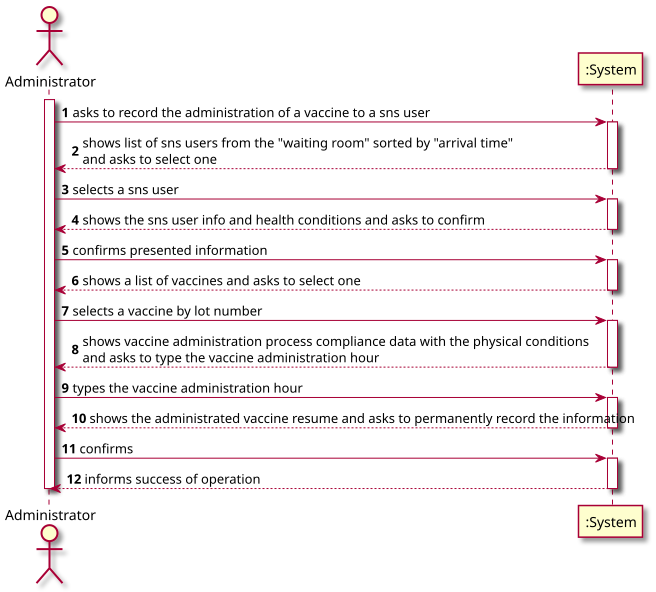

### 1.7 Other Relevant Remarks

* When the nurse starts to use the application, firstly, the nurse should select the vaccination center where she is working.

## 2. OO Analysis

### 2.1. Relevant Domain Model Excerpt

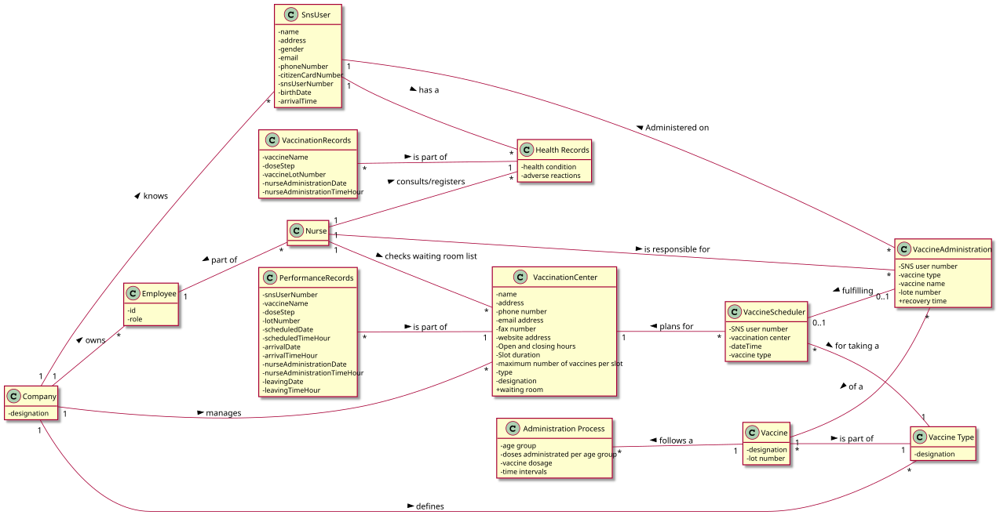

### 2.2. Other Remarks

n/a
  
## 3. Design - User Story Realization

### 3.1. Rationale

**The rationale grounds on the SSD interactions and the identified input/output data.**

| Interaction ID | Question: Which class is responsible for... | Answer  | Justification (with patterns)                                                                                                          |
|:-------------  |:--------------------- |:------------|:----------------------------                                                                                                                             |
| Step 1  		 |... interacting with the actor?                      |ScheduleVaccineUI        |Pure Fabrication:there is no reason to assign this responsibility to any existing class in the Domain Model.    |
| 		         |... coordinating the US?                             |ScheduleVaccineController|Pure Fabrication:responsible for coordinating and distributing the actions                                      |
|   		     |... instantiating a new vaccine Schedule ?           |ScheduleVaccineStore     |Creator R1/2                                                                                                    |
|  		         |... instantiating a new vaccine Schedule User store? |Company                  |Creator R1/2                                                                                                    |
|   		     |... knowing all Schedule ?                           |Company                  |Information Expert: the object owns the Schedule Vaccine store                                                         |
| Step 2	     |                                                     |                         |                                                                                                                |
| Step 3 		 |... saving the typed data?                           |Schedule                 |Information Expert: the object has its on data                                                                  |
| Step 4 		 |... validating the data locally?                     |Schedule                 |Information Expert (IE): the object knows its own data                                                          |
|          		 |... validating the data globally?                    |ScheduleVaccineStore     |IE: ScheduleVaccineStore knows all the Schedule VaccineS objects                                                |
| Step 5  		 |... saving all the created data?                     |Company                  |IE: records all the Schedule objects                                                                            |
| Step 6  		 | ... informing the operation success?                |ScheduleVaccineUI        |IE: responsible for user interaction                                                                            |

### Systematization ##

According to the taken rationale, the conceptual classes promoted to software classes are:

* Receptionist
* ScheduleVaccine
* Company

Other software classes (i.e. Pure Fabrication) identified:

* ScheduleVaccineUI
* ScheduleVaccineController
* ScheduleVaccineStore

## 3.2. Sequence Diagram (SD)

**Global**
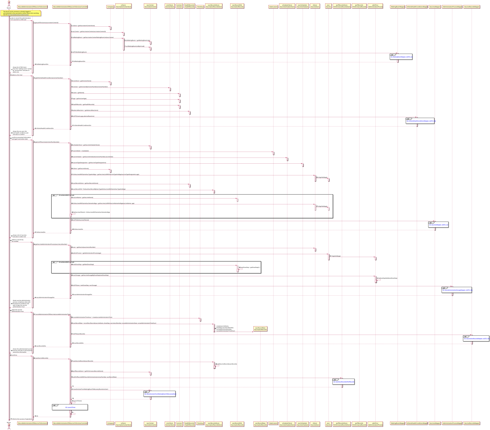

**Ref SD_NurseSelectsVaccinationCenter**
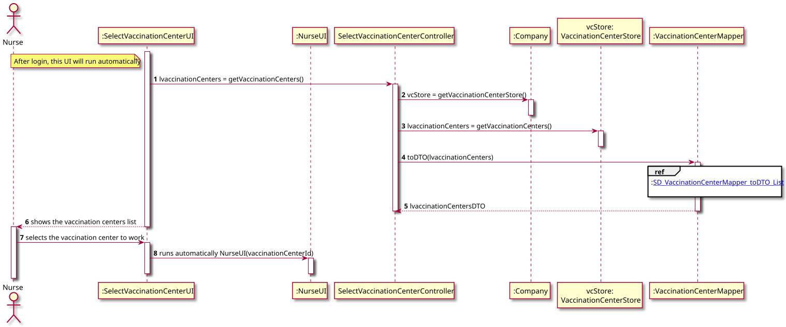

**Ref SD_VaccinationCenterMapper_toDTO_List**
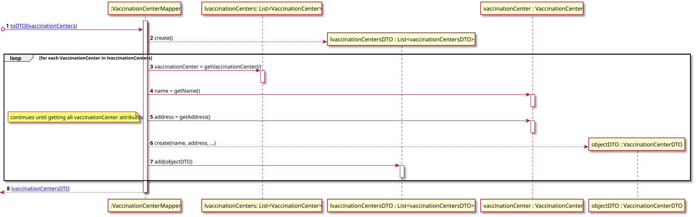

**Ref SD_WaitingRoomMapper_toDTO_List**
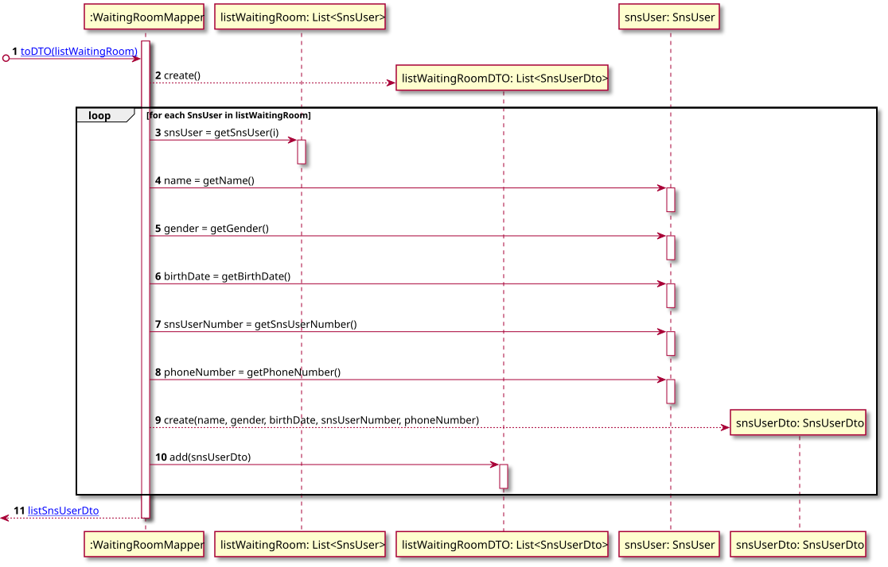

**Ref SD_InfoAndHealthConditionsMapper_toDTO_Obj**
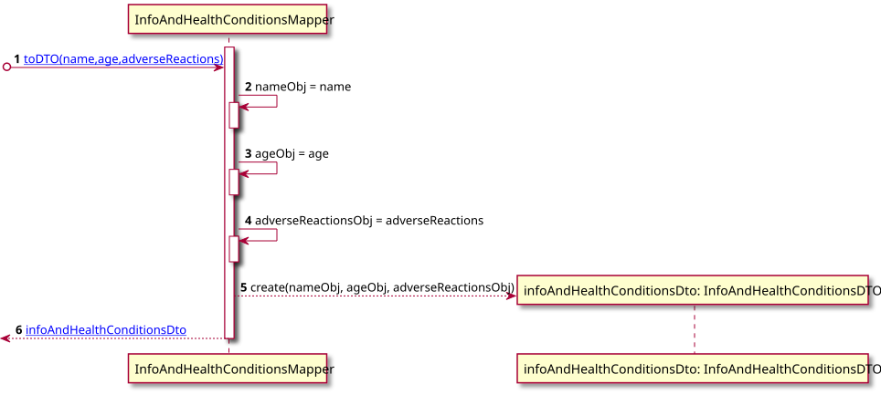

**Ref SD_VaccinesMapper_toDTO_List**
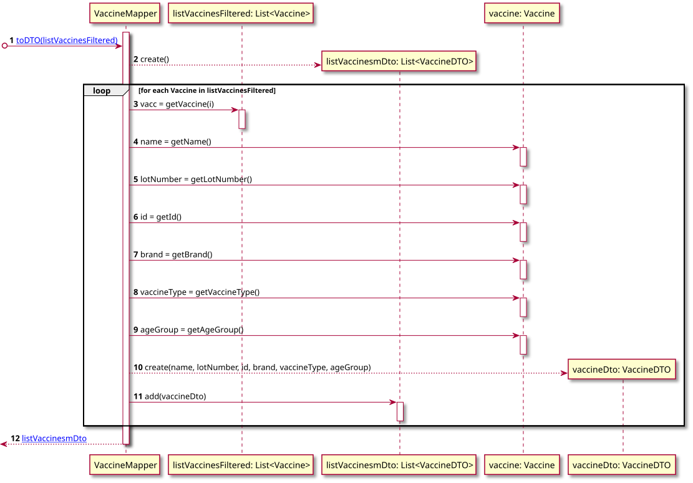

**Ref SD_VaccAdministrationDosageMapper_toDTO_Obj**
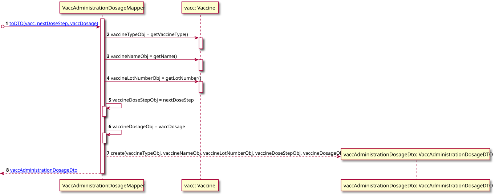

**Ref SD_VaccinationRecordsMapper_toDTO_Obj**
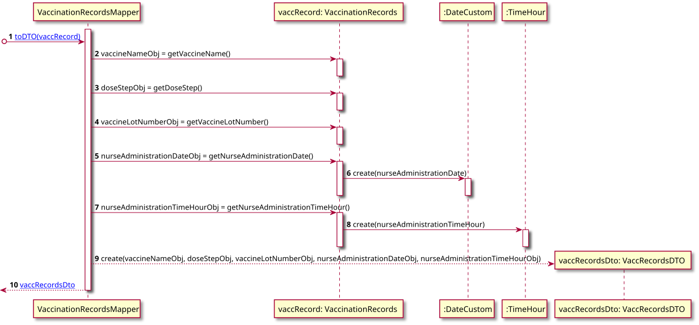

**Ref SD_SaveVaccRecordsInPerfRecords**
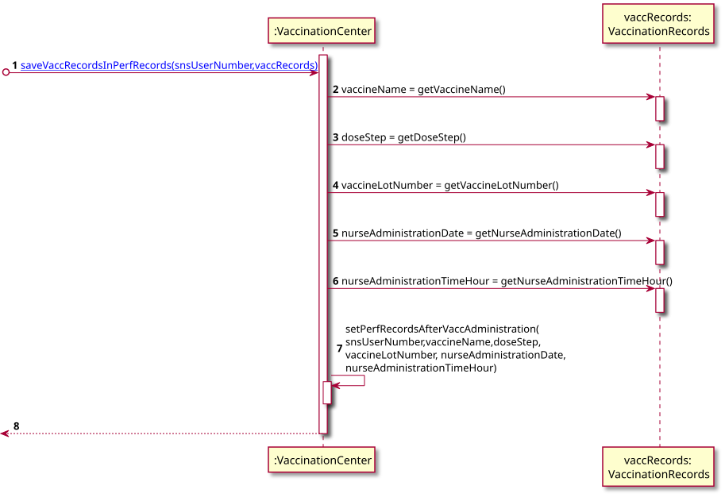

**Ref SD_MoveSnsUserFromWaitingRoomToRecoveryRoom**
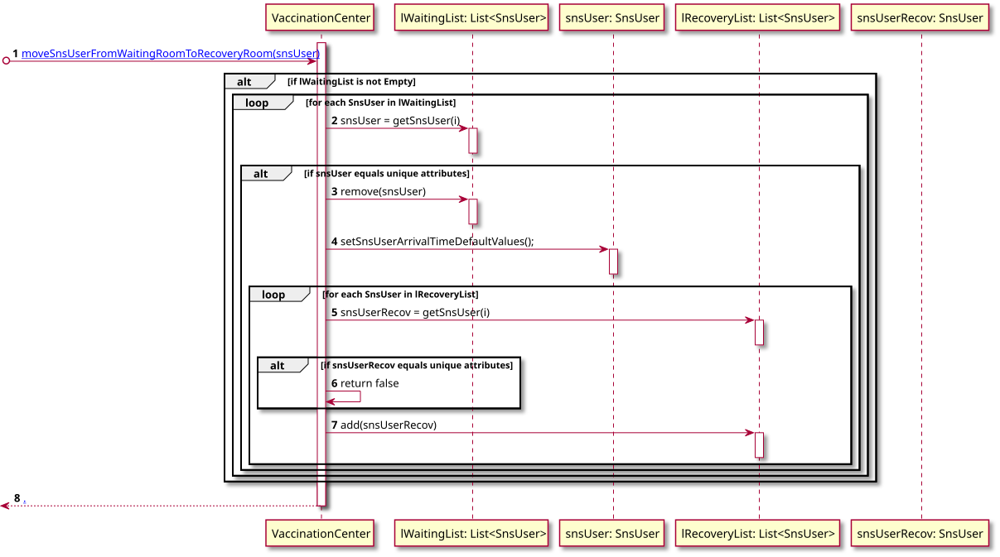

**Ref SD_LaunchTimer**
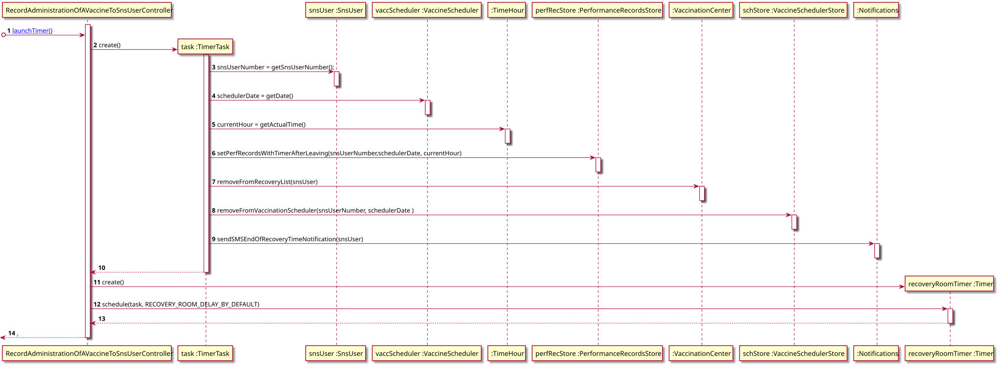

## 3.3. Class Diagram (CD)
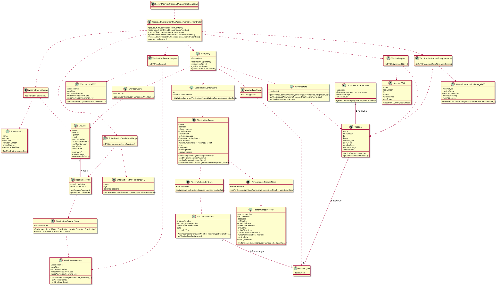

# 4. Tests
**Test 1:** TimeHour validations

    @Test
    void isHourFormatValid_OK() {
        try {
            assertTrue(Validations.isHourFormatValid(hourFormatValid, true, true));
        }
        catch(OperationCanceledByUserException e) {
            fail();
        }
    }

    @Test
    void isHourFormatValid_CancelOK() {
        Exception e = assertThrows(OperationCanceledByUserException.class, () -> {
            boolean result = Validations.isHourFormatValid(VALUE_TO_CANCEL, true, true);
        });
    }

    @Test
    void isHourFormatValid_NOKWithoutSpace() {
        try {
            assertFalse(Validations.isHourFormatValid(hourFormatInvalidWithoutSpace, true, true));
        }
        catch(OperationCanceledByUserException e) {
            fail();
        }
    }

    @Test
    void isHourFormatValid_NOKInvalidFormat() {
        try {
            assertFalse(Validations.isHourFormatValid(hourFormatInvalidException, true, true));
        }
        catch(OperationCanceledByUserException e) {
            fail();
        }
    }

    @Test
    void isHourFormatValid_NOKEmpty() {
        try {
            assertFalse(Validations.isHourFormatValid(stringEmpty, true, true));
        }
        catch(OperationCanceledByUserException e) {
            fail();
        }
    }

**Test 2:** DateCustom validations

    @Test
    void isDateFormatValid_NullMandatory() {
        try {
            assertFalse(Validations.isDateFormatValid(stringNull, true, true));
        }
        catch(OperationCanceledByUserException e) {
            fail();
        }
    }

    @Test
    void isDateFormatValid_NullNotMandatory() {
        try {
            assertTrue(Validations.isDateFormatValid(stringNull, false, true));
        }
        catch(OperationCanceledByUserException e) {
            fail();
        }
    }

    @Test
    void isDateFormatValid_EmptyMandatory() {
        try {
            assertFalse(Validations.isDateFormatValid(stringEmpty, true, true));
        }
        catch(OperationCanceledByUserException e) {
            fail();
        }
    }

    @Test
    void isDateFormatValid_EmptyNotMandatory() {
        try {
            assertTrue(Validations.isDateFormatValid(stringEmpty, false, true));
        }
        catch(OperationCanceledByUserException e) {
            fail();
        }
    }

    @Test
    void isDateFormatValid_CancelOK() {
        Exception e = assertThrows(OperationCanceledByUserException.class, () -> {
            boolean result = Validations.isDateFormatValid(VALUE_TO_CANCEL, true, true);
        });
    }

    @Test
    void isDateFormatValid_WrongNumberOfDelimiters() {
        String date3Delimeters = "///";
        try {
            assertFalse(Validations.isDateFormatValid(date3Delimeters, true, true));
        }
        catch(OperationCanceledByUserException e) {
            fail();
        }
    }

    @Test
    void isDateFormatValid_LetterInCorrectFormat() {
        String dateToValidate = "12/JAN/1980";
        try {
            assertFalse(Validations.isDateFormatValid(dateToValidate, true, true));
        }
        catch(OperationCanceledByUserException e) {
            fail();
        }
    }

    @Test
    void isDateFormatValid_CorrectFormatExceedsDay() {
        String dateToValidate = "100/01/1980";
        try {
            assertFalse(Validations.isDateFormatValid(dateToValidate, true, true));
        }
        catch(OperationCanceledByUserException e) {
            fail();
        }
    }

    @Test
    void isDateFormatValid_CorrectFormatExceedsMonth() {
        String dateToValidate = "10/100/1980";
        try {
            assertFalse(Validations.isDateFormatValid(dateToValidate, true, true));
        }
        catch(OperationCanceledByUserException e) {
            fail();
        }
    }

    @Test
    void isDateFormatValid_CorrectFormatExceedsDayAndMonth() {
        String dateToValidate = "100/100/1980";
        try {
            assertFalse(Validations.isDateFormatValid(dateToValidate, true, true));
        }
        catch(OperationCanceledByUserException e) {
            fail();
        }
    }

    @Test
    void isDateFormatValid_CorrectFormatExceedsYear() {
        String dateToValidate = "10/01/10000";
        try {
            assertFalse(Validations.isDateFormatValid(dateToValidate, true, true));
        }
        catch(OperationCanceledByUserException e) {
            fail();
        }
    }

    @Test
    void isDateFormatValid_CorrectFormatExceedsDayAndMonthAndYear() {
        String dateToValidate = "100/100/10000";
        try {
            assertFalse(Validations.isDateFormatValid(dateToValidate, true, true));
        }
        catch(OperationCanceledByUserException e) {
            fail();
        }
    }

    @Test
    void isDateFormatValid_CorrectFormatExceedsDayAndYear() {
        String dateToValidate = "100/10/10000";
        try {
            assertFalse(Validations.isDateFormatValid(dateToValidate, true, true));
        }
        catch(OperationCanceledByUserException e) {
            fail();
        }
    }

    @Test
    void isDateFormatValid_CorrectFormatLessYear() {
        String dateToValidate = "10/10/900";
        try {
            assertFalse(Validations.isDateFormatValid(dateToValidate, true, true));
        }
        catch(OperationCanceledByUserException e) {
            fail();
        }
    }

# 5. Construction (Implementation)

**Class WaitingRoomDTO** - Constructor of class WaitingRoomDTO

     /**
     * Method to protect List<SNSUser> listWaitingRoom with DTO
     *
     * @param listWaitingRoom
     * @return
     */
    public List<WaitingRoomDTO> toDTO(List<SNSUser> listWaitingRoom) {

        List<WaitingRoomDTO> listWaitingRoomDTO = new ArrayList<>();

        for(SNSUser obj : listWaitingRoom) {

            String name = obj.getName();
            String gender = obj.getGender();
            DateCustom birthDate=obj.getBirthDate();
            long snsUserNumber=obj.getSnsUserNumber();
            long phoneNumber=obj.getPhoneNumber();

            listWaitingRoomDTO.add(new WaitingRoomDTO(name,gender,birthDate,snsUserNumber,phoneNumber));
        } return listWaitingRoomDTO;
    }

**Class WaitingRoomMapper** - Method of class WaitingRoomMapper

     /**
     * WaitingRoomDTO constructor
     *
     * @param name
     * @param gender
     * @param birthDate
     * @param snsUserNumber
     * @param phoneNumber
     */
    @ExcludeFromJacocoGeneratedReport
    public WaitingRoomDTO(String name,String gender,DateCustom birthDate,long snsUserNumber,long phoneNumber){
        this.name=name;
        this.gender=gender;
        this.snsUserNumber=snsUserNumber;
        this.birthDate=birthDate;
        this.phoneNumber=phoneNumber;
    }    

**Class InfoAndHealthConditionsDTO** - Constructor of class InfoAndHealthConditionsDTO

    /***
     * InfoAndHealthConditionsDTO constructor
     * 
     * @param name - sns user name
     * @param age - sns user age
     * @param adverseReactions - sns user adverse reactions records
     */
    public InfoAndHealthConditionsDTO(String name, int age, String adverseReactions) {
        setName(name);
        setAge(age);
        setAdverseReactions(adverseReactions);
    }

**Class InfoAndHealthConditionsMapper** - Method of class InfoAndHealthConditionsMapper

    /***
     * Method to protect some sns user attributes with DTO
     *
     * @param name - sns user name
     * @param age - sns user age
     * @param adverseReactions - sns user adverse reactions records
     * @return new DTO obj with some sns user attributes
     */
    public InfoAndHealthConditionsDTO toDTO(String name, int age, String adverseReactions) {
        return new InfoAndHealthConditionsDTO(name, age, adverseReactions);
    }

**Class VaccineDTO** - Constructor of class VaccineDTO

     /***
     * VaccineDTO constructor
     * @param name - name of the vaccine
     * @param lotNumber - lot number of the vaccine
     * @param id - identifier of the vaccine
     * @param brand - brand of the vaccine
     * @param vaccineType - type of the vaccine (e.g. Covid-19)
     * @param ageGroup - age group specification of the vaccine
     */
    public VaccineDTO(String name, String lotNumber, int id, String brand, String vaccineType, String ageGroup) {
        setName(name);
        setLotNumber(lotNumber);
        setId(id);
        setBrand(brand);
        setVaccineType(vaccineType);
        setAgeGroup(ageGroup);
    }

**Class VaccineMapper** - Method of class VaccineDTO

    /***
     * Method to protect List<Vaccine> listVaccinesFiltered with DTO
     * @param listVaccinesFiltered - List<Vaccine>
     * @return List<VaccineDTO> listVaccinesDTO
     */
    public List<VaccineDTO> toDTO(List<Vaccine> listVaccinesFiltered) {

        List<VaccineDTO> listVaccinesDTO = new ArrayList<>();

        for(Vaccine obj : listVaccinesFiltered) {
            listVaccinesDTO.add(
                    new VaccineDTO(obj.getName(), obj.getLotNumber(), obj.getId(), obj.getBrand(), obj.getVaccineType(),
                                   obj.getAgeGroup()));

        }
        return listVaccinesDTO;
    }

**Class HealthRecords** - Constructor of class HealthRecords

    /***
     * Empty HealthRecords constructor
     */
    @ExcludeFromJacocoGeneratedReport
    public HealthRecords() {
        setHealthCondition(HEALTH_CONDITION_BY_DEFAULT);
        setAdverseReactions(ADVERSE_REACTIONS_BY_DEFAULT);
        this.vaccRecordsStore = new VaccinationRecordsStore();
    }

**Class VaccinationRecordsStore** - Constructor of class VaccinationRecordsStore

    /***
     * Method RecordVaccRecords used to record employee
     *
     * @param vaccineName - vaccine name
     * @param doseStep - vaccine dose step (related to administration process plan)
     * @param vaccineLotNumber - vaccine lot number
     * @param nurseAdministrationDate - nurse vaccine administration date
     * @param nurseAdministrationTimeHour - nurse vaccine administration hour
     * @return a new VaccinationRecords obj is created
     */
    public VaccinationRecords recordVaccRecords(String vaccineName, int doseStep, String vaccineLotNumber,
                                                DateCustom nurseAdministrationDate,
                                                TimeHour nurseAdministrationTimeHour) {
        return new VaccinationRecords(vaccineName, doseStep, vaccineLotNumber, nurseAdministrationDate,
                                      nurseAdministrationTimeHour);
    }

**Class VaccinationRecords** - Constructor of class VaccinationRecords

    /***
     * Complete VaccinationRecords constructor
     * @param vaccineName - vaccine name
     * @param doseStep - vaccine dose step (related to administration process plan)
     * @param vaccineLotNumber - vaccine lot number
     * @param nurseAdministrationDate - nurse vaccine administration date
     * @param nurseAdministrationTimeHour - nurse vaccine administration hour
     */
    public VaccinationRecords(String vaccineName, int doseStep, String vaccineLotNumber,
                              DateCustom nurseAdministrationDate, TimeHour nurseAdministrationTimeHour) {
        setVaccineName(vaccineName);
        setDoseStep(doseStep);
        setVaccineLotNumber(vaccineLotNumber);
        setNurseAdministrationDate(nurseAdministrationDate);
        setNurseAdministrationTimeHour(nurseAdministrationTimeHour);
    }

**Class VaccAdministrationDosageDTO** - Constructor of class VaccAdministrationDosageDTO

    /***
     * VaccAdministrationDosageDT constructor
     * 
     * @param vaccineType - Vaccine Type of vaccine : designation
     * @param vaccineName - Designation/name of vaccine
     * @param vaccineLotNumber - Lot number of vaccine
     * @param vaccineDoseStep - Vaccine dose step in accordance with administration process and sns user vaccination
     *                        history
     * @param vaccineDosage - Vaccine dosage [mL] in accordance with administration process
     */
    public VaccAdministrationDosageDTO(String vaccineType, String vaccineName, String vaccineLotNumber,
                                       int vaccineDoseStep, int vaccineDosage) {
        setVaccineType(vaccineType);
        setVaccineName(vaccineName);
        setVaccineLotNumber(vaccineLotNumber);
        setVaccineDoseStep(vaccineDoseStep);
        setVaccineDosage(vaccineDosage);
    }

**Class VaccAdministrationDosageMapper** - Method of class VaccAdministrationDosageMapper

    /***
     * Method to protect some vaccine and vaccine administration attributes with DTO
     * 
     * @param vacc - Vaccine obj
     * @param nextDoseStep - next vaccine dose step
     * @param vaccDosage - vaccine dosage [mL]
     * @return VaccAdministrationDosageDTO
     */
    public VaccAdministrationDosageDTO toDTO(Vaccine vacc, int nextDoseStep, int vaccDosage) {
        return new VaccAdministrationDosageDTO(vacc.getVaccineType(), vacc.getName(), vacc.getLotNumber(), nextDoseStep,
                                               vaccDosage);
    }

**Class VaccRecordsDTO** - Constructor of class VaccRecordsDTO

    /***
     * VaccRecordsDTO constructor
     * 
     * @param vaccineName - vaccine name
     * @param doseStep - vaccine dose step (related to administration process plan)
     * @param vaccineLotNumber - vaccine lot number
     * @param nurseAdministrationDate - nurse vaccine administration date
     * @param nurseAdministrationTimeHour - nurse vaccine administration hour
     */
    public VaccRecordsDTO(String vaccineName, int doseStep, String vaccineLotNumber, DateCustom nurseAdministrationDate,
                          TimeHour nurseAdministrationTimeHour) {
        setVaccineName(vaccineName);
        setDoseStep(doseStep);
        setVaccineLotNumber(vaccineLotNumber);
        setNurseAdministrationDate(nurseAdministrationDate);
        setNurseAdministrationTimeHour(nurseAdministrationTimeHour);
    }

**Class VaccinationRecordsMapper ** - Method of class VaccinationRecordsMapper

    /***
     * Method to protect VaccinationRecords vaccRecord with DTO
     * 
     * @param vaccRecord - VaccinationRecords obj
     * @return VaccRecordsDTO
     */
    public VaccRecordsDTO toDTO(VaccinationRecords vaccRecord) {
        return new VaccRecordsDTO(vaccRecord.getVaccineName(), vaccRecord.getDoseStep(),
                                  vaccRecord.getVaccineLotNumber(), vaccRecord.getNurseAdministrationDate(),
                                  vaccRecord.getNurseAdministrationTimeHour());
    }

**Class PerformanceRecordsStore** - Constructor of class PerformanceRecordsStore

    /***
     * Empty PerformanceRecordsStore constructor
     */
    public PerformanceRecordsStore() {
        this.listPerfRecords = new ArrayList<>();
    }

**Class PerformanceRecords** - Partial Constructor of class PerformanceRecords

    /***
     * Partial PerformanceRecords constructor, created when an SNS User schedules the vaccine administration
     *
     * @param snsUserNumber
     * @param scheduledDate
     * @param scheduledTimeHour
     */
    @ExcludeFromJacocoGeneratedReport
    public PerformanceRecords(long snsUserNumber, DateCustom scheduledDate, TimeHour scheduledTimeHour) {
        setSnsUserNumber(snsUserNumber);
        setVaccineName(VACC_NAME_BY_DEFAULT);
        setDoseStep(DOSE_STEP_BY_DEFAULT);
        setLotNumber(LOT_NUMBER_BY_DEFAULT);
        setScheduledDate(scheduledDate);
        setScheduledTimeHour(scheduledTimeHour);
        setArrivalDate(DATE_CUSTOM_BY_DEFAULT);
        setArrivalTimeHour(TIME_HOUR_BY_DEFAULT);
        setNurseAdministrationDate(DATE_CUSTOM_BY_DEFAULT);
        setNurseAdministrationTimeHour(TIME_HOUR_BY_DEFAULT);
        setLeavingDate(DATE_CUSTOM_BY_DEFAULT);
        setLeavingTimeHour(TIME_HOUR_BY_DEFAULT);
    }
