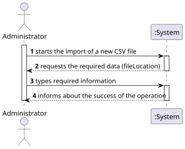
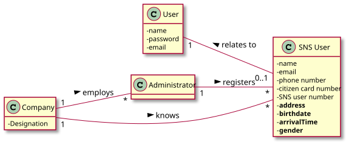
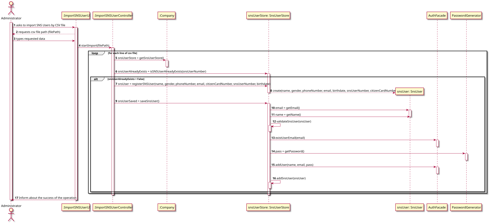
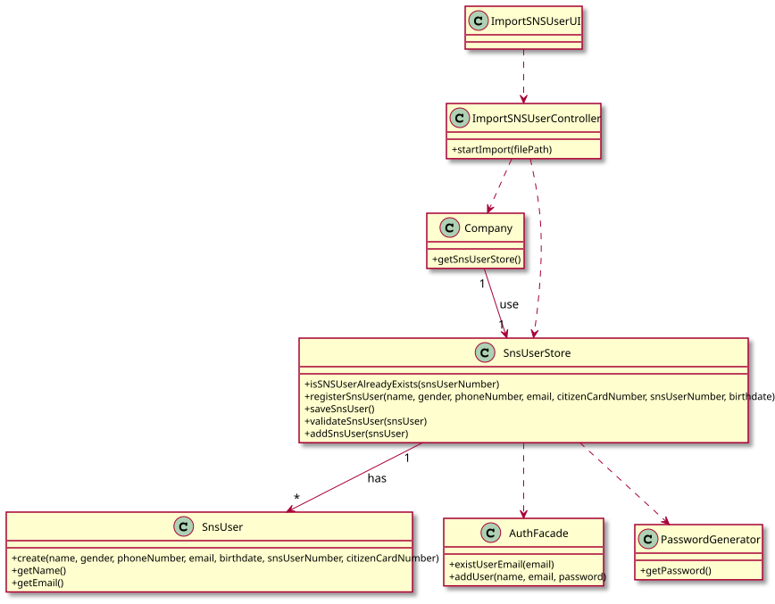

# US 014 - Load set of users from CSV file

## 1. Requirements Engineering

### 1.1. User Story Description

*As an administrator, I want to load a set of users from a CSV file.*

### 1.2. Customer Specifications and Clarifications

**From the specifications document:**

* N/A

**From the client clarifications:**

> **Question 01**:  
> "When the admin wants to upload a CSV file to be read, should the file be stored at a specific location on the
> computer (e.g. the desktop) or should the admin be able to choose the file he wants to upload in a file explorer?"
>
>  **Answer**:  
> "The Administrator should write the file path. In Sprint C we do not ask students to develop a graphical user
> interface."

> **Question 02**:  
> "What would be the sequence of parameters to be read on the CSV? For example: "Name | User Number""
>
>  **Answer**:  
> "Name, Sex, Birth Date, Address, Phone Number, E-mail, SNS User Number and Citizen Card Number."

> **Question 03**:  
> "Regarding US014, I would like to clarify if the CSV file only contains information about SNS users of if the CSV file
> may also contain some information about employees from that vaccination center."
>
>  **Answer**:  
> "The CSV file only contains information about SNS users."

> **Question 04**:  
> "Is it possible that the file can contain lines with incomplete information in some fields (e.g. N/A). If so, should
> we read those lines as well and leave those fields empty or shall we discard that complete line?"
>
> **Answer**:  
> "CSV files that have errors should not be loaded. Opcional attributes may have a NA value."

> **Question 05**:  
> "In witch format will be given the date of birth (YYYY/MM/DD or DD/MM/YYYY)"
>
> **Answer**:  
> "The dates registered in the system should follow the Portuguese format (dd/mm/yyyy)"

> **Question 06**:  
> "When the system is reading the file, should it discard all the lines that contain input mistakes?
> For example, if there is a line that contains a phone number that has the wrong number of digits,
> should the system discard the whole line in the moment that this error is noticed?"
>
>  **Answer**:

> **Question 07**:  
> Should our application detect if the CSV file to be loaded contains the header,
> or should we ask the user if is submitting a file with a header or not?
>
>  **Answer**:

> **Question 08**:  
> "is there any specific format that should be validated for the address, or we can assume it is just of string type?"
>
>  **Answer**:  
> "The address contained in the CSV file is a string and should not contain commas or semicolons."

> **Question 09**:  
> "This question also regards the attribute sex, is the format "F"/"M"/ "N/A", or "female"/"male"/"N/A" , 
> or a different, or can it be any?"
>
>  **Answer**:  
> "Opcional attributes may have a NA value"

> **Question 10**:  
> "how should the admin receive the login data/passwords for all registered users?"
>
>  **Answer**:  
> "In US14 the application is used to register a batch of users. For each user, 
> all the data required to register a user should be presented in the console."

> **Question 11**:  
> "What should the system do if the file to be loaded has  information that is repeated? 
> For example, if there are 5 lines that have the same information or that have the same attribute, 
> like the phone number, should the whole file be discarded?"
>
>  **Answer**:  
> "If the file does not have other errors, all records should be used to register users. 
> The business rules will be used to decide if all file records will be used to register a user. 
> For instance, if all users in the CSV file are already registered in system, the file should be 
> processed normally but no user will be added to the system (because the users are already in the system)."

### 1.3. Acceptance Criteria

* **AC1:** The application must support importing a CSV file with header and column separator using ";" character.
* **AC2:** The application must support importing a CSV file without header and column separator using "," character.
* **AC3:** The user should indicate the CSV file path.
* **AC4:** The sequence of parameters on CSV file should be: Name, Gender, Birth Date, Address, Phone Number, E-mail,
  SNS User Number and Citizen Card Number.
* **AC5:** The name field is a string and should have a max length of **60** characters.
* **AC6:** The gender field is a String and should have a max length of **6** characters.
* **AC7:** The phone number, must be a 9 digit number of type long.
* **AC8:** The e-mail field is a string and should be in e-mail format, with an @ and a dot.
* **AC9:** The date value should follow the Portuguese format (dd/mm/yyyy).
* **AC10:** SNS User number is a long type with a maximum of **10** digits length.
* **AC11:** The citizen card number, must be a string with **12** chars and have check-sum specific validation.
* **AC12:** The gender attribute is optional. All other fields are required.
* **AC13:** The E-mail, Phone Number, Citizen Card Number and SNS User Number should be unique for each SNS user.

### 1.4. Found out Dependencies

n/a

### 1.5 Input and Output Data

**Input Data:**

* File path for the CSV file with SNS users data to import.

**Output Data:**

* (In)Success of the operation

### 1.6. System Sequence Diagram (SSD)

### 1.7 Other Relevant Remarks

If the CSV file doesn't follow the AC1 and AC2, application will show an error and doesn't import any SNS User.

## 2. OO Analysis

### 2.1. Relevant Domain Model Excerpt

### 2.2. Other Remarks

n/a

## 3. Design - User Story Realization

### 3.1. Rationale

**The rationale grounds on the SSD interactions and the identified input/output data.**

| Interaction ID | Question: Which class is responsible for... | Answer                  | Justification (with patterns)                                                                                                    |
|:---------------|:--------------------------------------------|:------------------------|:---------------------------------------------------------------------------------------------------------------------------------|
| Step 1         | ... interacting with the actor?             | ImportSNSUserUI         | Pure Fabrication: there is no reason to assign this responsibility to any existing class in the Domain Model.                    |
| Step 2         |                                             |                         |                                                                                                                                  |
| Step 3         |                                             |                         |                                                                                                                                  |
| Step 4         | ... coordinates the US                      | ImportSNSUserController | Pure Fabrication: responsible for coordinating/controlling the flow and distributing the actions for this specific user scenario |
| Step 5         | ... instantiating SNS User Store            | Company                 | Creator R 1/2                                                                                                                    |
| Step 6         |                                             |                         |                                                                                                                                  |
| Step 7         | ... instantiating SNS User                  | SnsUserStore            | Creator R 1/2                                                                                                                    |
| Step 8         | ...                                         | ...                     | ...                                                                                                                              |
| Step 9         | ... save SNS User                           | SnsUserStore            | Information Expert: record SNS User data                                                                                         |
| Step 10        | ...                                         | ...                     | ...                                                                                                                              |
| Step 10        | ...                                         | ...                     | ...                                                                                                                              |
| Step 12        | ... validating SNS User                     | SnsUserStore            | Informarion Expert: Sns Store knows its own data                                                                                 |
| Step 13        | ...                                         | ...                     | ...                                                                                                                              |
| Step 14        | ... instantiating new password              | PasswordGenerator       | Creator R 1/2                                                                                                                    |
| Step 15        | ... instantiating Auth User                 | AuthFacade              | Creator R 1/2                                                                                                                    |
| Step 16        | ...                                         | ...                     | ...                                                                                                                              |
| Step 17        | ... inform success of operation             | ImportSNSUserController | Information Expert: responsible for user interaction                                                                             |

### Systematization ##

TBD

Other software classes (i.e. Pure Fabrication) identified:

TBD

## 3.2. Sequence Diagram (SD)

## 3.3. Class Diagram (CD)

# 4. Tests

**Test 1:** Check that it is not possible to create an employee without name

    @Test
    void testCreationOfNewEmployeeWithoutName() {
        Exception e = assertThrows(IllegalArgumentException.class, () -> {
            Employee employee = new Employee(null, address, phoneNumber, email, citizenCardNumber, role);
        });
    }

# 5. Construction (Implementation)

* TBD
*

# 6. Integration and Demo

*In this section, it is suggested to describe the efforts made to integrate this functionality with the other features
of the system.*

# 7. Observations

*In this section, it is suggested to present a critical perspective on the developed work, pointing, for example, to
other alternatives and or future related work.*

