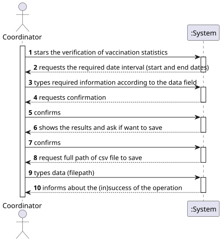
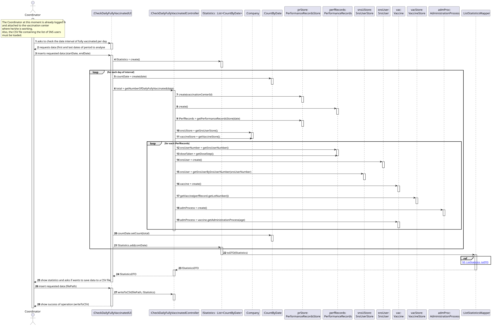
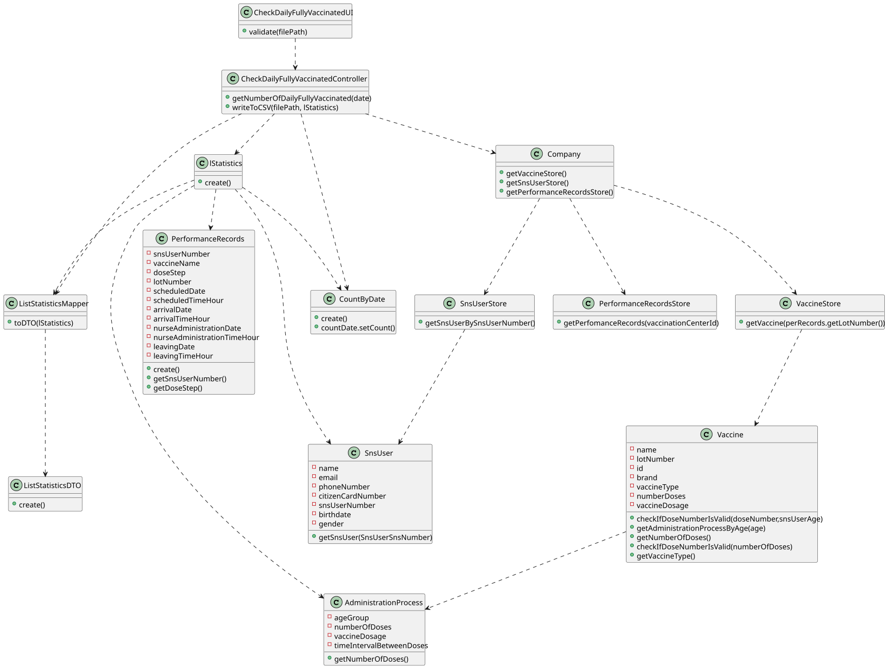

# US 015 - Check and export vaccination statistics

## 1. Requirements Engineering

### 1.1. User Story Description

*As a center coordinator, I intend to check and export vaccination statistics. I want to export, to a csv file, the total number of fully vaccinated users per day.*

### 1.2. Customer Specifications and Clarifications 

**From the specifications document:**
> "In addition, each vaccination center has one coordinator."

> "Each vaccination center has a Center Coordinator that has the responsibility to manage the Covid-19 vaccination process.  
> The Center Coordinator wants to monitor the vaccination process, to see statistics and charts, to evaluate the performance  
> of the vaccination process, generate reports and analyze data from other centers, including data from law systems."

**From the client clarifications:**
> **Question 01**:  
> "Which "vaccination statistics" are you referring to?" 
>
> **Answer**:  
> "The application should be used to check the total number of fully vaccinated users per day in the vaccination center  
> that the center coordinator coordinates. Please draw appropriate charts."

> **Question 02**:  
> "When exporting vaccination statistics, do we export the data from all days available in the system  
> or does the center coordinator chooses the time interval?" 
>
> **Answer**:  
> "The user should define a time interval (two dates)"

> **Question 03**:  
> "Is there any kind of format our exported data should follow?" 
>
> **Answer**:  
> "Data format: date; number of fully vaccinated user."

> **Question 04**:  
> "Is the exportation of the CSV file that contains the total number of fully vaccinated users per day,  
> the only feature that needs to be implemented in code, for US15?" 
>
> **Answer**:  
> "Yes"

> **Question 05**:  
> "Should the user introduce the name of the file intended to export the vaccination statistics ?" 
>
> **Answer**:  
> "The user should introduce the name of the file."

> **Question 06**:  
> "Are the vaccination statistics refering only to the fully vaccinated users or refering to something more ?" 
>
> **Answer**:  
> "Only to fully vaccinated users."

> **Question 07**:  
> "In this US should the Center Coordinator check and export the Vaccination Statistics of the Center  
> where he/she works at or should just check and export the Vaccination Statistics of all centers?" 
>
> **Answer**:  
> "The center coordinator can only export statistics from the vaccination center that he coordinates."

> **Question 08**:  
> "I want to know what you mean about fully vaccinated, it is a person who have take all the doses  
> that are defined for a specific vaccine?" 
>
> **Answer**:  
> "... a SNS user is fully vaccinated when he receives all doses of a given vaccine. A SNS user  
> that has received a single-dose vaccine is considered fully vaccinated and will not take more doses."

> **Question 09**:  
> "In a previous answer you said "Data format: date; number of fully vaccinated user.".  
> So our question is: -> Should we group all sns users fully vaccinated per day of different vaccine types  
> into a total number of that day? Or should we divide the number by vaccine types?" 
>
> **Answer**:  
> "The output data should be the date and the number of fully vaccinated users."

> **Question 10**:  
> "Which "vaccination statistics" are you referring to?" 
>
> **Answer**:  
> "The application should be used to check the total number of fully vaccinated users per day  
> in the vaccination center that the center coordinator coordinates. Please draw appropriate charts."

### 1.3. Acceptance Criteria
* **AC1:** The center coordinator should specify the data interval to check statistics.
* **AC2:** The center coordinator should specify the path of the file to be exported.
* **AC3:** The file to be exported must be in CSV format.
* **AC4:** The total number of fully vaccinated users per day must be of type integer.

### 1.4. Found out Dependencies
 * There is a dependency with the US01 ("As an SNS user, I intend to use the application to schedule a vaccine"), in order to have vaccine schedules, which give origin to the vaccine administrations that occur on the vaccination centers.
 * There is a dependency with the US04 ("As a receptionist at a vaccination center, I want to register the arrival of an SNS user to take the vaccine"), to effectively have SNS users who presented themselves in the vaccination centers for vaccine administration.
 * There is a dependency with the US08 ("As a nurse, I want to record the administration of a vaccine to an SNS user"), in order to have the confirmation of vaccine administration on SNS users.
 * There is a dependency with the US09 ("As an administrator, I want to register a vaccination center to respond to a certain pandemic"), in order to have vaccination center(s) registered in the system.
 * There is a dependency with the US10 ("As an administrator, I want to register an Employee"), in order to have coordinators registered in the system.

### 1.5 Input and Output Data
**Input Data:**
 * Period to be checked (start and end dates)
 * Path of the file to be exported

**Output Data:**
* CSV File with the statistics calculated

### 1.6. System Sequence Diagram (SSD)

### 1.7 Other Relevant Remarks

* n/a

## 2. OO Analysis

### 2.1. Relevant Domain Model Excerpt

### 2.2. Other Remarks

n/a
  
## 3. Design - User Story Realization

### 3.1. Rationale

**The rationale grounds on the SSD interactions and the identified input/output data.**

| Interaction ID | Question: Which class is responsible for... | Answer | Justification (with patterns) |
|:-------------  |:--------------------- |:-------|:------------------------------|
| Step 1  		 |...                       | ...    | ...                           |

### Systematization ##

According to the taken rationale, the conceptual classes promoted to software classes are:

* Company
* SnsUser
* Vaccine
* PerformanceRecords
* AdministrationProcess
* CountByDate

Other software classes (i.e. Pure Fabrication) identified:

* CheckDailyFullyVaccinatedUI
* CheckDailyFullyVaccinatedController
* PerformanceRecordsStore
* SNSUserStore
* VaccineStore

## 3.2. Sequence Diagram (SD)

## 3.3. Class Diagram (CD)

# 4. Tests

**Test 1:** Check that period is valid.

    @Test
    void isPeriodValid_valid() {
        DateCustom startDate = new DateCustom(DateCustom.getActualDate());
        DateCustom endDate = new DateCustom(DateCustom.getActualDate());
        startDate.setYear(endDate.getYear()-1);
        assertTrue(Validations.isPeriodValid(startDate, endDate));
    }

**Test 2:** Check if is possible to create csv file specified. 

    @Test
    void isFilePathNewCSV_FileNew(){
        String filePath = "fileNew.csv";
        assertTrue(Validations.isFilePathNewCSV(filePath));
    }

# 5. Construction (Implementation)

    /***
     * 
     * @param vaccinationCenterId Vaccination Center Id of user logged in
     */
    public CheckDailyFullyVaccinatedController(int vaccinationCenterId) {
        this.app = App.getInstance();
        this.company = this.app.getCompany();
        this.authFacade = this.company.getAuthFacade();
        this.vaccinationCenterId = vaccinationCenterId;
    }