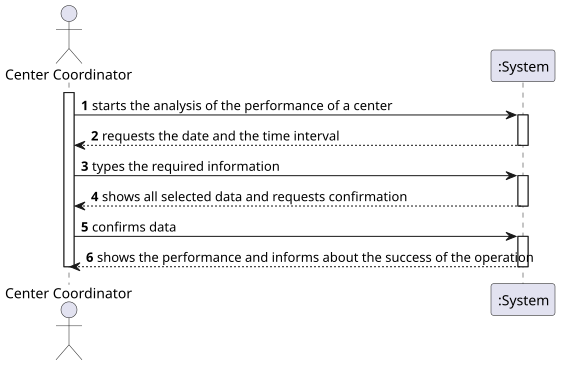
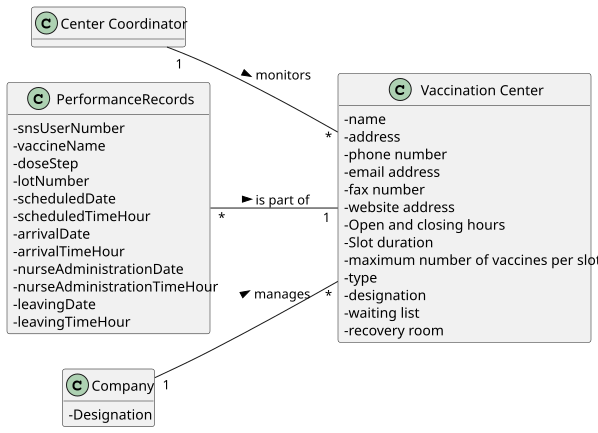
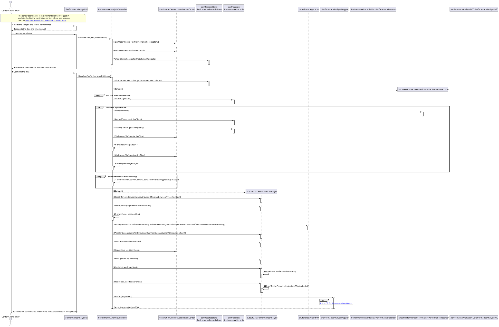
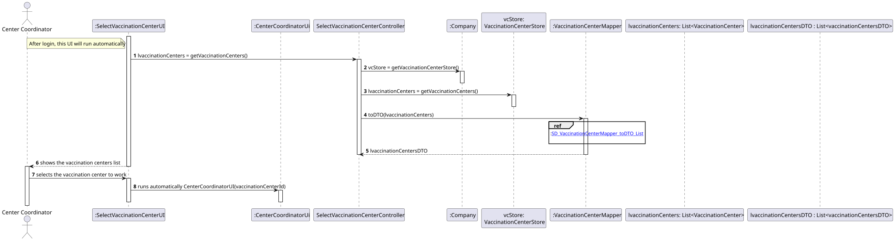
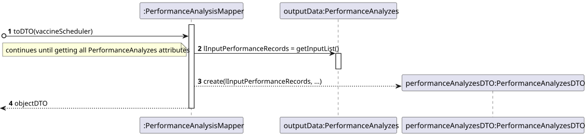
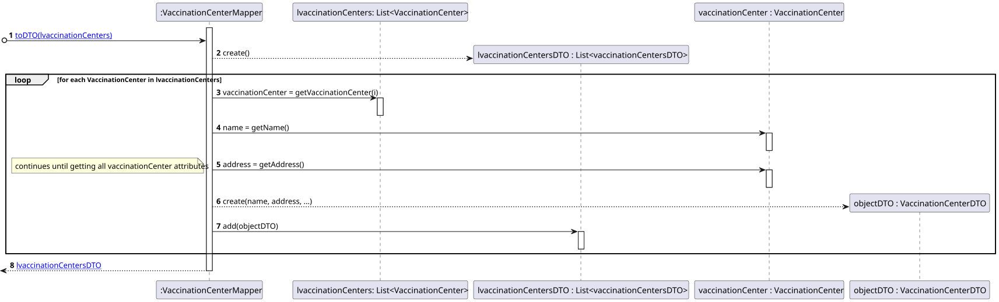
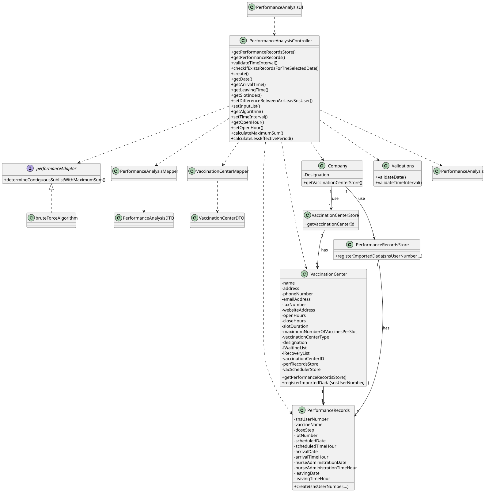

# US 016 - Analyse the Performance of a Center

## 1. Requirements Engineering

### 1.1. User Story Description

*As a center coordinator, I intend to analyze the performance of a center.*

### 1.2. Customer Specifications and Clarifications

**From the specifications document:**

> "Each vaccination center has a Center Coordinator that has the responsibility to manage the Covid-19 vaccination
> process."

> "The Center Coordinator wants to monitor the vaccination process, to see
> statistics and charts, to evaluate the performance of the vaccination process, generate reports and
> analyze data from other centers, including data from law systems."

> " The goal of the performance analysis is to decrease the number of clients in the center, from the moment they
> register at the
> arrival, until the moment they receive the SMS informing they can leave the vaccination center. To
> evaluate this, it proceeds as follows: for any time interval on one day, the difference between the
> number of new clients arrival and the number of clients leaving the center every five-minute period
> is computed. In the case of a working day, with a center open from 8 a.m. until 8 p.m., a list with
> 144 integers is obtained, where a positive integer means that in such a five-minute slot more clients
> arrive at the center for vaccination than clients leave with the vaccination process completed. A
> negative integer means the opposite."

> "[...] the problem consists in determining what the contiguous subsequence of the initial sequence
> is, whose sum of their entries is maximum. This will show the time interval, in such a day, when the
> vaccination center was less effective in responding. So, the application should implement a bruteforce
> algorithm (an algorithm which examines all the contiguous subsequences) to determine the
> contiguous subsequence with maximum sum. The implemented algorithm should be analyzed in
> terms of its worst-case time complexity, and it should be compared to a benchmark algorithm
> provided."

**From the client clarifications:**
> **Question**:  
> "From the Sprint D requirements it is possible to understand that we
> ought to implement a procedure that creates a list with the differences
> between the number of new clients arriving and the number of leaving
> clients for each time interval. My question then is, should this list
> strictly data from the legacy system (csv file from moodle which is loaded in US17), or should it also include data
> from our system?"
>
> **Answer**:  
> "US 16 is for all the data that exists in the system."

> **Question**:  
> "I would like to know if we could strict the user to pick
> only those intervals (m) (i.e. 1, 5, 10, 20, 30) as options
> for analyzing the performance of a center, since picking intervals is
> dependent on the list which is 720/m (which the length is an integer result).
> If we let the user pick an interval that results in a non-integer result,
> this will result in an invalid list since some data for the performance analysis will be lost. Can you provide a
> clarification on this situation?"
>
> **Answer**:   
> "The user can introduce any interval value. The system should
> validate the interval value introduced by the user."

> **Question**:  
> "I would like to ask that if to analyse the performance of a
> center, we can assume (as a pre requirement) that the center
> coordinator was already attributed to a specific vaccination
> center and proceed with the US as so (like the center coordinator does not
> have to choose at a certain point where he is working. This is already
> treated before this US happens). Could you clarify this?"
>
> **Answer**:  
> "A center coordinator can only coordinate one
> vaccination center. The center coordinator can only analyze
> the performance of the center that he coordinates."

> **Question:**
> "In US 16, should the coordinator have the option to choose
> which algorithm to run (e.g. via a configuration file or while running the
> application) in order to determine the goal sublist, or is the
> Benchmark Algorithm strictly for drawing comparisons with the Bruteforce one?"
>
>**Answer:**
> "The algorithm to run should be defined in a configuration file."

> **Question:**
> "Is the time of departure of an SNS user the time he got
> vaccinated plus the recovery time or do we have another way of knowing it?"
>
>**Answer:**
> "The time of departure of an SNS user is the time he
> got vaccinated plus the recovery time."

> **Question:**
> "The file loaded in US17 have only one day to analyse or it
> could have more than one day(?) and in US16 we need to select
> the day to analyse from 8:00 to 20:00"
>
>**Answer:**
> "The file can have data from more than one day.
> In US16 the center coordinator should select the day for which
> he wants to analyse the performance of the vaccination center."

### 1.3. Acceptance Criteria

* **AC1:** All the records in the system should be analysed for the selected date.
* **AC2:** The vaccination center selected must be defined in system.
* **AC3:** The center coordinator could select any interval of time to analyse.
* **AC4:** The time interval is defined in minutes and must be an integer.
* **AC5:** The brute-force algorithm must determine the maximum sum of contiguous sublist of the input list.
* **AC6:** The out-put should be the input list, the maximum sum contiguous sublist and ist sum, and the time interval
  selected by the user.

### 1.4. Found out Dependencies

* There is a dependency with the US01 ("As an SNS user, I intend to use the application to schedule a vaccine"), in
  order to have vaccine schedules, which give origin to the vaccine administrations that occur on the vaccination
  centers.
* There is a dependency with the US04 ("As a receptionist at a vaccination center, I want to register the arrival of an
  SNS user to take the vaccine"), to effectively have SNS users who presented themselves in the vaccination centers for
  vaccine administration.
* There is a dependency with the US08 ("As a nurse, I want to record the administration of a vaccine to an SNS user"),
  in order to have the confirmation of vaccine administration on SNS users.
* There is a dependency with the US09 ("As an administrator, I want to register a vaccination center to respond to a
  certain pandemic"), in order to have vaccination center(s) registered in the system.
* There is a dependency with the US10 ("As an administrator, I want to register an Employee"), in order to have
  coordinators registered in the system.
* There is a dependency with the US14 ("As an administrator, I want to load a set of users from a CSV file"), in order
  to be able to load the csv file with data.
* There is a dependency with the US17 ("As a center coordinator, I want to import data from a legacy system that was
  used in the past to manage centers."), in order to have the list of data (Sns users, dates of vaccine administration,
  dose, lot number, etc).

### 1.5 Input and Output Data

**Input Data:**

* Date (dd/mm/yyyy)
* Time interval in minutes

**Output Data:**

* Input list
* The maximum sum contiguous sublist and its sum
* The time interval corresponding to this contiguous sublist

### 1.6. System Sequence Diagram (SSD)

### 1.7 Other Relevant Remarks

* Each vaccination center has one coordinator.

## 2. OO Analysis

### 2.1. Relevant Domain Model Excerpt

### 2.2. Other Remarks

n/a

## 3. Design - User Story Realization

### 3.1. Rationale

**The rationale grounds on the SSD interactions and the identified input/output data.**

| Interaction ID  | Question: Which class is responsible for...                              | Answer                           | Justification (with patterns)                                                                                                                                 |
|:----------------|:-------------------------------------------------------------------------|:---------------------------------|:--------------------------------------------------------------------------------------------------------------------------------------------------------------|
| Step 1          | ... interacting with the actor?                                          | PerformanceAnalysisUI            | Pure Fabrication: there is no reason to assign this responsibility to any existing class in the Domain Model.                                                 |
|                 | ... coordinating the US?                                                 | PerformanceAnalysisController    | Pure Fabrication: responsible for coordinating and distributing the actions.                                                                                  |
|                 | ... instantiating a Vaccination Center Store?                            | Company                          | Creator R1/2                                                                                                                                                  |
|                 | ... instantiating a Performance Records Store?                           | Company                          | Creator R1/2                                                                                                                                                  |
| Step 2          | 	                                                                        |                                  |                                                                                                                                                               |
| Step 3          | ... validating the data locally?                                         | Validations                      | Pure Fabrication: there is no reason to assign this responsibility to any existing class in the Domain Model.                                                 |
| Step 4          |                                                                          |                                  |                                                                                                                                                               |
| Step 5          | ... interacting with the actor?                                          | PerformanceAnalysisUI            | Pure Fabrication: there is no reason to assign this responsibility to any existing class in the Domain Model.                                                 |
| Step 6          | ... knowing the vaccination center store?                                | Company                          | IE: The company owns the vaccination center store                                                                                                             |
|                 | ... knowing all the vaccination centers?                                 | VaccinationCenterStore           |                                                                                                                                                               |
|                 | ... instantiating the performance records of the center?                 | VaccinationCenter                        | Creator R1/2                                                                                                                                                  
| 		              | ... knowing all the performance records?                                 |             PerformanceRecordsStore                      | Information Expert (IE): the class owns all the performance records                                                                                           |
|                 | ... knowing performance of a center?                                     |      PerformanceRecords                     | IE: The PerformanceRecords knows it's own data |
|                 | ... informing the operation success?                                                                          |    PerformanceAnalysisUI                   |  IE: responsible for user interaction

### Systematization ##

According to the taken rationale, the conceptual classes promoted to software classes are:

* Company
* Receptionist
* CenterCoordinator
* VaccinationCenter
* PerformanceRecords
* PerformanceAnalysis

Other software classes (i.e. Pure Fabrication) identified:

* PerformanceAnalysisUI
* CenterCoordinatorUI
* SelectVaccinationCenterUI
* SelectVaccinationCenterController
* PerformanceAnalysisController
* PerformanceRecordsStore
* VaccinationCenterStore
* Validations

## 3.2. Sequence Diagram (SD)

**SD_CenterCoordinatorSelectsVaccinationCentert**

**Ref US016_SD_PerformanceAnalysisMapper**

**Ref US016_SD_VaccinationCenterMapper_toDTO_List**

## 3.3. Class Diagram (CD)

# 4. Tests

**Test 1 to 4:** Equals.

    @Test
    void testEquals_Null() {
        PerformanceRecords performanceRecordsToTest = null;
        assertFalse(performanceRecord.equals(performanceRecordsToTest));
    }

    @Test
    void testEquals_DifferentType() {
        String performanceRecordsToTest = "new performance record";
        assertFalse(performanceRecord.equals(performanceRecordsToTest));
    }

    @Test
    void testEquals_SameValues() {
        PerformanceRecords performanceRecordsToTest = new PerformanceRecords(performanceRecord);
        assertTrue(performanceRecord.equals(performanceRecordsToTest));
    }

    @Test
    void testEquals_DifferentValues() {
        PerformanceRecords performanceRecordsToTest = new PerformanceRecords(performanceRecord2);
        assertFalse(performanceRecord.equals(performanceRecordsToTest));
    }

# 5. Construction (Implementation)

    public class BruteForce implements BruteForceAlg {

    public int[] determineContiguousSublistWithMaximumSum(int[] array) {
        long startTime = System.currentTimeMillis();
        int sum;
        int maxSum = 0;
        int optimalStart = 0;
        int optimalEnd = 0;
        for(int i = 0; i < array.length; i++) {
            sum = 0;
            for(int j = i; j < array.length; j++) {
                sum = sum + array[j];
                if(sum > maxSum) {
                    maxSum = sum;
                    optimalStart = i;
                    optimalEnd = j;
                }
            }
        }
        long endTime = System.currentTimeMillis();
        System.out.println("Brute-Force algorithm takes: " + (endTime - startTime) + "milliseconds");
        return Arrays.copyOfRange(array, optimalStart, optimalEnd + 1);
    }
    }