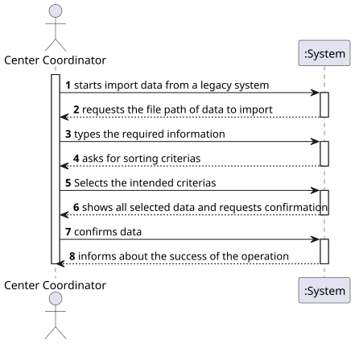
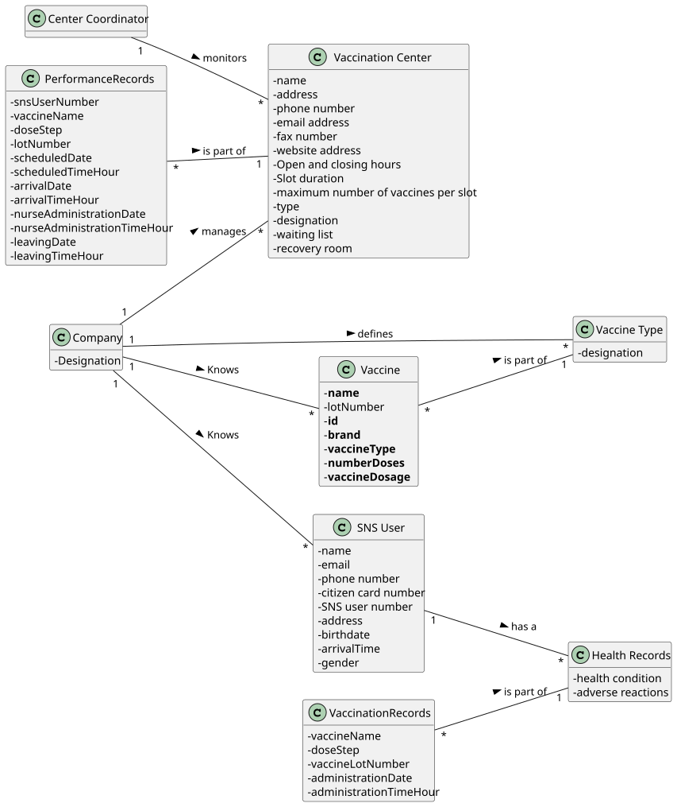
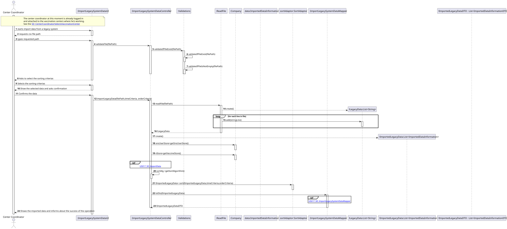
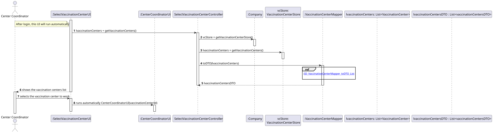
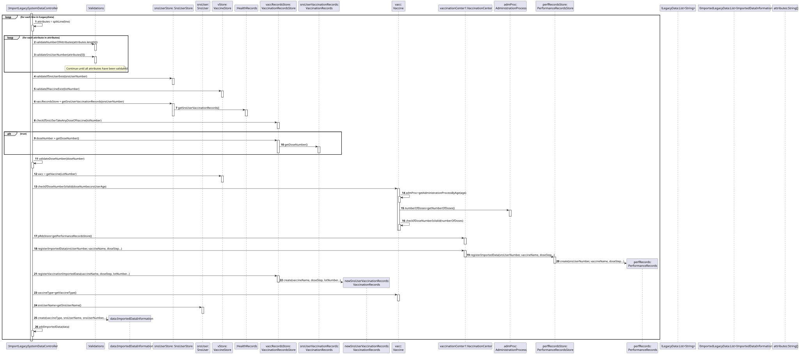
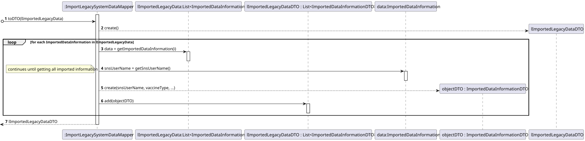
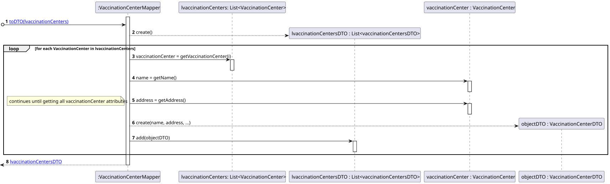
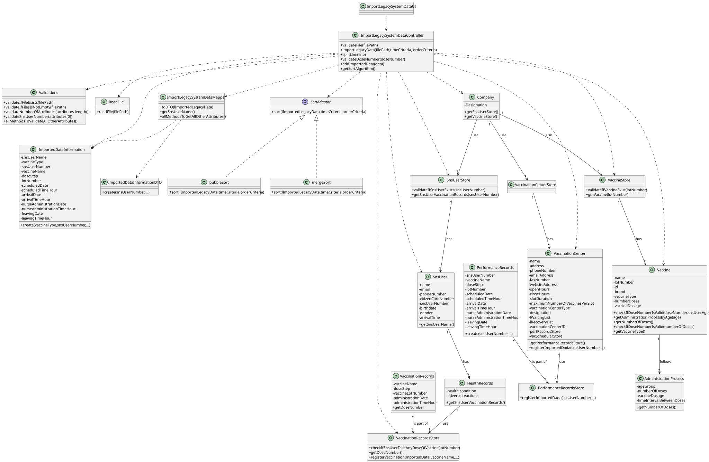

# US 017 - Import data from a legacy system

## 1. Requirements Engineering

### 1.1. User Story Description

*As a center coordinator, I want to import data from a legacy system that was used in the past to manage centers.*

### 1.2. Customer Specifications and Clarifications

**From the specifications document:**
> " The Center Coordinator wants to monitor the vaccination process, to see statistics and charts, to evaluate the performance of the vaccination process, generate reports and analyze data from other centers, including data from law systems."

> "The imported data should be presented to the user sorted by arrival time or by the center leaving time."

> "The name of the SNS user and the vaccine type "_Short Description_" attribute should also be presented to the user."

**From the client clarifications:**
> **Question:** "In the Sprint D requirements is stated that two sorting algorithms should be implemented and that the imported data should be sorted by arrival time or center leaving time. Should each algorithm be capable of both sortings or is one of the algorithms supposed to do one (e.g. arrival time) and the other the remaining sorting criteria (e.g. leaving time)?"
>
> **Answer:** "Each algorithm should be capable of doing both sorting. The application should be prepared to run both algorithms. The algorithm that will be used to sort data should be defined in a configuration file."

> **Question:** "I was analysing the csv file that should be imported for US17 (the one that is in moodle), I noticed that the date attributes are written like this 5/30/2022 I thought that the date format should be DD/MM/YYYY. I also noticed, that the time is written like this, 9:43, I also thought that the time format should be written like this HH:MM, (in this case it would be 09:43). Are the date and time formats different for US17?"
>
> **Answer:** "That file is from a legacy system, that uses a different date and time format. The date and time should be converted when loading the data into the application that we are developing."

> **Question:** "I noticed that some postal codes in the address does not follow the format of XXXX-YYY. For example some of them are XXXX-Y. Are we supposed to be able to load those users as well?"
>
> **Answer:** "Yes."

> **Question:** "In a meeting you already clarified that when uploading a file from a legacy system the application should check if the SNS Users are already registered and if not US 014 should be put to use. My question is now if only one or two SNS Users are not registered, should the whole legacy file be discarded?"
>
> **Answer:** "SNS users that are not registered should be loaded/registered. The other SNS users should not be registered again and should be ignored."

> **Question:** "You already have clarified that when uploading a file from a legacy system the application should check if the SNS Users are already registered and if not, we should register them using US 014. How exactly do you want this to proceed, in case there aren't registered users, should the application ask the center coordinator to select the file with the users data to be uploaded?"
>
> **Answer:** "US14 and US17 are two different features of the system. In US17, if the SNS user does not exist in the system, the vaccination of this SNS user should not be loaded. The system should continue processing the CSV file until all vaccinations are processed."

> **Question:** "Is there any correct format for the lot number? Should we simply assume that the lot number will always appear like this 21C16-05 ,like it's written in the file, and not validate it?"
>
> **Answer:** "The lot number has five alphanumeric characters an hyphen and two numerical characters (examples: 21C16-05 and A1C16-22 )"

> **Question:** "Should the vaccine named Spikevax, (the one in the given CSV file for US17), be registered before loading the CSV file?"
>
> **Answer:** "Yes."

> **Question:**  
> "1 - When sorting data by arrival time or central leaving time, should we sort from greater to smallest or from smallest to greater?  
> 2 - Also, should we consider only time or date also? So, for example, if we sort from smaller to greater and consider a date also, 20/11/2020 11:00 would go before 20/12/2020 08:00. Without considering the date (only time) it would be 20/12/2020 08:00 before 20/11/2020 11:00."  
> **Answer:**  
> "1 - The user must be able to sort in ascending and descending order.  
> 2 - Date and time should be used to sort the data. Sort the data by date and then by time."

> **Question:** "Regarding the validation of the data in the performance data csv, in case the dose is the not the first one, should we check if the user age and the date when the user took the other vaccine dose, are valid for the new dose to be administered? (This question popped up whith the project description: "The vaccine administration process comprises (i) one or more age groups (e.g.: 5 to 12 years old, 13 to 18 years old, greater than 18 years old), and (ii) per age group, the doses to be administered (e.g.: 1, 2, 3), the vaccine dosage (e.g.: 30 ml), and the time interval regarding the previously administered dose. Regarding this, it is important to notice that between doses (e.g.: between the 1st and 2nd doses) the dosage to be administered might vary as well as the time interval elapsing between two consecutive doses (e.g.: between the 1st and 2nd doses 21 days might be required, while between the 2nd and the 3 rd doses 6 months might be required)."
>
> **Answer:** "The data from the legacy system (CSV file) should be validated before being loaded. Even so, each team should create a Spikevax vaccine that allows loading all vaccinations from the example CSV file that is available in moodle. This is required for developing MDISC tasks and assessment."

> **Question:** "You answered to a previous question saying that the user should be able to sort by ascending or descending order. Should the user choose in the UI, the order in which the information should be presented? Or should this feature be defined in the configuration file?"
>
>**Answer:** The center coordinator must use the GUI to select the sorting type (ascending or descending).

> **Question:** "Should the configuration file be defined , manually, before strating the program? Or Should an administrator or another DGS entity be able to alter the file in a user interface? This question is also important for US06 and US16 since these US also use configuration files, will the same process be applied to them?"
>
>**Answer:** "The configuration file should be edited manually."

### 1.3. Acceptance Criteria

* **AC1:** Two sorting algorithms should be implemented (to be chosen manually by the coordinator).
* **AC2:** The center coordinator must be able to choose the file to be uploaded.
* **AC3:** The center coordinator should indicate a valid CSV file path.
* **AC4:** At least one vaccine type must be defined in the system, in order to specify a vaccine and its administration process.
* **AC5:** The center coordinator must be able to select different criteria of sorting (arrival time, leaving time, ascending and descending).
* **AC6:** All loaded data should be presented to the user, including the SNS user's name and the vaccine type designation.
* **AC7:** All SNS users that are not registered in system should be loaded/registered on system through the file to be imported.
* **AC8:** All data should be validated before being loaded in the system. If one validation fails, then all its related data
  will not be loaded in the system.

### 1.4. Found out Dependencies

* There is a dependency with the US010 ("As an administrator, I want to register an Employee."), in order to have
  coordinators registered in the system.
* There is a dependency with the US014 ("As an administrator, I want to load a set of users from a CSV file."), as the
  file from legacy system will only load the SNS users that are not already registered in the system through the US014.
* There is a dependency with the US012 and US013, as the vaccines must already exist in the system.

### 1.5 Input and Output Data

**Input Data:**

* Typed data:
    * CSV filepath to load file.

* Selected data:
    * Sort algorithm
    * Sort criteria

**Output Data:**

* Notification about the success of loading file.
* The data that was imported from legacy system, sorted by criteria.
* SNS user's name and the vaccine type.

### 1.6. System Sequence Diagram (SSD)

### 1.7 Other Relevant Remarks

* The center coordinator must be registered at a specific vaccination center where he/she is working.

## 2. OO Analysis

### 2.1. Relevant Domain Model Excerpt

### 2.2. Other Remarks

n/a

## 3. Design - User Story Realization

### 3.1. Rationale

**The rationale grounds on the SSD interactions and the identified input/output data.**

| Interaction ID | Question: Which class is responsible for... | Answer  | Justification (with patterns)  |
|:-------------  |:--------------------- |:------------|:---------------------------- |
| Step 1  		 |... interacting with the actor?| ImportLegacySystemDataUI | Pure Fabrication: there is no reason to assign this responsibility to any existing class in the Domain Model. |
|                |... coordinating the US? | ImportLegacySystemDataController |Pure Fabrication: responsible for coordinating and distributing the actions.                          |
|                |... instantiating a Sns User Store? | Company   | Creator R1/2       |
|                |... instantiating a Vaccine Store? | Company   | Creator R1/2       |
|                |... instantiating a Vaccination Center Store? | Company   | Creator R1/2       |
| Step 2  		 |	 |           |                              |
| Step 3  		 |... validating the data locally?  | Validations |Pure Fabrication: there is no reason to assign this responsibility to any existing class in the Domain Model.|
| Step 4  		 | | | |
| Step 5  		 |... interacting with the actor?| ImportLegacySystemDataUI | Pure Fabrication: there is no reason to assign this responsibility to any existing class in the Domain Model. |
| Step 6         | | | |
| Step 7         |... reading all the data?| ReadFile | Pure Fabrication: there is no reason to assign this responsibility to any existing class in the Domain Model. |
|                |... knowing the sns user store? | Company | IE: The company owns the sns user store
|		         |... knowing all the Sns users | SnsUserStore |Information Expert (IE): the class owns all the Sns users profiles and data |
|                |... knowing the vaccines store? | Company | IE: The company owns the Vaccine Store
|                |... knowing all the vaccines? | VaccineStore | IE: The VaccineStore knows all the objects contained on the Vaccine Store
|                |... validating the Sns User globally?| SnsUserStore | IE: SnsUserStore knows all the SNS Users objects |
|                |... validating the Vaccine globally?| VaccineStore | IE: VaccineStore knows all the vaccines objects |
|                |... instantiating the HealthRecords? | SnsUser  | Creator R1/2       |
|                |... knowing all the sns user health records? | HealthRecords | IE: The HealthRecords owns the VaccinationRecordsStore
|                |... validating the age and dose globally?| Vaccine | IE: Vaccine knows all the administrations process |
|                |... validating the age and dose locally?| AdministrationProcess | IE: AdministrationProcess knows it's own data |
|                |... instantiating the performance records of the center? | VaccinationCenter  | Creator R1/2       |
|                |... knowing all the performance records? | PerformanceRecordsStore | IE: The PerformanceRecordsStore knows all the performance records
|                |... knowing performance of a center? | PerformanceRecords | IE: The PerformanceRecords knows it's own data
|                |... instantiating the vaccination records? | HealthRecords  | Creator R1/2       |
|                |... knowing all the vaccination records? | VaccinationRecordsStore | IE: The VaccinationRecordsStore knows all the vaccination records
|                |... instantiating a new vaccination record? | VaccinationRecordsStore  | Creator R1/2       |
|                |... knowing the vaccination record? | VaccinationRecords | IE: The VaccinationRecords knows it's own data
|                |... instantiating the imported data? | ImportLegacySystemDataController  | Creator R1/2       |
|                |... knowing all the imported data? | ImportedDataInformation  | IE: The ImportedDataInformation knows all the valid data imported    |
| Step 8        |... informing the operation success?| ImportLegacySystemDataUI | IE: responsible for user interaction  | 

### Systematization ##

According to the taken rationale, the conceptual classes promoted to software classes are:

* Company
* SnsUser
* HealthRecords
* Vaccine
* AdministrationProcess
* VaccinationCenter
* ImportedDataInformation
* VaccinationRecords
* PerformanceRecords

Other software classes (i.e. Pure Fabrication) identified:

* ImportLegacySystemDataUI
* ImportLegacySystemDataController
* SnsUserStore
* VaccineStore
* PerformanceRecordsStore
* VaccinationRecordsStore
* Validations
* ReadFile

## 3.2. Sequence Diagram (SD)

**SD_CenterCoordinatorSelectsVaccinationCentert**

**Ref US017_SD_ImportData**

**Ref US017_SD_ImportLegacySystemDataMapper**

**Ref US017_SD_VaccinationCenterMapper_toDTO_List**

## 3.3. Class Diagram (CD)

# 4. Tests

**Test 1 and 2:** Tests to the Bubble Sort: to list by arrival and leaving time

    @Test
    void sortByArrivalTime_listMultiple() {
        List<ImportedDataInformation> list = new ArrayList<>();
        list.add(inf1);
        list.add(inf2);
        list.add(inf3);
        BubbleSort bubbleSort = new BubbleSort();
        bubbleSort.sortByArrivalTime(list);
        assertTrue(list.get(0).getName().equals("name tres"));
        assertTrue(list.get(1).getName().equals("name dois"));
        assertTrue(list.get(2).getName().equals("name um"));
    }

    @Test
    void sortByLeavingTime_listOne() {
        List<ImportedDataInformation> list = new ArrayList<>();
        list.add(inf2);
        BubbleSort bubbleSort = new BubbleSort();
        bubbleSort.sortByLeavingTime(list);
        assertTrue(list.get(0).getName().equals("name dois"));
    }

**Test 3:** Test to the Merge Sort: to list by leaving time

    @Test
    void sortByLeavingTime_listMultiple() {
        List<ImportedDataInformation> list = new ArrayList<>();
        list.add(inf1);
        list.add(inf2);
        list.add(inf3);
        MergeSort mergeSort = new MergeSort();
        mergeSort.sortByLeavingTime(list);
        assertTrue(list.get(0).getName().equals("name tres"));
        assertTrue(list.get(1).getName().equals("name um"));
        assertTrue(list.get(2).getName().equals("name dois"));
    }

# 5. Construction (Implementation)

    private List<ImportedDataInformation> mergeArrival(List<ImportedDataInformation> left,
                                                       List<ImportedDataInformation> right,
                                                       List<ImportedDataInformation> sortedArray) {
        int leftIndex = 0;
        int rightIndex = 0;
        int sortIndex = 0;
        while(leftIndex < left.size() && rightIndex < right.size()) {
            //compare date
            if(!left.get(leftIndex).getArrivalDate().equals(right.get(rightIndex).getArrivalDate())) {
                if(left.get(leftIndex).getArrivalDate().isBigger(right.get(rightIndex).getArrivalDate())) {
                    sortedArray.set(sortIndex, right.get(rightIndex));
                    rightIndex++;
                } else {
                    sortedArray.set(sortIndex, left.get(leftIndex));
                    leftIndex++;
                }
                sortIndex++;
            } else {
                if(left.get(leftIndex).getArrivalTimeHour().isBigger(right.get(rightIndex).getArrivalTimeHour())) {
                    sortedArray.set(sortIndex, right.get(rightIndex));
                    rightIndex++;
                } else {
                    sortedArray.set(sortIndex, left.get(leftIndex));
                    leftIndex++;
                }
                sortIndex++;
            }
        }
        //get the elements that are not used
        List<ImportedDataInformation> rest;
        int indexOfElementsMissingCompare;
        if(leftIndex >= left.size()) {
            //there are elements from right that are not used
            rest = right;
            indexOfElementsMissingCompare = rightIndex;
        } else {
            rest = left;
            indexOfElementsMissingCompare = leftIndex;
        }

        // Copy the elements that are not used in comparison
        for(int i = indexOfElementsMissingCompare; i < rest.size(); i++) {
            sortedArray.set(sortIndex, rest.get(i));
            sortIndex++;
        }
        return sortedArray;
    }

