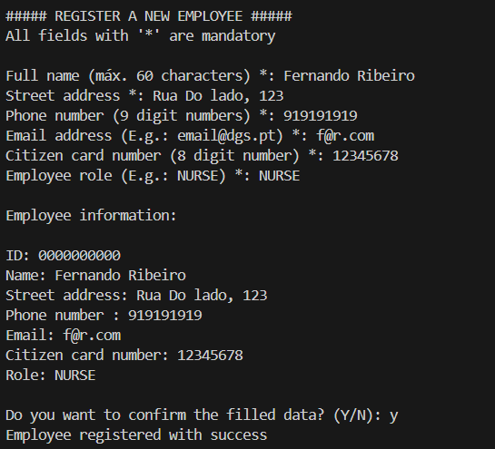
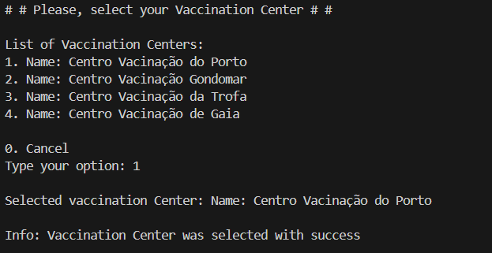
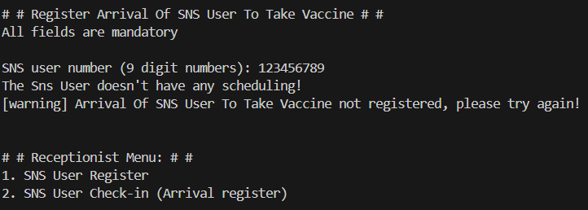

# Application Screenshots

This directory contains screenshots demonstrating the COVID Vaccination Management System.

## GUI Interface

### Welcome & Login

### Vaccination Center Selection

### Center Coordinator Features

### Nurse - Vaccine Administration Process

## Console Interface

### Welcome & Login

### Administrator Menu

### Register Employee

### Receptionist - Choose Center

### Receptionist - Register User

### Receptionist - Register User (Validation)

---

## Usage

These screenshots are used for:
- Project documentation
- Demo presentations
- User guide illustrations
- Main README.md showcase
